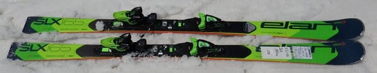
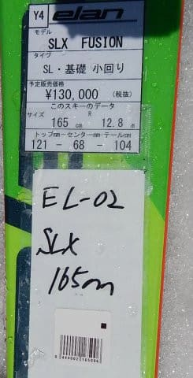
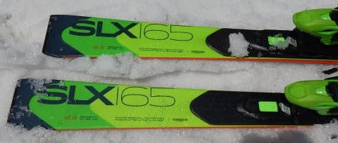

# 2019シーズンのスキー板，試乗レポート第15回…ELAN編その１

📅 投稿日時: 2018-06-14 02:16:36

🏷️ カテゴリ: [スキー板試乗](c0bd8048615710cee890e403a36cc9a2b.md)

はいはいはいはい．

徒然スキーヤー日記ですからね，このBlog．

今日はスキーネタですよ～！

…とりあえず．

今週末は月山に行く予定ですが．

土曜は曇り空ですね…

もしかすると，午前中はガスがかかるかも…

でも．

日曜は晴れそうな予感！

ってな感じで．

まだ細々と続いている，スキー試乗レポート．

今日は，エラン編です．

昨シーズンはELANの板は試乗してなかったので，

2年ぶりですね…

では，どうぞ～！

--

○ELAN SLX FUSION 165cm

SL競技用＆基礎小回り用．

去年から，左右非対称のアンフィビオ形状じゃなくなった，

エランの小回り用モデル，SLX Fusion．

昨年は試乗しなかったので，普通の左右対称の

板に戻ってから，初めてSLXに試乗になりますが…

SL競技用トップモデルとして，SLX Worldcupがあるので．

SLセカンドモデル兼基礎小回りトップモデルという

位置づけの，この板ですが．

うーむ．

昔のアンフィビオ形状のSLX Fusionとはかなり違う

感じですね…

かつての，ひたすらレールターンで滑り降りて

いくような，不思議な感じを持つ小回り

強制マシンから，

極めて常識的な小回り板に変わった感じです．

でも，比較的軽快に，良く回っていきます．

かなり良く板が回り込んで，深いターンが

できます．

以前のSLXの，谷回りからどうしようもなく

エッジで捉えていく感覚は薄まり，

谷回りは板を動かしていく余裕があります．

谷回りの捉えがルーズになり，板を外に

動かしていきやすくなりました．

というより，谷回りのエッジグリップは結構

弱く感じると言ってもいいかも．

…谷回りからレールターンのように

どうしようもなくエッジに沿って進んで

いくという，以前のアンフィビオ形状時代の

SLXが好きな人は，違和感を感じるかも…

でも，テールの張りが比較的あるように感じられるので，

山回りのグリップのしっかり感は強いです．

スピードを出しても，山回りで張りの強いテールに

乗って，しっかりグリップして板が横に走っていきます．

ただ，テールをそれほど抑え込まなければ

山回りでもグリップを抜いていく自由度はあり，

板の返りもそれほど速くなく．

履いた感じが軽く感じるというのもあって．

手ごわいSL用板というより，割と気軽に

ゲレンデでも履けそうな小回り板，という

感じでした…
