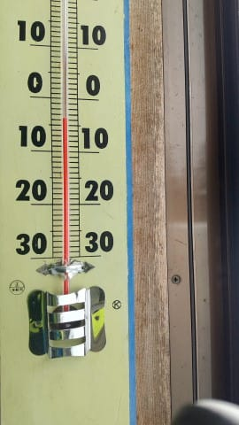
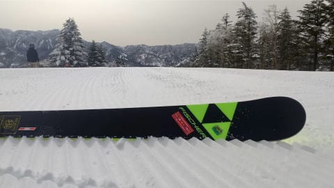
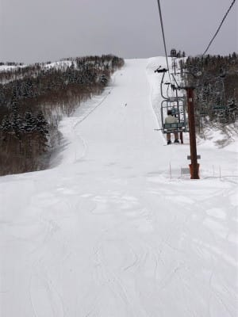
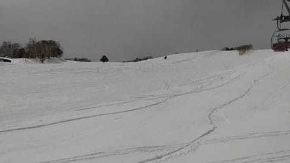

# 3月26，27日の週末の志賀高原スキー場の天気は…悲惨．土曜は強風高温南風，夕方は雨もぱらつく？日曜は高温で雨が一時強く降る

📅 投稿日時: 2022-03-24 04:41:58

ダメだ…

今週末，スキーに行けるかどうかかなり

クリティカルになってきた…

たった今，明日の資料が出来たよ…(泣)

寝るのは5時過ぎそうだし．

明日朝，ちゃんと起きて仕事に

行けるのかな…(涙)

しかし．

この状態でBlogを書いていて大丈夫なのかな？←他人事のように書いている場合じゃないでしょ

ってなことで．

本日も特派員から志賀高原の写真が

送られてきたので，見てみると．

…

…

…ぐはぁ(血を吐く音)

目の毒だぁっ！！

朝の気温は-4℃とまぁまぁ冷えて…

そしてあさイチは見事な締まった

シマシマバーン！！

そして，朝イチと夕方は晴れたよう

ですが…

昼間はちょうどいい感じでうす曇りに

なってくれて，日差しで雪が融けず，

シーズンでも5本の指に入るベスト

コンディションとのことで…

それでいて，さらにゲレンデも貸し切り

状態のガラガラだったとくれば…

うぉぉぉぉぉーーー！！

こんないいコンディションで滑りたい！

滑りに行きたい！！（ひっくり返って手足をじたばたさせるSkier_S）

…これは．

日ごろの行いが良い私は，

当然今週末も，今日みたいなコンディションで

滑れるはずだよね！！

…と，期待して天気図を見るわけですが…

見た瞬間，死亡するレベルの最悪天気図

でしたね(泣)

とりあえず．

今日はもう夜遅いので←朝早いので，の方が正解のような気が…

細かな天気図の解説をせず，

天気予想だけ書いておくと．

24日(木)：曇り～晴れ．

　気温は昼間でもギリギリ0℃程度までしか

　上がらず，いいコンディション！！

25日(金)：終日晴れ！

　朝は締まったいい雪だけど，

　午後は気温がぐっと上がり

　ザラメが溶けた粘りつく重い雪に…

26日(土)：曇り．

　朝から強烈な南風．終日強風．

　ゴンドラ動くか心配なレベル．

　たぶんヤバい．

　午後は時折雨粒が飛んでくる．

　リフト営業中はザーザーぶりに

　なることは無いと信じたい．

　ポツポツ程度と期待．

　気温は+10℃くらいまで上がるので

　雪質は水を吸った重い雪に(涙)

27日(日)：前日夜から雨．

　雨が降ったり止んだり，

　時折ザーザーぶりになる．

　朝から気温は+5℃，昼間は

　+10℃近くまで上がるので，

　雪質やゲレンデコンディションを

　期待するのが間違っている．

という感じで．

おそらく金曜朝まではコンディションが

良さそうなのに．

週末を狙ったように悪天候になります

…誰だ…！！？？

日ごろの行いが悪い人は？？

なぜ，ぴったり週末を狙って

強風＆雨のコンボがやってくるのか…(激涙)

とりあえず，今から祈って踊れば

なんとかなるかな…？

…という以前に．

私は今週末にスキーに行けるか心配だったり

するんだけど…

とりあえず．

これからシャワー浴びて寝ます．

2時間ちょいしか寝られない（泣）

（すみません．コメント回答は明日に…）

## 💬 コメント一覧

### 💬 コメント by (横須賀のウルトラセブン)
**タイトル**: Unknown
**投稿日**: 2022-03-24 08:34:26

この週末の天気～まるでスキーの神がＳさんに意地

悪しているとしか・・・そこで対処法を考えました

～ふれふれや冷え冷え〇〇ではなく、へそ曲がりな

スキーの神には「昨日の積砂10センチ！黄砂ふれふ

れ踊り」「３月なのに900ヘクトパスカル台風発生

踊り」「えっ志賀高原が赤道直下！地球軌道変動踊

り」などなど踊ってみてはいかがでしょうか？そう

すれば意地悪なスキーの神もあわてていい雪降らせ

てくれるで笑う！ちなみに僕は今週末スキーに行け

ませんが、Ｓさんの５本の指に入るスキーレポを

楽しみに仕事してます。（泣）

### 💬 コメント by (レインボー74)
**タイトル**: Unknown
**投稿日**: 2022-03-24 14:09:11

木曜日の志賀高原情報

天気もよく、朝からまさに快適バーン。自己最高速も出せたし、大満足で昼上がり。

昼の蓮池は+5℃まで上がってました。

週末のエス様予報が、大外れとなることを祈ってます。

そもそも悪い予報をしておけば、当たれば予報の的中で満足がいくし、外れれば楽しく滑れるから嬉しいですよね。

いい予報をしておいたら、外れた場合には立ち直れません。

だからわざと悪い予報をたててるのではないですか？本当は快適な週末だと信じたい！

### 💬 コメント by (Skier_S)
**タイトル**: コメント遅れました
**投稿日**: 2022-03-26 00:30:05

＞横須賀のウルトラセブンさま

お久しぶりです～！

この週末は狙ったように悪天候（泣）

もう，踊りを踊るより家で寝ていたい気分なんですが…（涙）

＞レインボー74さま

残念ながら，今週末は…（涙）

