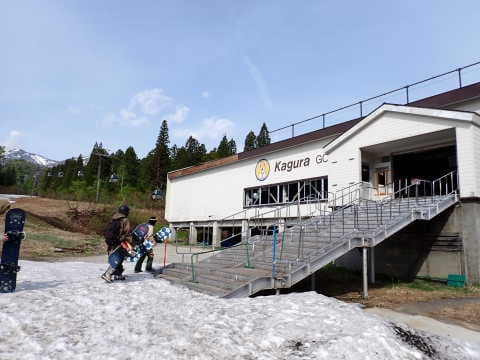

# 2023/5/13(土)かぐらスキー場で滑ってきたよ！…雪はちょっと薄いけど，今日は天気悪めの予報だったのでリフトはガラガラ．ゲレンデは混んだけど…

📅 投稿日時: 2023-05-14 01:09:07

🏷️ カテゴリ: [2023スキー滑走日記](cd943df30cfcc3d0896469e2ff98720cd.md)

ってなことで．

本日は予告通り，かぐらスキー場へ

滑りに行ってきました～！！

天気は，朝は予想外に晴れてたけど…

昼からは予報通りの雨でした(涙)

で．

明日は天気が悪くなる予想なので…

かぐらスキー場は，5月13日(日)の

営業を早くも諦めたようです（涙）

（[かぐらスキー場Facebook](https://www.facebook.com/snowkagura/posts/pfbid0entTMAXjWTLjHp5zBxeJhefnz1J4ZddzSpL2t9ZJiB6wmPidTkYbUTwTECUi5cWal?__cft__[0]=AZWt3s5hvlReH9tssZSNL6A6PMRHaj5GLz4EYLFReY1pWQWi4OrPLipNboPu6bZF1bPc6hT8vPRht2OMiohbejQsHflHjm_kXZFSpe6Xlb78KjtEpwf1JKr2A8BduRpqvPH0piAXCIkhw82ZiOTTK94DxfNmO_z3DDoNorL1bHoBsBwjN5A5ZVjKKUptlD4V56cFsIbbKz58jd7V4LZdRiiU&__tn__=%2CO%2CP-R)より）

ってなことなので．

このBlogを読んで，日曜にかぐらに行こうと

している方．

日曜はかぐら，全面運休です

ご注意ください…！！！

だもんで．

本日のかぐらスキー場がどうだったかを

見て，明日行くかどうかの参考にする人は

いなくなったわけですが…

でも．

とりあえず，ゲレンデがどんなだったか速報する

義務があるので．←それ，義務だったの！？？

本日のかぐらの速報レポート！！

えー．

まず．

今日は天気が悪い予報だったからか…

予想より空いてました！！

駐車場もガラガラだったし，

朝7時半からの営業なのに，7時20分で

リフト券売り場に並んでいる人がいない…

7時20分の段階で，ロープウェイ待ちが

この程度しかないので…

これ，平日と変わらないくらいなのでは？？

GWの殺人的混雑状況を聞いていたので，

すごい待つことを覚悟したけど…

拍子抜け．

ってなことで，ロープウェイで上がりますが…

すでに最終形態になっているかぐらスキー場．

ゲレンデに行くまでに，ロープウェイで

上がった後にさらにリフト2本＋ゴンドラを

乗り継がないといけないです…

ロープウェイを降りたら，

みつまた第1高速リフト乗り場まで歩いて．

リフトに乗って…

みつまた第1高速を降りたら，

今度はみつまた第2ペア乗り場まで

歩いて…

みつまた第2ペアの下りに乗って，

ゴンドラ側に下ります…

リフトの輸送能力に合わせてロープウェイの

定員を抑えて運転しているので，

ロープウェイは待ったけど，その後の

乗り継ぎのリフト・ゴンドラはほぼ待ちなく

乗れたのが良かったかな．

毎回乗り継ぎのたびに待たされたらちょっと

辛いですからね…

ちなみに，ロープウェイ降り場から

ゴンドラ乗り場まで，板は車に乗せて

運んでくれますが．

運んでくれるのは板だけです！！

昨シーズンまでみたいに，荷物やら

ブーツケースは運んでくれませんので，

ご注意を…

ってなことで．

ロープウェイの営業開始から約1時間．

やっと滑れるゲレンデに到着です…！

うーん．

雪はかなり減ってますね…（泣）

そして，パークがレールとかBOXだけで，

いつもの巨大キッカーが無い！！

…キッカーを維持できるだけの雪が無かったと

言うことか…

でも．

朝のうちは天気も良く．

ペアリフトの輸送力で運ばれる人しか

ゲレンデにやってこないので…

人も少なく，いい感じ！！

朝から雪は緩かったけど…

でも，朝はフラットで，人も少なく

大回り可能！！

和田小屋前からクワッド乗り場までも，

まだ意外と雪はありますね…

で．

雨の天気予報のおかげで，リフト待ちは

最大でもこの程度．

午前は平均的に，搬器3-4台待ちくらいで

乗れた感じでした．

ただ．

雪が減って，ところどころコース幅が狭めに

なってるのもあって．

午前10時ごろには，コース上の人口密度が

すごいことに…（涙）

いや…

この時期にこれだけの人が集まる

ゲレンデってすごい…

いつも思うけど．

この時期のかぐらを爆撃すれば，

日本のコアなスキーヤーの半分くらいは

抹消できるんじゃないかな？？

で．

これだけの人数が掘削作業を行うので…

昼ごろには早くも，ゲレンデは全て

完全コブコブになって来ました（泣）

ただ…

朝は晴れていたものの，12時過ぎから

ポツポツと雨が降り出し…

1時ごろには，ウェアが濡れるほどの

パラパラとした雨になってきました（涙）

そのおかげで，

午後のリフトはガラガラになったし…

ゲレンデの人口密度も，ピーク時に比べれば

減ってきました！！

…そのかわり，凸凹ゲレンデのそこかしこに

雪が薄い部分が現れ，ブッシュさんや

小石が出てきましたけど（涙）

午後は雨がパラパラと降ったり止んだり

を繰り返しましたが…

日差しがあった午前中はかなり滑りが

悪かった雪も，この雨のおかげで滑りが

よくなってきたのはありがたい！！！

やっぱり雨が降った方が，ゲレンデは空くし

板が滑るし，いいかも…←某氏に終わってる発想と言われたけど

で．

雪にはところどころ穴が開きかけてきた

ところがあったものの，まだ回避できる

レベルだったし．

午後は全面ボコボコになったものの．

営業終了時でも，コブ溝の全てで底が抜けて，

土が出てくるようなひどい状況でも

無かったし．

うん．

今日は雨のおかげでリフト待ちはそんなに

無かったし．

雪も滑ったし．

予想よりは良かった一日だったな～！！←あなたは雪さえあれば

どんなひどい状況でも「良かった」っていうんじゃないの？？

…ってなことで．

夜も遅いので，速報モードで書いている

るもりだったのに．

書きあがってから，かなり長いレポートを

書いちゃってたことに気づいた，

Skier_Sだったのでした…
