# 11月7日は志賀高原で雪が積もったよ！熊の湯・横手山スキー場は人工降雪機フル稼働！…でも，明後日以降12月に入るまでずっと気温爆上がり（激涙）

📅 投稿日時: 2024-11-08 02:13:42

えー．

降りました．

予想通り，積もりました！！

6日夜から雪が降りはじめ…

7日朝の志賀高原はうっすら積雪しました！！

今シーズンの初積雪です～っ！！

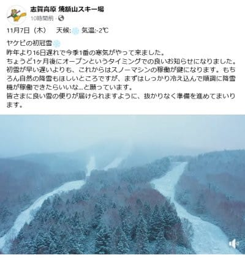

（[焼額山スキー場Facebook](https://www.facebook.com/yakebitaiyama/videos/948500793832103/)より）

朝の志賀高原のライブカメラを見ても，

白くなってるし…

気温は-2.8℃と低く，この日の志賀高原は

終日マイナス気温だったようです…！

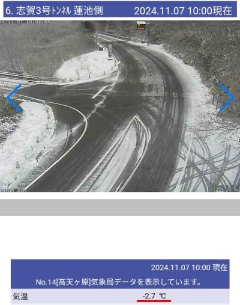

（[北信建設事務道路気象状況カメラ](http://hokushin.pref-nagano-roadcamera.jp/)より）

この冷え込みのおかげで，横手山は降雪機

フル稼働とホームページに出てたし…

熊の湯も全力で人工雪を打っているようです！

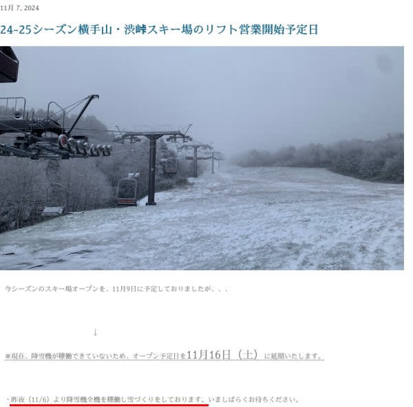

（[横手山スキー場ホームページ](https://yokoteyama2307.com/2024/11/07/%e3%82%b9%e3%82%ad%e3%83%bc%e5%a0%b4%e3%82%aa%e3%83%bc%e3%83%97%e3%83%b3%e4%ba%88%e5%ae%9a%e6%97%a5/)より）

結構冷え込んだけど，軽井沢は人工雪が

打てるほど気温が下がらなかったよう

ですね…

でも，冷えた分アイスクラッシュの造雪が

効率よく進んでいるのか，融ける量が

減ったからか．

コース幅は順調に広がってきてますね…

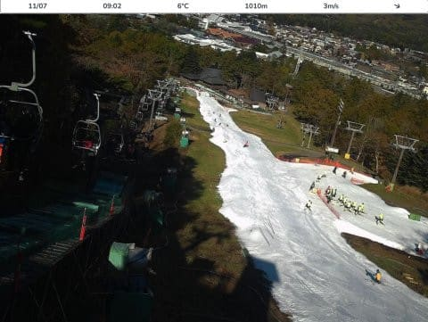

（[軽井沢スキー場ライブカメラ](https://skiday.app/4G6B9dqotZfiqc8dtW7d/869223046914998/embed)より）

イエティも人工降雪機は全く動かせなかった

みたいですが．

この冷え込みで造雪が上手く進んだからか，

日付が変わった本日，11月8日(金)より

営業再開です！！！

ただ…ナイターは13日(水)から再開で，

火曜まではナイター無しのようです…

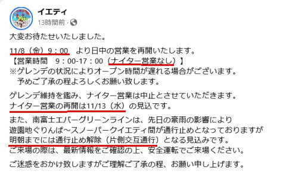

（[イエティFacebook](https://www.facebook.com/YetiSnowtown/posts/pfbid02RfLsqxTMBbaomznH4jFdYw27i6QC1LUoBCruN8yx7hyEDhFWBsQ58ygj1JR4u3AYl)より）

いやーー．

10月28日のクローズ以来11日ぶりに，

ようやっと再オープンか…

イエティの一時営業休止としては最長

記録じゃないですかね？？

一応，一時通行止めだった南富士エバー

グリーンラインの有料道路．

片側交互通行で再開とのことですが…

まぁ，上からアクセスした方が正解ですかね．

ただ．

ライブカメラを見てみると…

まだ，かなりコース幅が狭そう…

まぁ，ナイターができないレベルだから，

かなりギリギリの状態で営業再開だと

思った方がよさそうです…

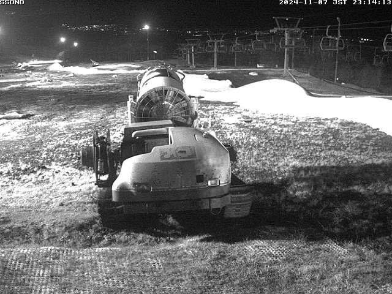

（[WNIライブカメラ](http://webcam.wni.co.jp/KAC24326/loop.html)より）

ってな感じで．

とりあえず，今シーズン最高の冷え込み

と言われながらも，ようやく平年並みに

冷えただけの日がやってきたわけですが．

…冷えるのは，8日の午前中までなのだ．

その後はまた気温が上がるのだ…

…その高温がどのくらい続くのか…？？

と恐れながら，

このBlog読者ならご存じの，毎週木曜発表の

気象庁1か月予報をこわごわ見てみました…

12月8日までの予想だし．

さすが12月に入ったら冷えるよね！？？

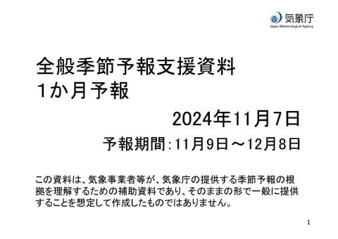

はてさて．

さすが12月は冷える…っ！！

冷えるはずっ…（全霊の祈りを込めてページをクリック）

…

…

…

…

…

…

ぐふぅ（即死）

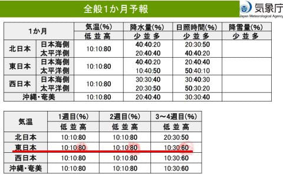

だめだ…

ダメだよ…

第3，4週の12月に入るころまで，今の

高温傾向が続くよ…

中身を詳しく見てみると…

なに？？？850hPa気温の1か月平均で，

赤色の一番濃いところが平年比+4℃？

1か月平均が4℃も気温が高いって…

季節がまるっと1か月遅れるくらいの感じに

なるんですが？？

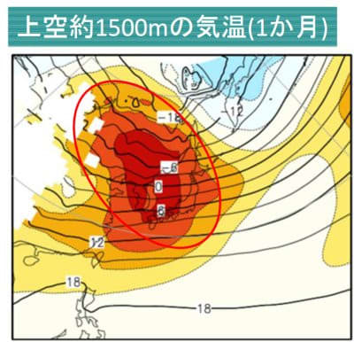

うがーー！！

なんだ…

なんてこった！！

とりあえず，第2週の11/16-11/22の期間でも．

赤く塗りつぶしたのは平年比+5℃…（激涙）

11月22日まで，雪が降るのは完全にあきらめ

ないといけないレベルですね（泣）

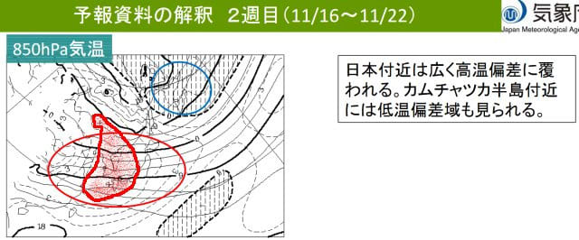

さらに第3，4週の11/23-12/6の期間でも，

赤く塗りつぶしたのは850hPa気温が

平年比+3℃のエリア．

本州がすっぽり，狙ったかのように

高温域にはまってます…

なんでこんな狙ったように，本州だけ

高温になるんだ…（激泣）

絶対嫌がらせだろ，これ…

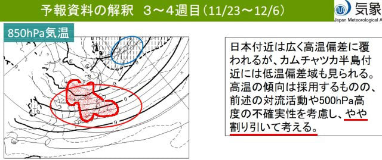

ただ，上の図面の解説に，

3-4週の高温傾向はやや割り引いて考える

と書かれてますが．

これは，この下の図の赤矢印で示した部分，

スプレッドが大きい（予想のばらつきが大きい）

ことを示す網掛け領域に入っているので…

予想の精度が低いだろう，ということで

高温傾向はちょっと割り引いて考えるべし，

と職人が読み取っています．

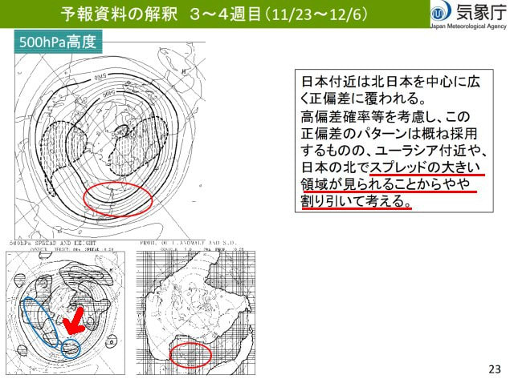

うーん．

「やや」じゃなく，思いっきり割り引いて

考えてほしいところですが．

そこまで割り引けないようなので．

高温傾向である事実は変わらないようで…

850hPa気温推移グラフを見ても．

9日までの冷え込みを最後に，

このまま12月上旬まで激烈高温期間が

続きそうです…（悲しさに思考が停止中）

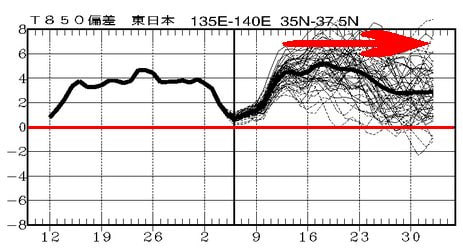

しかし．

ホントに12月に突入するまでのこれから1か月，こんな

高温がえんえん続くというのか？？

これは…

これはきっと．

今から1か月後に12月に突入というのが，

全ての人類が見ている幻覚なのだ！！

2024年はスペシャルボーナスで11月が

終わったらシークレット11月が始まるから，

季節が1か月遅れてるに違いない…っ！←そんなわきゃない

## 💬 コメント一覧

### 💬 コメント by (くま)
**タイトル**: Unknown
**投稿日**: 2024-11-08 07:20:51

偏西風が南に蛇行するの変わったんですかね？

### 💬 コメント by (Unknown)
**タイトル**: Unknown
**投稿日**: 2024-11-08 15:20:01

いつも詳しい情報ありがとうございます。

### 💬 コメント by (Skier_S)
**タイトル**: 明日はイエティ！
**投稿日**: 2024-11-09 00:23:49

＞くまさま

そうなんですよ…

偏西風が11月ごろから南に蛇行して寒くなるはずが，逆に日本付近だけ見事に

北にずれるという嫌がらせ状態で，当初予想の全く逆になってるんです（泣）

＞Unknownさま

コメントありがとうございます~！

これからも濃密な内容のBlogを書いてきますので，引き続きご愛読のほどを…

