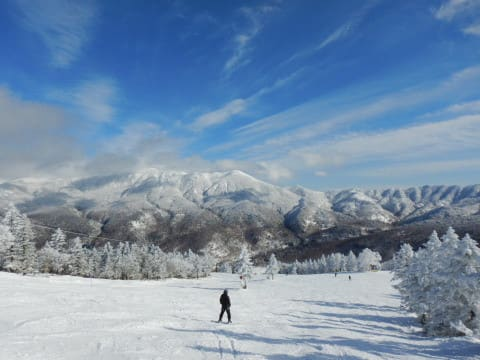
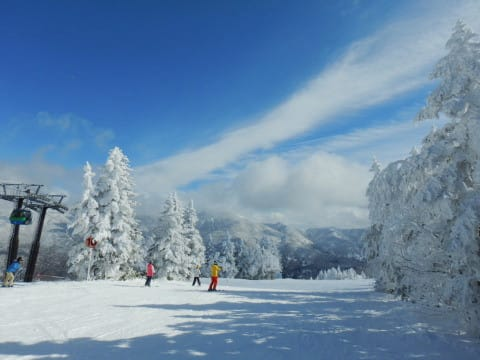
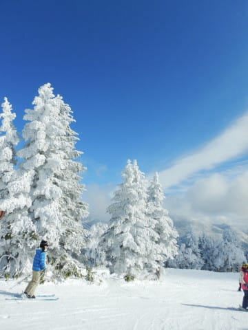
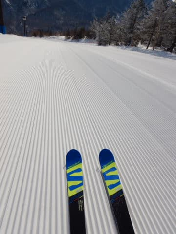
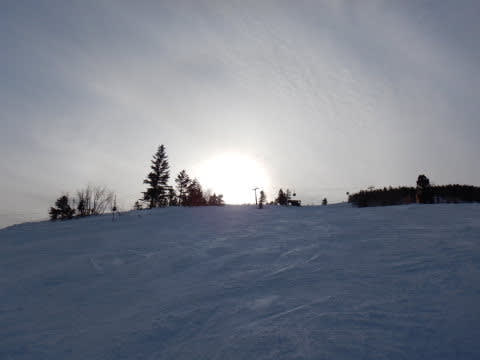
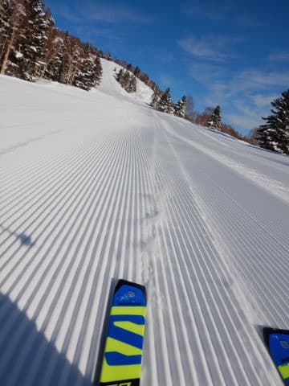

# 2020スキーシーズンの思い出…まだ終わってないけど，いろいろあったシーズンでした…

📅 投稿日時: 2020-06-18 01:17:28

えー．

何度も言うように．

私にとってのスキーシーズン，まだ終わってませんが．

ええ．まだ今シーズンは終わってませんが…

でも，もうほぼ終わりかけているので←ネタが尽きてきたからじゃないの？

そろそろ，今シーズンのまとめネタを

お送りしています…

ってことで．

2020シーズンは，コロナ騒ぎのおかげで，

いつもよりスキーに行った回数は少なかったですが…

いろいろあったシーズンでした．

とりあえず，ちょっといくつか，

今シーズンのトピックを振り返ってみますか…

○12月：ヤケビスーパーキッズはやっぱりすごかった

12月に，焼額で飛び込み参加OKのSAJバッジ

テストが開催されていたので，ヤケビスーパー

キッズの小2＆小5仲良し3人が2級を

飛び入り受験！

うーむ．

ジュニア2級じゃなく，大人の2級だからな…

小学校5年の彼は問題なく受かるとして．

小学校2年生の二人は大丈夫かな？？

と，心配しながら見ていたら…

…

うむ．

この子たち．

歩くよりスキーで雪面移動する方が

慣れてるんじゃないの？？

って感じで，標準からかなり激しくズレた

子たちなので．

検定で全く緊張してる気配，ありませんね．

…いつもの滑りしてますね．

…みんな，シュテムターンできるんだ…

（いつもはかっ飛ばすので，シュテムターンなんてやってない）

結果は…

全員合格！

特に，小学2年のNちゃんは…

え？？6点加点！？？

主任検定員も絶賛の結果で，全員余裕の

加点合格だったのでした…

まぁ，[こんな滑り](https://www.youtube.com/watch?v=PyB5xB6J_Qs)をする小学2年生だから（2分45秒あたりから見てみてください）

合格するのは当然だと思ってたけど…←最初は小学校2年生二人，大丈夫か心配だったのでは？？

でも．

君たち．

順番を待って滑ることができたんだね…

（いつもはキッズたちは待ってくれず，大人は置いて行かれてる）

○焼額常連メンバーで20000m達成者続出！

今シーズンは，いつもの焼額朝礼メンバー

（朝イチゴンドラ仲間）が，

立て続けに20000m達成しました！

うち1名は，

[一の瀬ファミリー76本，滑走標高差23900m](e67119fc051eac33a3c41c37125f335a8.md)という，

バカとしか言いようがない素晴らしい記録！

Skiline開催以降では，最高記録を達成しました…

そのほかにも，Blog読者さんがたくさん

20000m達成しましたね～．

なんでそんなことにチャレンジするのか謎

皆さんチャレンジ精神にあふれてますね！！

○知り合いがすごい増えて，ゲレンデに謎の恐ろしい集団が滑っていた…

なんだか．

今シーズン，焼額に集う仲間がだんだん加速度的に

増えて行き，

気づくと30人くらいの大人数で

一緒に滑ってたこともありましたね…

そして．

集うみなさんは，あるレベル以上の滑りを

する方たちばかりなので．

一斉にかなりのスピードで滑り出すこの団体を，

一歩引いて客観視してみると．

「なんだ，この謎の団体は…！？？」

とかなりおかしい不思議な感じで．

「いや．自分はこの団体と関係ありません～」

と．ちょっと他人のフリをしたくなってみたり…

しかし，なぜかこのBlog読者の方は，皆さん

いい感じのスキーバ○ですね（いい意味で）←なんでも「いい意味で」を付ければ，免罪符になると思ってないか？

なんでこんなに素晴らしいスキー○カ（いい意味で）が

いっぱい集まるんでしょう…

○人生初の腰痛っ！！

今シーズンのバッドニュースとして．

生まれて初めて[腰を痛めてしまいました](e0659eb29308f6874e4aab627f673b7af.md)（涙）

いや．

もう全く普通に滑っていたら，突然グキッと．

…こういうの，いきなり来るんですね…（涙）

スキーヤーとしては，大切な膝と腰は絶対に

痛めないように，めちゃくちゃ注意して

いたのに…（泣）

腰をやっちゃったのは，

やはりもう歳だから

とは思わない．

思わないぞ！

まだ若いんだからっ！←そんなことを言っているのが年取った証拠

でも．

ロボットのように歩きながらも，

その日もナイターまで滑った上，

翌日も滑ってしまい．

（ブーツを脱ぎ履きする時が死ぬほど痛かった…

　脱ぎ履き手伝ってくださった

　焼額メンバーの皆様，その節は

　ご迷惑おかけしました…）

翌週からは痛いながらも痛み止めを飲めば普通に滑れて．

2週間後には痛み止めが無くても滑れるように

なったので．

もしかしたら今後シーズン全滅か！？？

と，心配で夜しか寝られないほどでしたが．←いや．それ，寝てるやん

予想より早く回復してくれて，良かった…

しかし．

これを契機に．

20000mの皆さんは，ほぼ全員間違いなく

どこか体を壊している

ということを知り．

（みんな痛み止めやら腰痛対策にむちゃくちゃ詳しい）

大量の痛み止めや，強烈な薬を飲みながら

サポーターグルグル巻きで毎週毎週

滑っている…という皆さんの話を聞いて．

なんでそこまでして滑るんだろう…

という，哲学的疑問を抱かずにいられなかった

Skier_Sだったのでした…

○コロナでシーズン強制終了（激烈涙）

いろいろ書いてきましたが．

もう，このシーズンの記憶に残るのは，

これに尽きますね．

GWも滑れなければ，

ヤケビスタッフへのお別れも，ヤケビメンバーへの

挨拶もできず．

4月に予定していたみんなで泊ろう会も，

BBQも，そしてタケノコ狩りも中止…（涙）

ってな感じで．

いろいろあった2020シーズンでしたが．

来シーズンこそ，シーズンインから普通に雪があって．

コロナ騒ぎも落ち着いて，

普通にGWまで滑れるシーズンであってほしい

と．

普通であれば，それでいいんだ…

という達観に至った，Skier_Sだったのでした…‘

## 💬 コメント一覧

### 💬 コメント by (さち)
**タイトル**: Unknown
**投稿日**: 2020-06-18 08:17:29

本当に残念です(´・ω・`)

来シーズンもよろしくお願いいたします！

ネマガリ食べたい…

### 💬 コメント by (michi)
**タイトル**: Unknown
**投稿日**: 2020-06-18 16:12:47

もう懐かしい感じですね。

12月の検定、みんな合格で良かったです。見ていたこちらが緊張しましたが、女の子2人は全く緊張してなかったですよね。リフトの上で歌を歌いまくってましたから（爆）

20000mチャレンジ、次は誰でしょうね。

Sさんがしんちゃんの記録にチャレンジとか？（笑）

謎の集団滑走はヤバかったです。

あの人数での集団滑走は初ですよね。

### 💬 コメント by (しんちゃん)
**タイトル**: Unknown
**投稿日**: 2020-06-18 19:31:29

20000mチャレンジは過酷でした。チャレンジ終了して五時間かけて帰りましたからね^^;

謎の集団滑走は圧巻でしたね。気合い入りました。またみんなで一緒に滑りたいなぁ。

今シーズンは、３高降り場での終礼も定番でしたよね。日暮れの山のシルエット、なんかノスタルジックでした。。。

### 💬 コメント by (ヒータロゥ)
**タイトル**: Unknown
**投稿日**: 2020-06-18 20:14:25

子供たち、本当にスーパーですよね。ウチの子供は検定にまったく興味ないのですが受けさせてみようかな〜落ちるの嫌だから受けるのイヤと言いそうですが。

私ごとですが階段を踏み外して骨折しました（泣）

スキーシーズンでなくてよかったです。来たるシーズンに向けて体力強化して20000メートルにチャレンジ……するかもです。（現段階ではまだ冗談レベルの妄想ですが）

### 💬 コメント by (ゆーき)
**タイトル**: Unknown
**投稿日**: 2020-06-18 21:14:01

私は5月は2回行ったので、意外とスッキリしていますが、ほんと謎の高速集団と思ってたら、このブログの人たちでしたからね、、、　来季は富士山山麓からスタートと思うけど、狭い、ボードたくさん、並ぶのて、ちょっと避けちゃいます、、、

### 💬 コメント by (Skier_S)
**タイトル**: いろいろあったシーズンでした…
**投稿日**: 2020-06-19 01:05:54

＞さちさま

今シーズンは，4月の大宴会も6月のタケノコ狩りもできず，

寂しいシーズン終わりになりましたね…

来シーズンはいいシーズンになりますように！！

状況が許せば，また12月に宴会する予定です…

＞michiさま

そうですね…志賀高原で滑ったのは，もう遠い昔の話みたいですね…

私は今シーズンは一度も20000mを超えず．

腰を痛めたので，無理をしませんでした…

でも，あの集団暴走はかなりヤバい感じでしたね（笑）．

＞しんちゃんさま

23900m達成，おめでとうございます．

まさか，最後の最後まで滑るとは思ってませんでした（笑）．

最近は，もうイチゴン朝礼と3高終礼が定番となりましたね…

来シーズンは，ぜひ日曜も終礼にご参加ください（笑）．

＞ヒータロゥさま

いや，あの子たち，ホントにスーパーですよ…

検定とか特に興味なさそうでしたが，なんだか流れで受けることになり

心の覚悟も何もなくいきなり受験してましたが，

全員余裕で合格ですから．

…しかし，骨折ですか！？？？

足でしょうか…？？

くれぐれも気を付けてください．

スキーシーズンまでに，無事回復することを願ってます…！

＞ゆーきさま

このBlog関係者というか…焼額常連さんたちが知らぬ間に

挨拶しながら滑っていたら，次々「やぁ！」って感じで

集まって，気づくと集団になっていた…って感じですよね．

来シーズンはYetiからですか！？

狭いですが，10月から滑れるだけありがたいと思っています…

来シーズン，Yetiでお会いしましょう（笑）．

