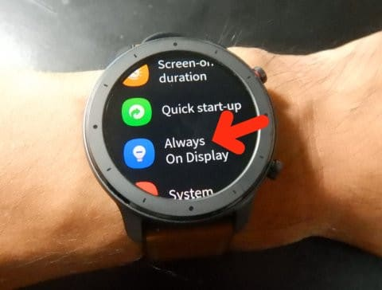
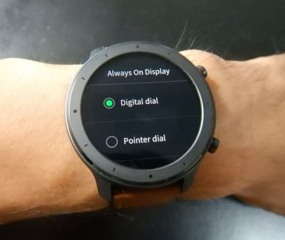
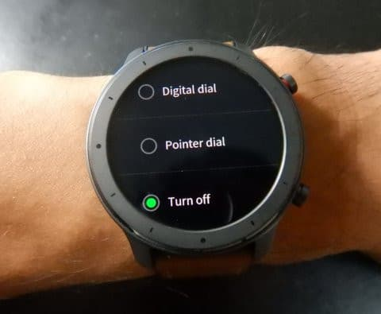
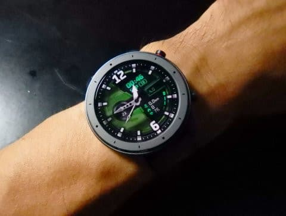
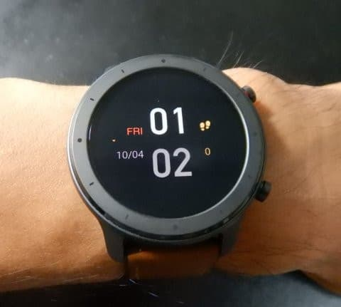
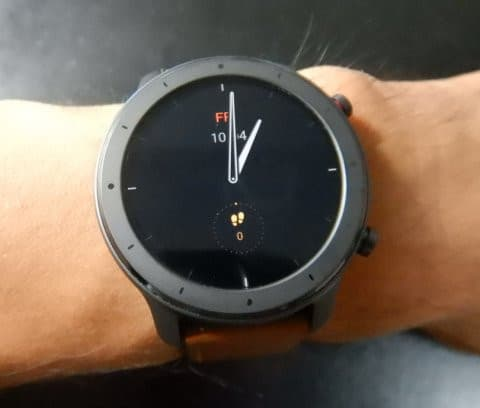
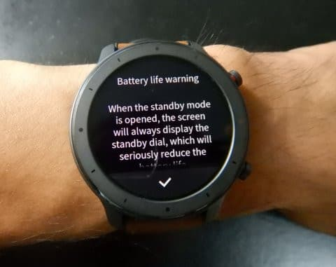

# Amazefit GTR，常時点灯がアナログかデジタルか選べるようになったよ…そして，2018年8月子連れ座間味で小5の娘とファンダイビング！もくじ

📅 投稿日時: 2019-10-04 01:35:48

えー．

本題に入る前に，雑談ですが．

[わがAmazefit GTR](e031a6cc94592b655560de20fc58cacf1.md)．

先日，また本体のアップデートが

かかったので．

「をを！？？今度こそメッセージ日本語対応

　してくれたか？？」

と，期待しましたが．

相変わらずメッセージの日本語は

漢字以外「？？？」となるままでした（涙）

結局，今回のアップデートで何が

変わったかと言えば．

Always on display（常時点灯）の設定が変わって．

こんな感じで，アナログか

デジタルかを選べるように

なりました…

当然，常時点灯Offも選べます．

普通の，このOn状態の表示から．

時間が経つと，

常時点灯がOffだと画面が消えるところ，

常時点灯のデジタル表示を選ぶと，

こんな感じの表示に切り替わり．

常時点灯のアナログ（ポインター）を選ぶと

こんな感じに表示が切り替わり，

この画面がずっと表示され続けます．

ただ，画面を常時onにすると，

電池の減りが激しいよ～！

と警告が出るので．

たぶん，これだとすごい勢いで電池が減ると

思います．

今回のアップデート．

何が変わったのか，いろいろ

見てみましたが．

この，常時表示がアナログとデジタルが

選べるようになった以外，

どこも変わってないような

気がします…

ちなみに．

先日，ようやっとこの時計，2度目の

充電をしましたが．

心拍計測や睡眠計測を一日動かしっぱなし，

メッセージ受信通知Onの状態で．

9月1日に充電してから10月2日まで，

電池が1か月以上もちましたね～！！

電池もちは恐ろしくいいです．

かなりよくできたスマートウォッチです．

…返す返す，メッセージ着信通知，

日本語対応していないのが，惜しい…

ってなことで，本題．←え？ここまでが本題じゃなかったの？

1年以上前に行った，座間味旅行記．

無事完結したので，

いつも通りのもくじです…

2018年8月，

娘＠小学校5年生のジュニアオープンウォーター

取得記念で行った，親子で座間味で

ファンダイブの旅行記

[プロローグ](e1a65d10f78851add0507d4c499dde50e.md)：Cカード取りたてだし，行きつけの場所がいいよね…

1日目

[その1](ec59e3f2ec3ad30dda2e68b51d6c2b244.md)：いざ出発！那覇に着いたけど，想定外の悪天候！？？

[その2](e279909dfa5a059ed137024ea1a534485.md)：今日は那覇観光だけど，予約した明日の高速船は欠航するっぽい…（涙）

2日目

[その3](ef33b20a551738a062f89f97bfb36a34c.md)：フェリーは運航することにかけて，朝イチからキャンセル待ち！…高速船全て欠航なれど，無事座間味へ

[その4](e3884f3df5eef37d6e6240663da204398.md)：座間味到着！いつものザマミセーリングさんで，午後からダイビングへ出発！

[その5](ecaa5124141309bc2e1e8b1725c1aecab.md)：座間味の1本目…最高の天気の中ダイビング！

[その6](e5a57b2fdc8a8c1a34d5512f7551d0691.md)：ダイビング初日は1本だけ．1日目終了．

3日目

[その7](e4a47b21bab9411296b38a9a1497fa630.md)：ダイビング2日目も，晴天でスタート！

[その8](ef314ef161809d1564a50b2ab531ce0b2.md)：2日目の1本目のダイビング

[その9](e2114246a688bed9c0240dfec08b9e81d.md)：本日のダイビング2本目は，娘のダイブ10本目…水中カメラを持たせてみた

[その10](ed55461f697210a74ee4dfe16120e1377.md)：2日目のお昼休み…そして，午後に娘は潜らないの！？？？

[その11](ee4b260d5b8d50161fc2874404d0df8c6.md)：2日目午後のダイビング

[その12](e78a6b530a8f835005711ba4fcff90c61.md)：ダイビング2日目終了．娘の水中写真，意外とまともだったなぁ…

4日目

[その13](e537070ebec734fb8178aec763bbac59a.md)：ダイビング最終日は，どしゃ降りでスタート

[その14](e8a8758ebef5c6fde3d366d2faa54f250.md)：1本目ダイビング…天気はすっかり晴れてきた！

[その15](ee57c7dcb40f99dbc1bf826334ce27c37.md)：今日は午前は1本だけ．晴天，きれいな海で最高のお昼休み！

[その16](ed548e970ea9f06e1b494b2562dfb53d6.md)：午後の1本は，このツアーのラストダイブ

[その17](e537070ebec734fb8178aec763bbac59a.md)：座間味のラストナイト…お友達とさようなら

最終日

[ファイナル](ecca02ea781acfba5530ec9582d7f5d48.md)：最終日は帰るだけ

[エピローグ](eec2c052111bdf777b5a75e67d6043187.md)：家族3人でダイビングして，気づいてしまったこと
