# 2019/1/26(土)の志賀高原スキー場は…朝は穏やかだったものの，午後は吹雪．悪天候のため全リフトの営業早めに終了（激泣）

📅 投稿日時: 2019-01-26 23:11:27

🏷️ カテゴリ: [2019スキー滑走日記](c3e4496fc0fb7f9c17ff21214a35b1ace.md)

ということで．

実に…

実に2週間ぶりに，スキー場に戻ってきました！！！

あぁ…スキーができるって素晴らしい…

…と．

感動したいところですが．

もう．

ホントに今日は

「なんじゃこりゃーーーー！！！！」

と，のたうち回ってます．

なぜ，私がスキーができる週に限って，

こんなことに…（涙）

とりあえず．

本日朝，志賀高原に向かったわけですが．

上信越道は普段はそうそうない，横川からの

チェーン規制となり．

横川サービスエリアにすべての車を誘導して．

全車停止でのタイヤチェックが入りました…

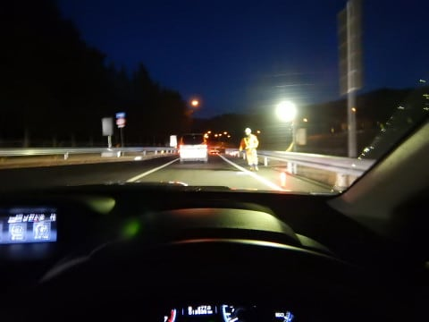

このチェーンチェック渋滞で，10分以上のロス（涙）

しかし．

結局上信越道は，信州中野までほぼ積雪なし．

まぁ，凍結の恐れはあったのかもしれないけど…

なぜ，横川という，全く積雪がない地点で

チェーンチェックしたのかはちと謎な感じでした．

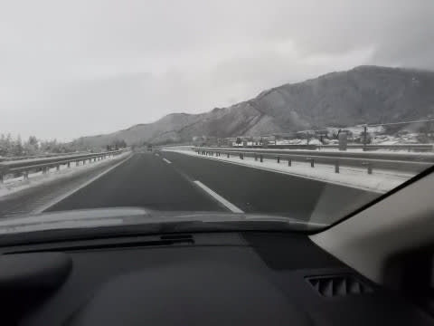

ただ，中野の街中から，積雪となり…

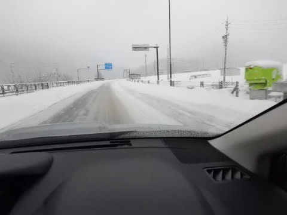

志賀高原の登り坂は，かなり気合の入った

雪道で．

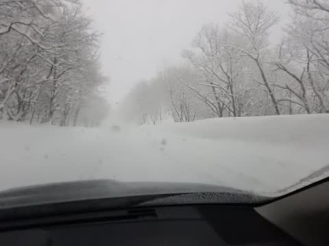

そのため．

結構車が詰まって，のろのろ運転でした…（涙）

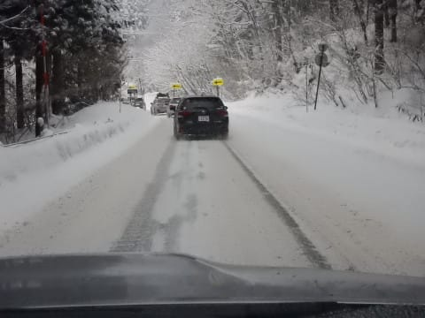

ってな感じで．

チェーンチェック渋滞と本格雪道渋滞のため．

焼額の第1ゴンドラオープンに2分遅れ（泣）

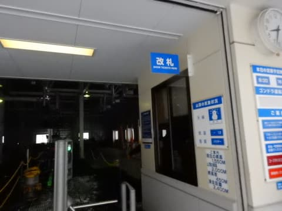

でも，かなりの頑張り運転で，2分遅れに抑えた！

頑張った！←そこ，頑張りどころじゃないから

ってな感じで．

焼額山頂に出ると…

気温は-12℃ですか．

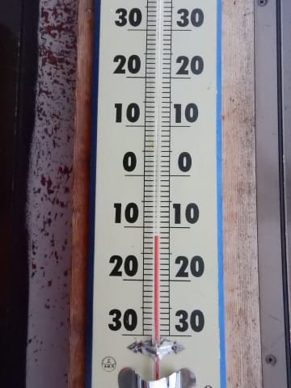

水曜の予想の，-13℃から1℃の誤差．

最近の予想精度がかなり上がってきた気が

する…！（自画自賛）

そして．

山頂は．

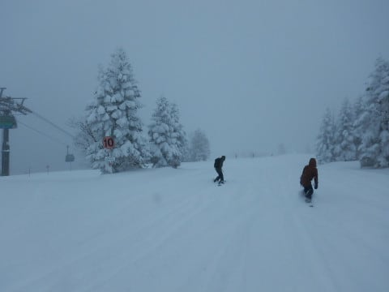

なんと．

圧雪コース全面，新雪パフパフ！

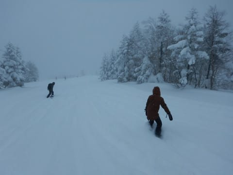

10㎝ほどの新雪かな？？

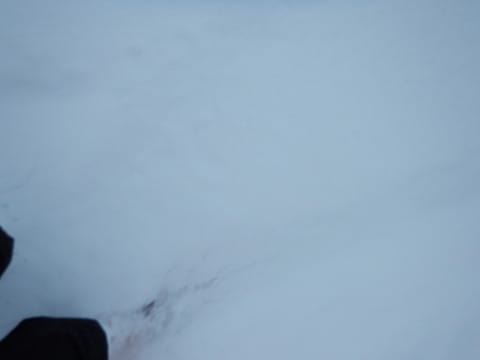

これは…

オリンピックコースはもっと深い

パフパフのはず！

…と，期待して突っ込んでいくと．

うむ？

すごい新雪か！！！！

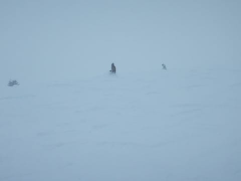

…という感じに見えましたが…

実際は，脛パフ．

…まぁ，水曜の予想通りか…

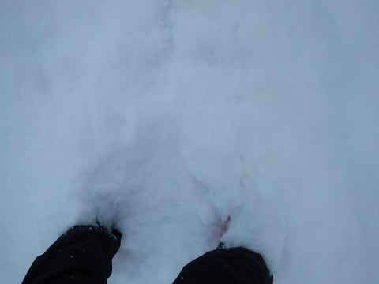

完全に硬い斜面に底付きしてしまう，

いまいち浮遊感のないパウダーです…（ちょいと残念）

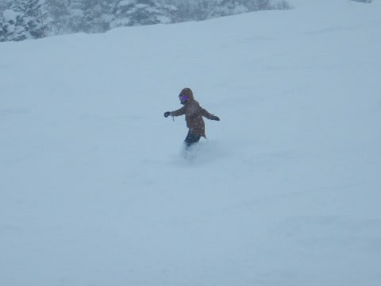

うーむ．

最近，12月に入ってからというもの．

かなりの確率で雪降りの日に当たっているものの．

ほとんどが，この程度の底付きパウダー…

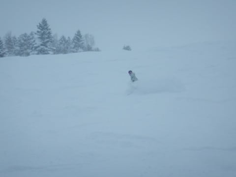

太い板の出番とは言えない，

完全に下地の斜面を滑っている感じの，

イマイチのパウダーです（ちょっと泣）

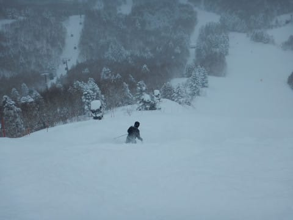

あぁ…腰くらいまである，浮遊感を味わえる

ディープパウダーを滑りたい…っ！！

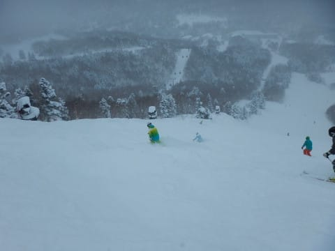

…とはいえ．

これはこれで．

ほぼ整地を滑ってるに近い感覚で．

その上のパウダーをまき散らしながら

滑れるので．

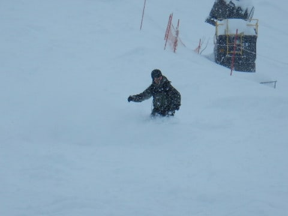

浮遊感はないけど，それなりに

楽しめるかな…

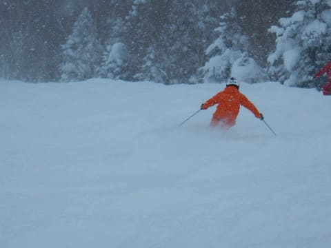

と，思っていたら．

なんと．

朝10時ごろになると…

雲の合間から，日が差してきました！！

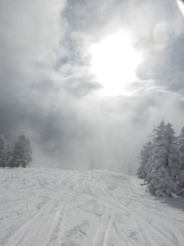

そして…

日が差して，コースがすっきり見えます！

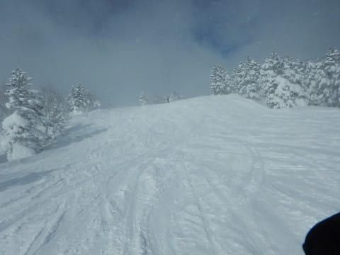

素晴らしい…．

素晴らしいよ！

終日雪の予想だったのに．

きっと，神様が．

先週スキーに来れなかった私のために，

いい天気にしてくれたに違いない！！←いや，違うから．違いまくってるから

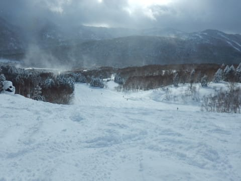

と，天気予想を外したのをごまかしつつ．

日が差す新雪のオリンピックコースを．

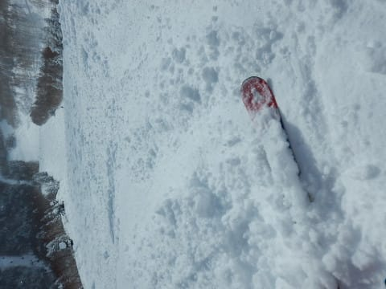

気持ちよく飛ばしていたのですが…

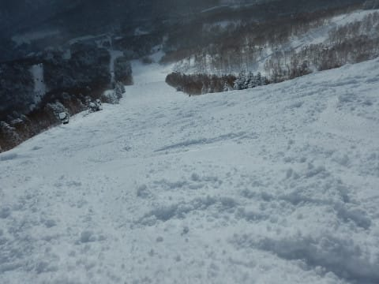

…日が差していたのは，わずか30分程度（涙）

またすぐに，曇りだしてきたと思ったら…

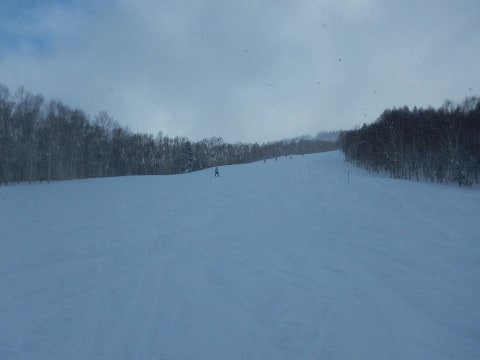

午前10時半過ぎには．

コース上の人も増え始め．

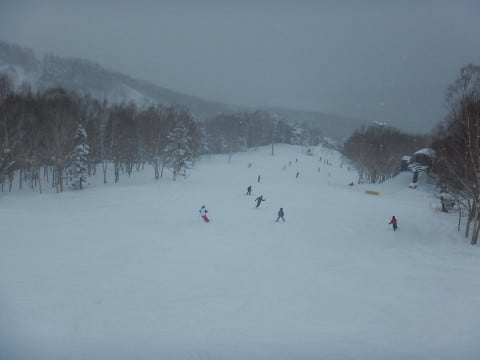

新雪が蹴散らされて，コース上は

かなり凸凹になってきちゃいました（涙）

ただ，コース上の人は多かったものの．

正月に比べれば全然少ないし．

さらに，ゴンドラは終日ほぼ飛び乗りだったし．

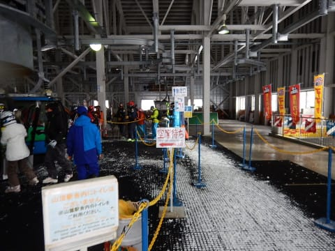

リフト待ちは完全0だったし．

まぁ，まだ許してやってもいいかな…←だから，なんでそんなに上から目線？

…

…と，思っていたところ．

午前11時を過ぎるころには．

え？なんですか？これ？？

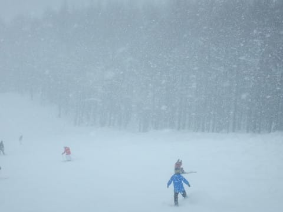

いきなり激しい雪が降り始めて

きたんですが…っ！（泣）

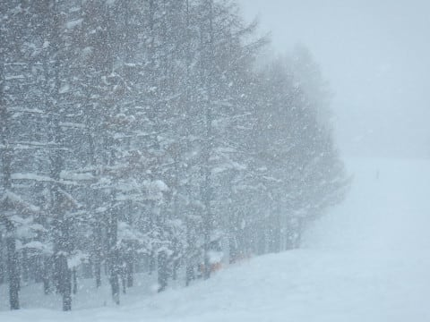

そして．

激しい雪のため，視界が悪く．

風もそこそこ強くなり…

うむ．

これは．

視界が悪い吹雪

というやつですね…（激涙）

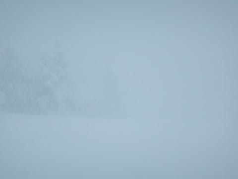

前が…

前が見えんよ（涙）

とりあえず．

　　土曜は吹雪

と書いた，私の天気予想．

ふはははは．やっぱり，当たったのだっ！！

…と．

半ば自棄で言ってみたものの．

私が滑りに行けなかった先週は，すごいいい

コンディションだったようなのに．

なぜ，2週間ぶりにスキーに来た日に，

こんな天気になるのか…（こぼれ落ちる涙）

そして．

気温は最高でも-10℃と寒く．

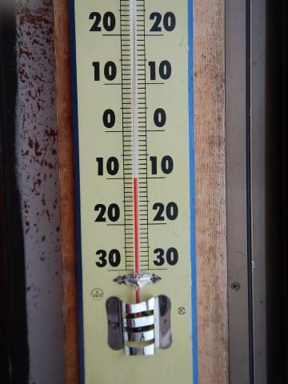

新雪が蹴散らされて凸凹になったバーン．

凸凹が大変見にくいし…

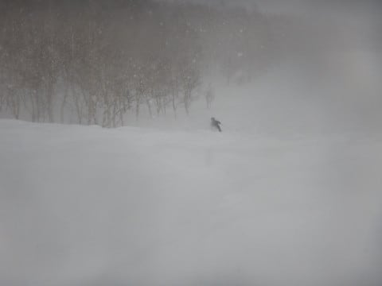

それどころか．

すごい勢いで新雪が積もっていくので．

圧雪コース上が，全面新雪で覆われて

行くのですが…っ！？？

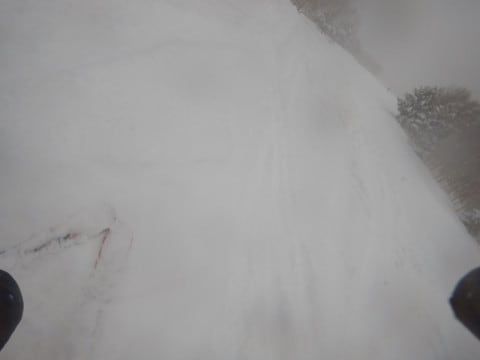

圧雪コースでも．

人が少ないと，もうブーツパフに

なってるんですが…っ！？？

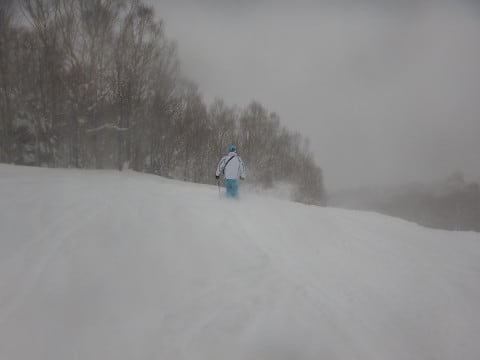

視界は良くないし．

凸凹斜面の上に新雪が積もって．

結構厳しいコンディションになって来たなぁ…（涙）

…と．

悲しんでいたところに．

さらに追い打ち．

な，な，な，

なんですと～！！！

悪天候のため，焼額ゴンドラ，

3:30で終了？？？

リフトも3:45で終わり？？？

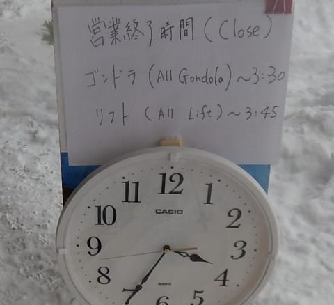

ゴンドラ4:10，リフト4:20まで営業の

はずだったのに…

なぜ…

なぜ，2週間ぶりに焼額に復活した今日．

こんなピンポイントで，こんな運が悪い

日に当たるんだ！！？？

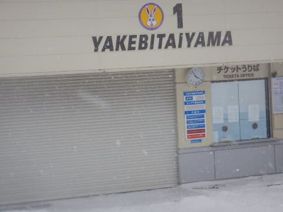

（まだ時計が4時になってないのに閉まっている焼額ゴンドラ）

これは…

一の瀬に瞬間移動だ！！！

と，思ったものの．

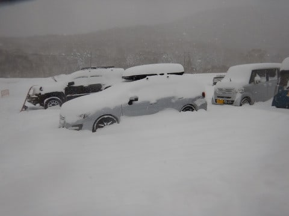

…く，車が，埋もれてる…（涙）

昼間だけで，これだけ積もったのか…！！

とりあえず．

全力で発掘し．

フルスピードで一の瀬に向かったものの…

本日，一の瀬クワッドも予定をかなり早め，

4時で営業終了（チーン）

ペアリフトも20分で営業終了だったため．

まにあいませんでした…（涙）

あぁ．

なんということか…

と，嘆いていたら．

さらに追い打ち．

本日，悪天候のためナイター中止

な，な，な．

なんて日だっ！！！！！

…しかし．

先々週は，風邪でナイターに行けず．

（というか，昼間滑っていただけでもちょっとおかしいレベルだったかも）

先週は，法事でスキーに行けず．

そして，今週は，悪天候でナイター中止…

こんなジェットストリームアタックを受けて，

3週連続ナイターに行けなくなるなんて！！

これらの出来事が一回の週末にまとまってくれれば

あきらめもつくものの．

なぜ，バラバラに，3週間続けてやってくるのか…（涙）

トップシーズンの週末にスキーに行けなかったのも

5年ぶりの記録だけど．

トップシーズンに3週連続でナイターに行けなかったのは．

…娘が生まれた年以降，無かったんじゃなかろうか…（泣）

今年は呪われている．

お祓いを受けてこないとダメか…

そして．

明日も悪天候の予想が…（涙）

…ホントに今年，いろいろダメかもしれない…（悲）．

PS.今，志賀高原はかなりの勢いで雪が降ってます．

明日の朝は，すごいことになってそう…

リフト，朝ちゃんと動くかな

## 💬 コメント一覧

### 💬 コメント by (Goku)
**タイトル**: お互いに痛い一日でした(>_<)
**投稿日**: 2019-01-27 08:33:38

昨日はお騒がせしました。

結局、渋には泊まらずそのまま自宅に帰りました。

首は張りが出てきましたが、痛みそのものは酷くなっていないので一安心です。

それにしても、リフトの早終いとナイター中止とは、２週間ぶりに滑るＳさんには痛すぎる仕打ちですね。

そして、今日はリフト動きそうですか？

山から下りれば、里は晴れているので帰り道は大丈夫かと思います。

では、今日も一日楽しんでください。

### 💬 コメント by (若杉勲71)
**タイトル**: 世の中にはもっと不幸な人もいます
**投稿日**: 2019-01-27 12:19:37

今朝の雪は半端なく、車四台も駐車できる家の住民に初の試練。屋根の雪下ろしも含めて、作業終了が11時。腰パフを楽しめるsさんらが恨めしい。初めて一軒家の大変さを味わいました。

昨土曜日は、ほっぽさんやgokuさんにお会いできましたが、sさんは？？

私は朝オリンピック一番のり。スタートはおくれたんですが、いつの間にか先頭になっていました、。昨日はあんなに幸せだったのに。今日はもう疲れきりました。いつもあんか作業をこなしているなんて、恐るべし長野県民。

### 💬 コメント by (michi)
**タイトル**: Unknown
**投稿日**: 2019-01-27 13:23:27

昨日はフワフワ雪で楽しめました。しかしお昼を食べたら本降りになってきたので早めにあがりましたがまさかリフトが早期終了とは思いませんでした。

今朝は長野市内も20cmくらい積もって朝から雪かきをしましたよ。

来週末はお日様の下で滑れることに期待です。

### 💬 コメント by (いー)
**タイトル**: お久しぶりです
**投稿日**: 2019-01-27 14:26:33

ジェットストリームアタタック

スキーを始めた頃 友達3人で遊んだ記憶が …

そっこーで自爆しましたが(笑)

まさか、こんな使い方とは…

勉強になります。使わせて頂きます(笑)

またお会いの際はよろしくお願いします。

### 💬 コメント by (かず)
**タイトル**: Unknown
**投稿日**: 2019-01-27 18:31:19

オリンピックftほんと残念でした　あれ予想どうりでしたので1本調査して来ました　かなりよかったので今日も泊まりまーす

### 💬 コメント by (ほっぽ)
**タイトル**: 1/27
**投稿日**: 2019-01-28 01:22:26

Ｓさん

結局この２日間は痕跡すら見つけられませんでした。

私は２時に上がり、車を発掘して３時に出発し無事帰宅しました。

次週はスキーお休みなので、次回お会いできるとしたら３連休ですね。

http://www2.tokai.or.jp/nana_hoppo/

### 💬 コメント by (Skier_S)
**タイトル**: 日曜はパウダー祭りだったよ
**投稿日**: 2019-01-28 01:55:20

＞Gokuさま

首の調子がそれほどひどくなかったようで，一安心です．

日曜の志賀高原は，全面的に営業開始が遅れ，

さらに奥志賀はほぼ全滅，寺子屋全滅，高天ヶ原クワッド午後まで運休，西館フーディー運休

って感じでした．

…でも，朝イチは新雪好きにはたまらん感じでしたよ～！

＞若杉さま

あら…

家の雪かき＆屋根の雪下ろしですか．

宿に泊っていれば気にしなくていい，

一軒家ならではの想定外の手間ですね…

大雪の日に必ず雪下ろしをしないと行けなかったら，

パウダーの日は滑れないことになってしまいますね…

＞michiさま

土曜はお世話になりました～！

早めに上がられたのですね．

日曜の志賀の積雪は，すごかったですよ…

また来週お会いしましょう！

晴れるように祈っています…

＞いーさま

いや．

やっぱり3週連続で攻撃食らったら，

これはジェットストリームアタックでしょう…

と，脊髄反射で書いてしまいました．

ぜひ応用してやってください(笑)

＞かずさま

をを．

今日もあのパターンで行ってきたのですね．

残念ながら，明日はあんまり積もらなさそうですが，

楽しんできてください～！

＞ほっぽさま

この土日，お会いしませんでしたね～…

私は午前はオリンピックコース，

午後は1ゴン＆2高で白樺コースを回して

いたのですが…

どこですれ違ったのでしょう？

とりあえず，3連休にお会いしましょう！

