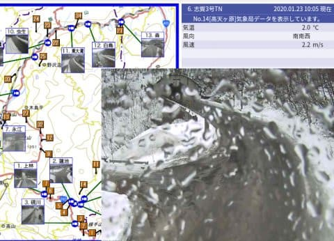
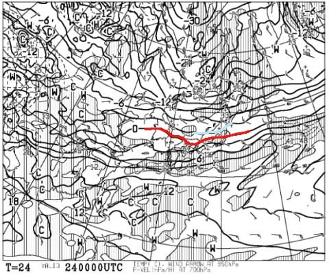
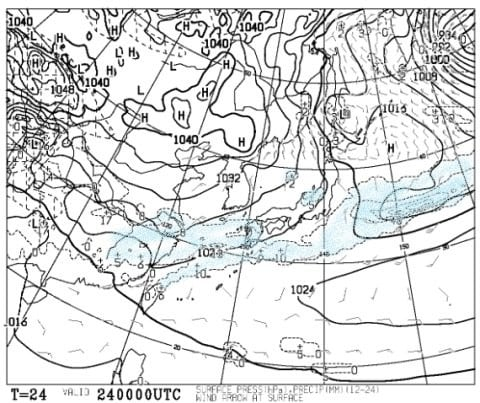
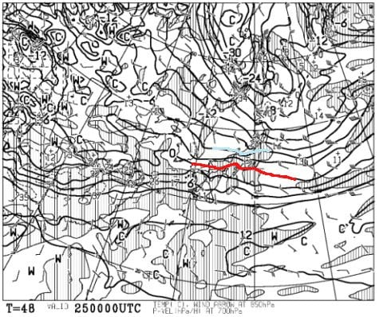
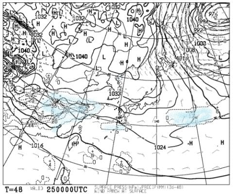
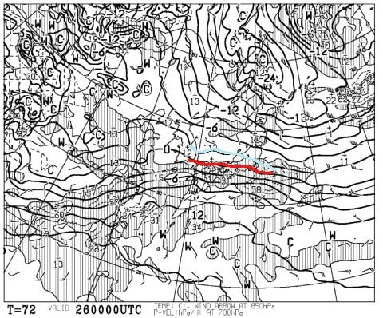
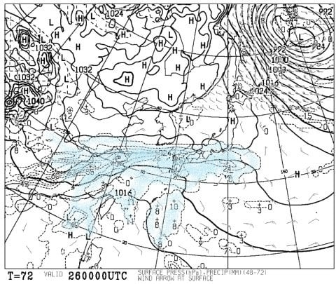
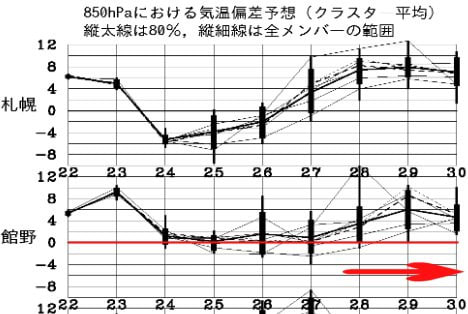
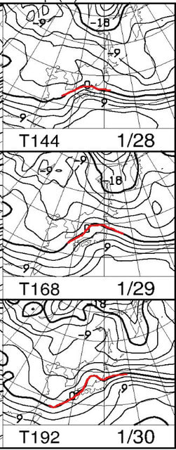
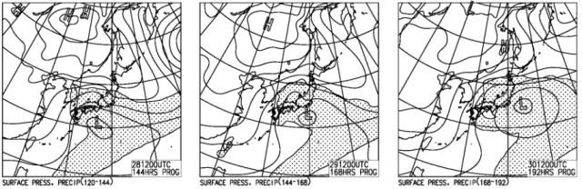

# 1月25，26日の週末の志賀高原スキー場の天気は？…当初予想より冷えて，雨の心配なし！…なんだけど，雪は積もらないよ（涙）

📅 投稿日時: 2020-01-24 00:30:20

🏷️ カテゴリ: [スキー天気予想](c6554f5c3c106093b511a8daae23757e8.md)

えー．

本日．

大変悲しいことに．

予想通り，23日の昼間の志賀高原．

空から無慈悲な液体が降り注いだようです…（涙）

（[北信建設事務所道路気象情報ページ](http://hokushin-camera.org/)より）

朝のうちから雨で．

山頂は降り始めは雪，

途中から雨となり，

終日パラパラ降り続けたようです…

降り始めは予想より早かったものの．

　気温は朝はギリギリ0℃を

　下回るくらい．昼に向かって気温が上がっていき，

　+3℃を超えてきて…昼ごろのどこかのタイミングで，

　パラパラ降りだす．

　運が良ければ，最初は雪かもしれないけど…

　午後は雨が時折ぱらつく，気温の高い一日

と言う，予想通りの天気となったようです…

あぁ…なぜ．

なぜ，こんな予報は当たるのか…！（涙）

とりあえず．

これで，志賀高原のトップシーズンの雪も，

ダメダメになってしまいました（泣）

果たして，これから週末までに．

このダメダメ雪を隠すよう，

超冷え冷えドサドサ雪が降り，

ゲレンデ状況が回復するのか？←…それが期待薄なのは，分かっているよね？？

これからの天気図を見てみましょうか…

えー．

まずは，24日金曜の850hpa気温を見てみますが．

うむ．火曜深夜の予想と変わらず．

赤い0℃線が志賀より南に下がり．

水色の-3℃線が志賀に近づいてます！

…これなら，雨の心配はないです！！！

ってなことで．

雨の心配がないなら，

むしろ雪が降って，木曜の雨で解けた

雪質が戻ることを願いたいところ…

雪が降ることを期待して，地上天気図を

見ると．

…やっぱりダメか…

わずかに新潟県付近に降水域がかかってますが．

これだと，志賀は積もらない感じです（泣）

運が良ければ，2-3cmの積雪があるかも…

というレベル（涙）

…ダメか…（落胆）

とりあえず．

肝心の週末，25日土曜の850hpa図を見てみますが．

をを？？

この日は金曜より冷えて，水色の-6℃線が志賀に

近づいてます！

これは，火曜段階の予想より冷えそう！

これなら，雪が降ってくれれば，かなり

いい雪が期待できるんだけど…

と，地上天気図を見てみると．

…ダメだ…

降水域が全く日本にかかっておらず．

雪が降る気配は全くありません…（激泣）

なぜ，冷えると降らないのだ！？？

せめて，

せめて日曜くらいは雪が降ってくれるよね…（熱望）

と，26日日曜の850hpa図を見てみますが．

この日も水色の-3℃線が志賀高原にかかっているので．

少なくとも，志賀に降ってくれれば雪の気温…っ！

気温は1月にしては高いものの，

雪が降るレベルで冷えてる．

果たして，降ってくれるのか！？？

…と，期待して地上天気図を見ますが．

…

…

…ダメじゃん（爆涙）

降水域は，志賀の南側ギリギリで

止まってます．

これは…

志賀では降らないことを覚悟した方が良さそう(涙）

ということで．

これから週末の26日まで．

積雪は期待できなさそう…（泣）

なぜ，気温が高い日は見事に雨が降るのに．

気温が冷えると全く降らないのか…

もう，神様が何かの嫌がらせをしているとしか

思えないんですけど（涙）

とりあえず．

まとめると．

24日（金）：朝は-5℃程度．朝イチは

　昨日の雨で溶けた雪が固まった，トップシーズンとは

　思えないかなりガリガリの固めバーン．

　天気は終日曇り，時折雪がぱらつくかも．

　ただ，積もるほどの雪にはならず(涙）

　気温は終日プラスにはならないので，

　バーンは終日ガリガリのまま．

　硬い斜面が好きな人はいいかもしれないけど…

　ちょっと悲しい感じ．

25日（土）：朝は結構冷え込む．-7~8℃程度．

　天気は朝から曇り．24日にわずかでも雪が

　降ってくれると，硬めながらもエッジが引っかかる

　バーンになってくれるけど…

　全く雪が無いと，ガリガリカリカリバーンに

　なってる可能性．

　天気は終日曇り．気温も低めのままなので，

　バーンは終日固い．

　急斜面はツルツルの場所が出現．

　普通の1月の，柔らかいトップシーズン雪から

　はほど遠いゲレンデコンディション（泣）

　

26日（日）：朝は-5℃程度．昼間もそれほど気温が

　上がらず，マイナスを終日キープ．

　朝は硬めのシマシマバーン．

　硬めとはいえ，冷え込みが続き，圧雪車も

　入ればバーンはツルツルではないと信じたい…

　カリカリした感じは残りながらも，この日の

　朝は雪がちょっとマシになってる…と思う．

　思いたい．

　ただ，昼ごろに向けて急斜面は磨かれて

　ツルツルした感じのところが増えていきそう…

　天気は終日曇り．午後になると，時折雪が

　ぱらつくかも．

　

という感じで．

雪が少なめながらも，トップシーズンの雪で

滑れた先週とは，かなり違いそうです…（涙）

でも．

雨になるかも…と心配していた週末．

なんとか雨にならずに済んだのは．

私が必死に祈り，踊ったからだ

ということなので，皆様感謝のほどを←絶対違うから

で．

週末が終わったあと．

「一体，いつ雪が降るんだろう？」

と気になって．

来週以降の天気図を見てみるわけですが…

…

…え？？

何？？

また，28日から30日，平年比で

ぐっと気温上がっちゃうの？？？

えええ！！

…この，29，30日．

赤い0℃線．

ちょっとヤバいところにあるんですが…

とても1月と思えないところに

0℃線がいやがるのですが！？？？

まさか．

まさか．

冷え冷えの日には全く降る気配が

無いのに．

気温が高い日に限って降ったりしないよね…

…

…ダメだ…（屍）

29，30日．降水域を予想する網掛け，

日本全土を覆ってます…

なぜ．

なぜ，気温が上がる日に限って降るかな～（涙）

ただ，28日は0℃線はまだ志賀より南．

雪になる気温なので．

28日はちょっと雪が降ってくれるか…？？

まぁ，28日に降っても，29，30日に，

空から降ってくる液体で溶かされるだけ

の雪になりそうですが…（泣）．

あぁ…今年はダメだ．

冷え冷え踊りは，効果絶大なはずなのに…？？

なぜ効かないのだ？？

…もしかしたら，今，日本全国1億2千万人が

必死に踊っている，冷え冷え踊りの

怨念が溜まったものが．←いや，そんなに大勢が踊ってないから

時間遅れで強烈に効いて．

夏に，異常な冷夏になったりしないのか…？

と，心配になってしまう，Skier_Sなのだった…

## 💬 コメント一覧

### 💬 コメント by (ほっぽ)
**タイトル**: 1/23志賀高原
**投稿日**: 2020-01-24 06:24:58

Ｓさん

昨日の残念な状況をアップしておきました。

結局ヤケビラストまで滑ってしまいました。

ウェアは完全浸水です。(T_T)

http://www2.tokai.or.jp/nana_hoppo/

### 💬 コメント by (Hide)
**タイトル**: 今シーズンは・・・
**投稿日**: 2020-01-24 07:34:44

S 様

今シーズンはホントに悲惨ですね。

志賀はまだまだ良い方ですよね。

今週末は泊りで白馬方面に”行かねばならず”状況が思いやられます。

酒盛りになる可能性も・・・（笑）

＞夏に，異常な冷夏になったりしないのか…？

→私もコレ心配してます。30年ほど前と同様、米不足になったりして・・。

### 💬 コメント by (新米パパさん)
**タイトル**: Unknown
**投稿日**: 2020-01-24 20:41:01

本日より奥志賀に来ております。

昨日の雨の影響もあり朝一は固め？かと思いきや昼頃から緩み、夕方より雪が降り続いております。

明日は多少の積み上げがれありそうですよ。

### 💬 コメント by (ほっぽ)
**タイトル**: 明日は20000m日和？
**投稿日**: 2020-01-24 23:41:17

Ｓさん

今日の志賀高原をアップしておきました。

一の瀬ファミリーは午後になってもシマシマが残る全面アイスバーン、

滑走性良好でこの状態がＫＥＥＰ出来ていたら、

明日は絶好の20000m日和かもしれません。(^^;

初級者天狗コースまで全面アイスバーンだったとの情報です。

夕方の降雪は残念ながら一の瀬では1cmも降っていません。(T_T)

http://www2.tokai.or.jp/nana_hoppo/

### 💬 コメント by (Skier_S)
**タイトル**: 明日から志賀高原！
**投稿日**: 2020-01-24 23:57:40

＞ほっぽさま

一の瀬はツルツルアイスバーンだったんですね…

焼額はそれほどのアイスバーンじゃないようですが．

うーむ．あと5cmでも，雪が降ってくれるとバーンコンディション

よくなるのですが…

でも，週末は晴れそうです！！

先週の予想から比べれば，天国と思える天気かと．

＞Hideさま

今シーズン，雪が無いながらも，志賀はまだ結構楽しめるので，

かなりマシかと…

白馬はちょっと厳しそうですね．

そして，この夏が冷夏にならないか心配です…

＞新米パパさんさま

志賀高原に復活しましたか！

明日は焼額グルグル滑ってます～！

スーパーキッズたちが2名ほど，また登場するかと思います(笑)．

