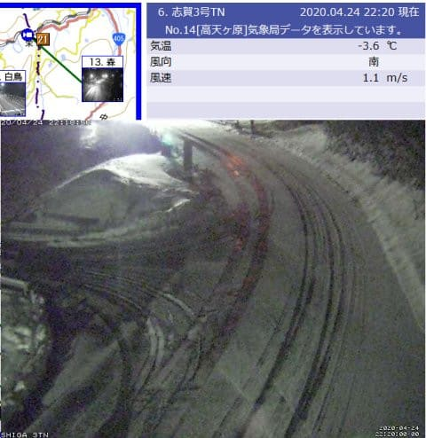
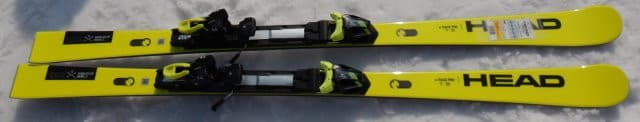
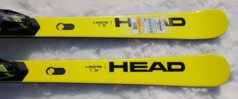
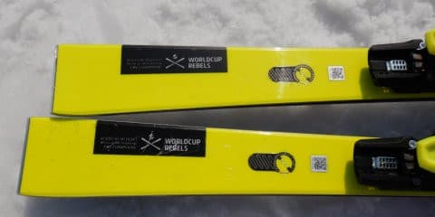
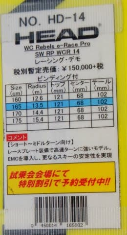
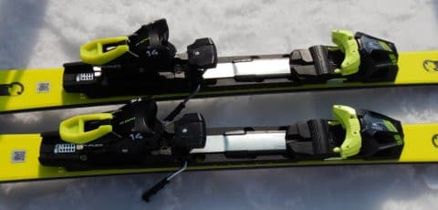

# 2021シーズンモデルのスキー板，試乗レポート…HEAD REBELS e-RACE PRO SW

📅 投稿日時: 2020-04-25 02:52:22

えー．

やはり，冷え冷え4月の本日．

志賀高原では，予想通り雪が積もったようです…っ！！！

…まぁ，西風だったので，

予想どおりの「わずかな積雪」でしたが…

（[北信建設事務所道路気象情報ページ](http://hokushin.pref-nagano-roadcamera.jp/)より）

でも，この時期に雨じゃなく雪になってくれて．

そして気温も-3.6℃と，結構冷え込んでくれてる

とは，素晴らしぃ！！

…けど．

惜しい．

惜しすぎる．

これでスキー場がクローズしているのは，

惜しすぎる…（涙）

…とりあえず今は．

この積雪が，GW後の横手・渋再オープンに向けての

恵みの雪になることを信じましょう…

ってなことで．

本日も続く，ど素人スキーヤーが個人的主観と

偏見で綴る，あまり役に立たない

2021シーズンモデルのスキー板試乗レポート．

今回は，HEAD編です！

○HEAD REBELS e-RACE PRO SW Raceplate 165cm

小回りベース基礎オールラウンド

HEADの基礎用上級モデルには，

小回りベースe-RACE PRO

大回りベースe-SPEED PRO

があり．

来シーズンは，これと

競技用SL e-SL RD

競技用GS e-GS RD

の4種類が，基礎トップモデルを意味する

ネオンイエローのカラーで販売されるようです．

（e-SL RDとe-GS RDは白色モデルもあり）

で，今回履いたのは，小回りベースのe-RACE PRO．

普通の黒いe-RACEと比べ，がっちりしたRaceplateが

入ってるのが違いです．

サイドカーブは13.5mと，それほど過激ではない

ラディウスですが．

滑ってみたところ…

これは，かなりしっかりグリップする，

ハイスピードカービングマシーン！

メタルのしっかりした張りがあり，

どれだけスピードを出しても怖さを感じさせない，

余裕をもった高速安定性があります．

エッジグリップがかなり強いので，

エッジグリップをしっかり活かし，

板のサイドカーブなりに滑る分には，

かなり快楽を感じられる傾きを

出せます．

サイドカーブが13m半ばと，

SL用板に比べるとちょいと大きめだし，

板のフレックスも強いので，

板なりに滑っていくと，小回りというより

中回り程度が快適．

スピードを出した大回りも問題なく

イケます．

中回りから大回りでは，

ガッツリグリップして切れていき，

スピードを出しても板がたわみきって

窒息することもなく．

スピードを上げて行ってもメタルの強い

バネ感で，たまった圧がすっと気持ちよく

返ってくる，かなりハイスピード派

向けの板です．

むしろ，この板の強さゆえに，

カービング小回りまでもっていくには

かなりのスピードと脚力が求められる

感じ…

ズラシの小回りもできるけど，

板にずっしりとした重さを感じる分，

板を動かして小回りしていくには

そこそこのパワーが求められます．

谷回りから気楽に動かして小回りができる

板ではなく，しっかりと板の真上から

正しく押していく必要があります．

でも，板なりに中回りから大回りで

下りていく分には，ガッツリグリップと

板の適度な重さによる高速安定感で，

かなりハイスピードで落ちていけます．

硬い雪になればなるほどいい感じで

攻めていけそうな，かなりハイレベルな

板です．

板が求めるスピードはかなり高く，

体力を必要としそうな板ですが．

ガンガンハイスピードで攻める人が，

小回りから大回りまである程度

攻撃的に滑れる板…って観点なら，

いいチョイスになりそう．

## 💬 コメント一覧

### 💬 コメント by (しんちゃん)
**タイトル**: 安定感増した？
**投稿日**: 2020-04-26 00:06:14

来季のHEAD、ＥＭＣでグラフィンより安定感が増してる気がするのは、私だけでしょうか(^^ゞ

外出できない分、試乗レポートが楽しみです!!

今後も試乗レポート、楽しみにしています。

### 💬 コメント by (Skier_S)
**タイトル**: ＞しんちゃんさま
**投稿日**: 2020-04-26 06:16:14

来シーズンのHEADは，全体的に張りが強くなった気がします…

求めるスピード域が全体的に上がったのか，レベルアップした

感じがします．

試乗レポートは，まだあと8機種ありますので，お楽しみに～！

