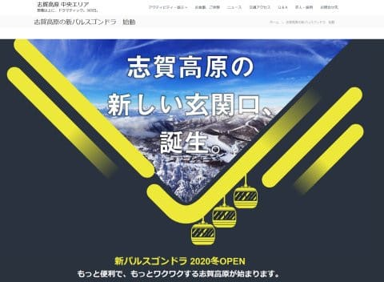
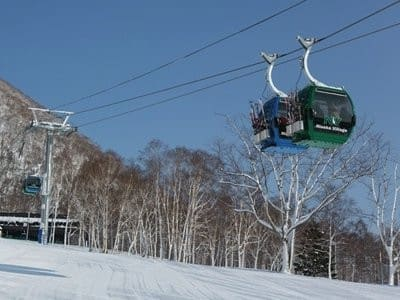
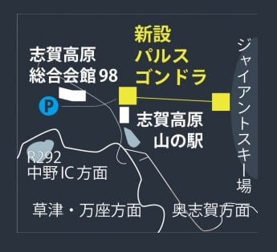
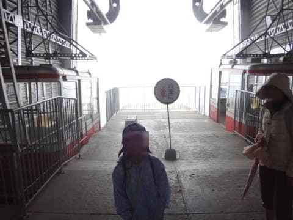
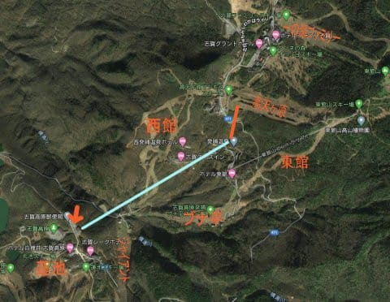
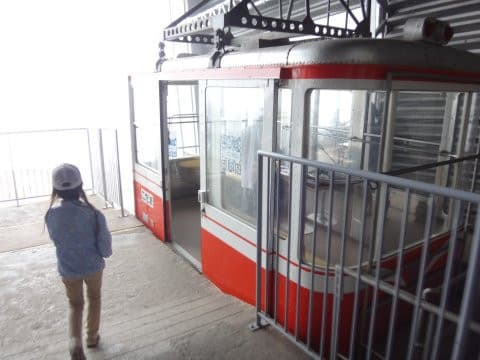
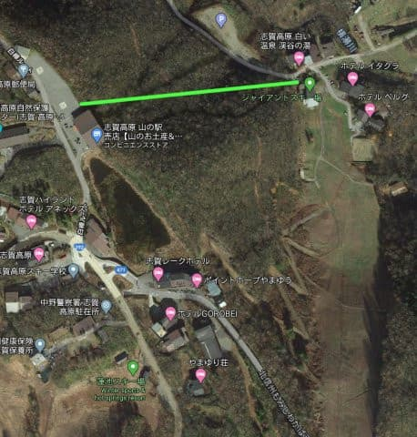
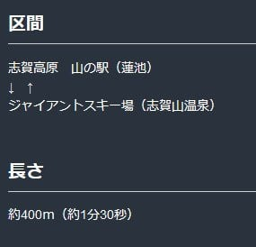

# え？2021シーズン，志賀高原にゴンドラ新設！？？山の駅～ジャイアントを繋ぐ「パルスゴンドラ」とは…？？

📅 投稿日時: 2020-07-05 00:26:30

🏷️ カテゴリ: [スキー雑談](c1f9d2cb7478308da16419928ea3945e9.md)

ということで．

ここ3日間，ダイビング日記が続いてますが．

このBlog．スキーBlogですから，

ちゃんとスキーネタもやりますよ～！！←スキーネタ「も」？スキーネタ「を」じゃなくて…

で．

タイトルにある通り．

どうやら，来シーズン．

志賀高原に新しいゴンドラがかかるようです…！

…その名も，パルスゴンドラ．

パルスゴンドラって，普通のゴンドラみたいに

乗り場・降り場で搬器がケーブルから

外れる仕掛けは無くて．

ゴンドラが乗り場に着くたびに，ケーブルごと

減速させる，「固定循環式ゴンドラ」です…

（写真：[日本ケーブルHP](http://www.nipponcable.com/trans/gondola/)より引用）

ケーブルごと減速させるので，

なるべく減速の頻度を下げるよう，

搬器は2個とか4個とかが並べてつけられて

いて．

同じ輸送定員でも，なるべくゴンドラ群の間隔を

広くできるようにしているのが特徴です…

で．このパルスゴンドラ．

一体どこにかかるのか？？

すごく気になるところですが．

場所はここ．

山の駅と，ジャイアントのリフト乗り場を繋ぐ場所です．

そうそう．

今は知らない人も多いかもしれませんが．　←おぢさんの昔語りの枕詞だな

「山の駅」は，かつて蓮池ロープウェーの蓮池側の駅．

ちなみに，蓮池ロープウェーがどこにかかって

いたか，知らない人もいると思うので．

下の地図の水色の線で示しますが…

赤矢印で示す蓮池駅（現山の駅）から，

発哺温泉までを結んでいたんですね～．

発哺駅からは，赤線の場所にあった，

今は無きシングルリフトで高天ヶ原へ

往復する形でしたね…（昔を懐かしむ目）

ただ．

蓮池駅が，スキー場から遠くて不便なので，

私はこのロープウェーを使うことは

ほとんどありませんでしたが（笑）．

…蓮池バス停を廃止して，この旧蓮池駅である

山の駅をバス停にすると聞いた時は．

「ゲレンデから遠くて不便で廃止になった

　ロープウェーなのに，そんな不便な駅舎を

　バス停にしなくても…（涙）」

と思ったものです…

で．

この山の駅．

今でも駅舎設備を残し，ロープウェーの

搬器が展示されてたりしますが…

今回，てっきりこの駅舎を再利用するんだと

思っていたのですが．

どうやらそうじゃなくて，山の駅の隣に

新たにゴンドラ駅舎を建てるようですね…

で．

Google Mapでゴンドラがかかる場所を見ると，

こんな感じ．

すごい短いです．

距離わずか400m．

乗車時間は1分30秒ですか…！

うーむ．一の瀬ダイヤモンドクワッドより

短いくらいですね…

そして．

一番肝心なところですが．

この，山の駅からジャイアントまで．

滑っていくことはできません

上りも下りも，ゴンドラ利用です！！！

…そうです．

このゴンドラがかかることで，

滑るコースが増えるとかいうことは

ないんです．

これまで，

山の駅のバス停や駐車場からゲレンデに

行くには，とぼとぼと丸池スキー場まで

5分ほど歩かなくてはならなかったところ．

山の駅からゲレンデまでとぼとぼ歩かなくて済むよう，

ゲレンデ往復用ゴンドラをかけた

という事なんです．

…だったら，

山の駅のような不便な場所をバス停にしなければ

良い気がする…（独り言）

とりあえず．

こんなゴンドラを架けるなら，ジャイアントを高速リフトにしてほしい

このゴンドラができれば．

一の瀬や焼額，奥志賀から山の駅のバス停に

行きやすくなり，横手山・熊の湯方面の

バスに乗りやすくなりますね

（志賀高原索道協会の公式見解を棒読みで）

まぁ，

あとは，強いて言うなら．

駐車場が少なかったジャイアント・ブナ・西館エリア．

98会館駐車場が使えるようになり，

駐車場キャパシティーが上がるってのが

もう一つのメリットかな…

…98会館駐車場から山の駅まで，意外と距離があり

かなり歩くので，便利に思う人はそんなにいないと思うけど

しかし…

不便な山の駅をバス停にして，

そこまでゴンドラを架けるより．

バス停はちゃんと便利なゲレンデ前にして，

いっそ丸池までゴンドラを伸ばし，

ジャイアントと丸池をゴンドラで

繋いだ方がよっぽどいいんじゃないか…？？

という，心の声は押し殺して．

このゴンドラの新設が．

滅びの言葉で志賀高原が崩れていくような．

そんな縁起でもないきっかけならないよう，

願いましょう…

PS.「バルスゴンドラ」じゃないよ．「パルスゴンドラ」ですから…！

意味が分からない人は[こちら](https://ciatr.jp/topics/312308)

## 💬 コメント一覧

### 💬 コメント by (Goku)
**タイトル**: Unknown
**投稿日**: 2020-07-05 07:06:27

あまりにも利用者が少なくて、１０年後には撤去なんて事にならなければいいけど…

### 💬 コメント by (いちと)
**タイトル**: Unknown
**投稿日**: 2020-07-05 07:09:42

いつもジャイアントの宿に泊まってます　ジャイアントは宿の横に駐車場がなく歩きも大変ですが、スノーモービルで運んでくれるので、それに乗るのも楽しみです　いつも夜中着ですが、駐車場が大きくても夜中も動いているわけでも無くイマイチな感じがします　それより本当にあの遅いリフトを早くして頂きたいです　しかも今年はコロナなんで悲しいかな駐車場は混まないでしょう(涙)

### 💬 コメント by (ももも)
**タイトル**: Unknown
**投稿日**: 2020-07-05 11:48:25

新しいゴンドラ…　別のところに掛けてほしかったです！

シャトルバスで横手山から山の駅の間のどこかで降りるとジャイアントに滑っていけると聞いたことがあります。(池ノ平バス停だったかな？)　

知ってはいるものの怖くて一度も行ったことがありません。歩いたりするのか、雪あるのか、途中で迷子にならないのか、遠くはないか…などと考えて遭難したら涙でちゃうから行けない！

Sさんは車で瞬間移動だから行ったことないかな？　

〉いちとさま

はじめまして。コメント拝見し興味がありすぎて質問します。私もスノーモービルに乗りたい！　ジャイアントのホテルはどこも乗せてくれるのでしょうか?

### 💬 コメント by (シガすきお)
**タイトル**: Unknown
**投稿日**: 2020-07-05 13:41:29

滞在型のスキーヤーにとっても中央エリアから横手山へのアクセスが今より格段に良くなる訳で、志賀高原の本来のスケールメリットを享受でき、魅力が増えるでしょう。　恒久化したスキー人口の減少、温暖化、更にCOVID-19の収束が見えないない状況下での新しい設備です、わたしはポジティブに受けとめています。

### 💬 コメント by (Skier_S)
**タイトル**: これからの志賀の発展に期待したいところなんだけど…
**投稿日**: 2020-07-06 01:45:32

＞Gokuさま

私としては，志賀高原の投資が裏目に出ずに，このゴンドラのおかげで

お客さんが増えた！！

…ってなってくれることを祈りたいのですが．

少なくとも，私の身の回りの志賀高原常連は，誰も使わなさそうなので，

その祈りが届くのかどうか…

＞いちとさま

志賀中央エリアは，ジャイアントのデタッチャブルリフトの電子部品欠品で

修理不可能…というのに懲りて，二度とデタッチャブルリフトやゴンドラを

新設しないことを誓ったのか，ジャイアントも低速リフトにして，

ゴンドラまで固定循環式にしましたから…

私もジャイアントを高速リフトにしてくれた方が，

丸池・蓮池・サンバレーへ移動が便利になり，

広いエリアの魅力が増す気がします．

＞もももさま

ジャイアントに行くには，池ノ平で下りて蓮池スキー場に出て，

蓮池スキー場からジャイアントに行くのと同じ手順で行けばOKです．

具体的には，ホテル五郎兵衛さんの前から道路を渡ってレークホテルへ．

レークホテル裏からジャイアントへ滑り込むコースです…

池の平からダイレクトにジャイアントへ出るルートもありますが，

旧ロープトゥの下に出るので，多少登らなくてはならないです…

＞シガすきおさま

いや…私のノスタルジーなのでしょうが，

旧蓮池バス停はスキー場から滑りこめて，

かつジャイアントが高速リフトだったので，

昔は中央エリアから横手へのアクセス，そんなに悪くなかったよな…

そして，ジャイアントも高速リフトでグルグルできて便利だったよな…

という，「昔はよかった…」的な老人のつぶやきです．←老人だったのか…

もし中央エリアが志賀高原のスケールメリットを活かしたいなら，

新しい設備増設にとどまらず，シャトルバス増発や山の神リフトの

営業期間延長など，さらに魅力を増す積極施策を打ってほしいところです…

いや，私も志賀高原の好きさ加減ではかなりのレベルで

いるつもりなんですが…

それだけ，ちょっと評価が厳しくなってるのかもしれません．

### 💬 コメント by (いちと)
**タイトル**: Unknown
**投稿日**: 2020-07-07 23:19:40

もももさん

スノーモービル　そんなに楽しくないですよ

特にお父さんは、後ろ向きに座らされるので

BERGです

### 💬 コメント by (ももも)
**タイトル**: Unknown
**投稿日**: 2020-07-08 08:53:50

〉いちとさま

ありがとうございます!

楽しくないんですね…残念(｡ŏ﹏ŏ)

荷物や板もスノーモービルで持っていかないと行けないんですものね。ギューギューなんでしょうね。

確かに、いつも楽だから〜といって駐車場が目の前にあるホテルを予約してます。

でも、いつか泊まってみたいなぁ！

### 💬 コメント by (Skier_S)
**タイトル**: 昨日は夜倒れたように熟睡
**投稿日**: 2020-07-08 09:07:54

＞いちとさま

スノーモービル，そんなに面白くないんですね…

荷物は後ろに荷台のそりを引っ張っていく感じですか？

＞もももさま

スノーモービルに乗りたいなら，焼額とかでやってるスノーモービル乗車体験がいいかも…

### 💬 コメント by (Goku)
**タイトル**: 昔々・・・
**投稿日**: 2020-07-08 20:13:33

もももさま

私、昔々スノーモービルのレースをやっていた時期がありました。

モービルは誰でも簡単に楽しめる最高の乗り物です(^^♪

乗せてもらうより、断然自分で運転したほうが楽しいです。

ぜひ、お試しあれ！

### 💬 コメント by (ももも)
**タイトル**: Unknown
**投稿日**: 2020-07-08 22:59:51

S様.Goku様

ありがとうございます。

スノーモービル、昔から面白そうだと思っていたのですが一度も乗ったことないんですよね…。でも、体験コーナーには、この歳では恥ずかしくて行けない…(｡ŏ﹏ŏ)

ホテルに行くのに「仕方なく!!」乗れたらと思った次第です。

息子は怪我して乗ってたけど、さすがにその手は使えないわ

### 💬 コメント by (Skier_S)
**タイトル**: 海外でスノーモービルツアーに参加したなぁ…
**投稿日**: 2020-07-09 01:11:38

＞Gokuさま

ええ！スノーモービルレースやってたなんて聞いた思い出が無かったんですが…

昔聴いたけど，私が忘れただけでしょうか…？

トランポになる車もいるし，お金かかりそうですね．

＞もももさま

志賀高原のスノーモービルツアーなら，

https://hakuba.lion-adventure.com/activity/shigakogen/

ですね…

金曜と月曜しかやってないし，60分ツアーが15000円とちょいとお高めです．

でも，スノーモービル，自分で運転すると楽しいですよ！！

私はクロスカントリースキーのコース係員として，スノーモービル運転して

カッターでコース切ったりしたこともあります（笑）．

### 💬 コメント by (いちと)
**タイトル**: Unknown
**投稿日**: 2020-07-10 19:10:56

S様

お返事遅れました

まさに荷台で引っ張る感じです　たしか荷台の下は、古いスノーボードの自作だった気がします

宿自体は、ご飯も美味しく、薪ストーブもあり、またイチゴタルトがメチャ美味しくいい感じですが、志賀高原らしく部屋はボロです　ジャイアントはご存知のように、志賀の湯温泉で気持ちいいので温泉好きには最高です

ただオーナーも高齢であと何年やってもらえるのか？コロナでやめようなんて言われたら、何処に泊まれはいいでしょうか？

### 💬 コメント by (Goku)
**タイトル**: Unknown
**投稿日**: 2020-07-10 23:21:06

２年で資金難に陥りました（笑）

### 💬 コメント by (地元民)
**タイトル**: Unknown
**投稿日**: 2020-07-10 23:53:30

今はスキーはやめましたが、かつてはマップなしで志賀高原の全エリア滑れました。このゴンドラ、乗る人、いないのでは？

ゴンドラ乗り場に行くのと、ジャイアントの中間点に丸池から滑り(漕ぎ)込むの、距離、変わらない気がしますが・・・。

逆ルートはジャイアントの山頂から蓮池へ滑り込めますよね？ あれ? 今も蓮池スキー場ってあるんですか？

寺小屋も東館山の山頂へのリフトがなくて、クワッドの向かいにあったペアリフトから、短いコブ斜面を経由して一ノ瀬パーフエクターに滑り込めた時代の方が楽しかった・・・。

25年前の話ですが。

### 💬 コメント by (Skier_S)
**タイトル**: 山場は超えたが…
**投稿日**: 2020-07-11 03:07:21

＞いちとさま

ベルグの苺タルト，噂には聞いてましたが今シーズン初めて

食べました…

娘も気に入ったようです！

＞Gokuさま

やっぱり…

お金かかりますよね…

＞地元民さま

とりあえず，蓮池＆丸池＆サンバレーエリアからはアクセスよくないですよね…

バスに乗る人にとっては便利なのかな．

今も蓮池スキー場，ありますよ~！

ジャイアントから蓮池はちゃんと滑りこめます！

寺子屋も，クワッドの反対側斜面にリフトがあったころは良かったですよね…

あの斜面，意外と楽しかった思い出があります．

### 💬 コメント by (macs501)
**タイトル**: バスユーザにはありがたいですよ (^^
**投稿日**: 2020-12-25 14:43:34

シーズンに 1回程度のペースで新幹線、高速バスを使ってベルグさんに泊まって滑っている者です。

ジャイアントの低速ペアリフトの途中駅があった頃は行きは蓮池で降りて下り線に乗車して河原小屋へ行き、帰りは途中駅で降りて蓮池に向かっていました、もちろんスキーなしで。

途中駅がなくなってからは行きはウェアは着替えずに靴と板だけ着けてジャイアントを滑り、帰りは宿の車で送ってもらってました。

というわけで新ゴンドラはバスで移動して河原小屋エリアに泊まる人には割と待望の路線ではあるのです。

が、その前にジャイアントのリフトを高速化してくれという要望はもっともだとわたしも思いますです。(^^;;;

### 💬 コメント by (Skier_S)
**タイトル**: ＞macs501さま
**投稿日**: 2020-12-25 23:53:35

コメントありがとうございます～！

…そうなんですね．

自家用車以外で，ベルグさんとかに泊まられる方が

やっぱりいらっしゃるんですね…

むちゃくちゃ不便ですよね．

リフト営業時間に到着しなかったら死にますね（笑）．

しかし，荷物全部持ってジャイアント途中駅から乗ってたんですか？？

なら，パルスゴンドラができれば便利ですね…

…しかし．

やっぱりジャイアントは高速化してほしい（涙）

### 💬 コメント by (macs501)
**タイトル**: 新ゴンドラ、乗って来ました
**投稿日**: 2021-02-10 17:52:11

先日ベルグさんに宿泊して滑って来ました。

新ゴンドラ、宿に向かうのにも横手方面バスに

乗るのにも帰りのバスに乗るのにも非常に

便利でした。

リフト券を持っていない場合は片道で700円

かかるのですが、川原小屋エリアの宿泊客は

無料とのこと。しかしチケット売り場には

その掲示がないので行きは払ってしまいました。

帰りにちゃんと掲示すべき、返金してくれと

抗議したら返金してもらえましたが確信犯なら

掲示は改善されないかもですね…。

### 💬 コメント by (Skier_S)
**タイトル**: ＞macs501さま
**投稿日**: 2021-02-10 23:46:43

おっと．

ついに行ってこられたのですね…！

### 💬 コメント by (西舘)
**タイトル**: 河原小屋宿泊者無料の提示
**投稿日**: 2021-02-11 00:48:39

＞macs501様、Skier_S様

先週パルスゴンドラに乗った際に確認したところ、ジャイアント側から乗るところ（山の駅から降りてきたところ）には「宿泊者無料」の提示が有りました。

確かにチケット売り場には提示が有りませんでした。

恐らく確信犯と言うよりも、中央エリアは残念ながら「気が利かない」んだと思います。

主要リフト乗り場には、シャトルバスの時刻表貼っとけや、奥志賀みたいに！と思うんですよね。

西舘辺りで帰れなくなった人、よく見かけますもん。

### 💬 コメント by (Skier_S)
**タイトル**: ＞西舘さま
**投稿日**: 2021-02-12 03:00:42

登り側には掲示してあるんですね…

下りの乗り場に掲示してないのだとすると，確かにちょっと

気が利いてないかも…

中央エリア，もうちょっと工夫してくれれば便利なのに…

と思うところがちょくちょくありますよね．

