# 2019/1/3，正月三が日最終日の志賀高原は…今日も激寒，吹雪の一日．ゴンドラはそれほど混まなかったけど，バーンは荒れ気味だったよ

📅 投稿日時: 2019-01-04 05:12:39

🏷️ カテゴリ: [2019スキー滑走日記](c3e4496fc0fb7f9c17ff21214a35b1ace.md)

ってなことで．

志賀高原に6日間滞在してましたが．

今晩一旦，自宅に戻ってきました…

今日もしっかり最終リフトまで滑ってきたので．

帰宅は夜遅くだったのですが．

気力を振り絞って，本日の志賀高原

レポートをば…

なんて偉いんだ！←自分で自分を誉めておく

まず．

朝はいつも通り，8:30の第1ゴンドラ

スタート前に並びますが．

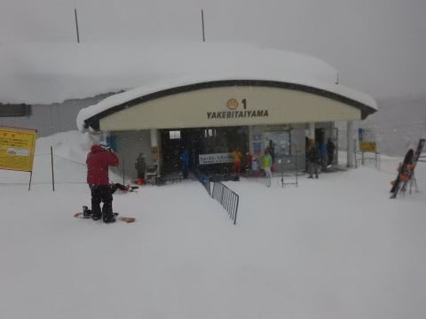

…並んでいる人は少なく．

いつもの顔ぶれですね…

もう6日連続なので．

そろそろ見飽きた感もある，

山頂温度計を今日も見てみると．

朝の気温は-11℃ですか…

今日も寒いよ！

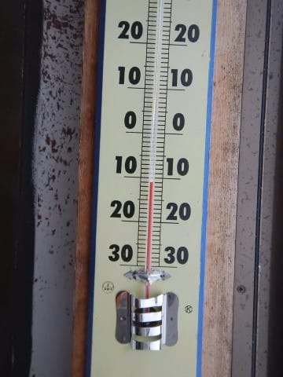

そして．

そろそろ見飽きた1ゴン山頂．

…今日も雪降り．

明け方から強く降っていて．

ちょっと積もってそうですよ…

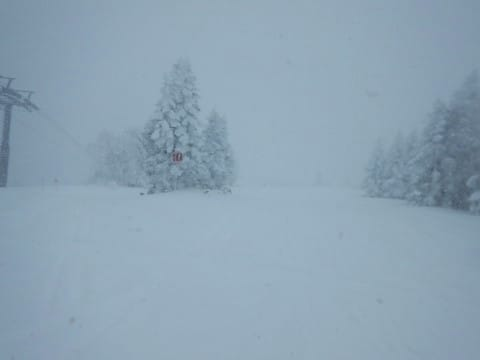

ってな感じで．

コースに飛び出すと．

圧雪後に結構降ったようで，

圧雪上に5～10cmの積雪が！

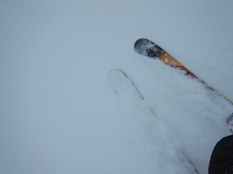

圧雪コースでも．

あさイチは結構パウダー斜面っぽい感じ…

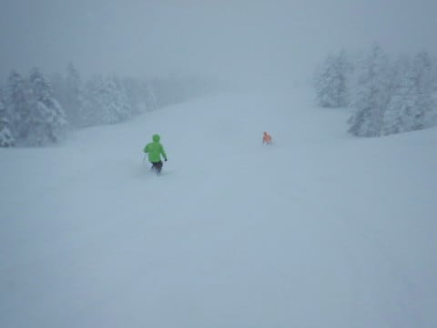

…でも．

新雪が積もってると．

午後になると，新雪が蹴散らされて，

凸凹になっていくパターンですね…

とりあえず．

新雪が積もっている気配なので．

当然，オリンピックコースへ向かいますが．

…オリンピックコースは．

うーむ．脛～ブーツパフ．

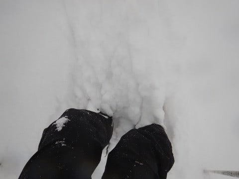

圧雪コースもかなり新雪だったので，

期待したんだけどな～．

思ったほど深くないな…（ちょいと残念）．

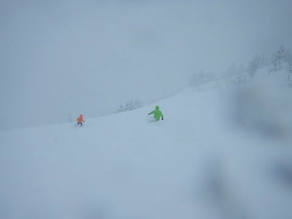

底付きしてしまって，浮遊感がなく，

普通の斜面を滑ってる感じ…

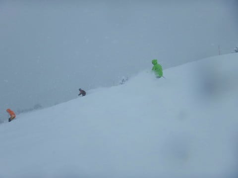

でも，軽めの新雪で．

パウダーを巻き上げながら落下して

いけます！

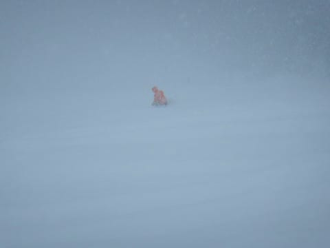

ちょっと視界が悪いのが惜しいけど．

まぁ楽しめたかな…

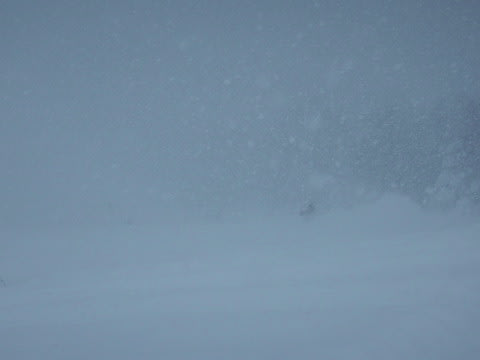

圧雪がかかっているGSコースも，圧雪後に

積もった雪で，結構なプチ新雪コース！

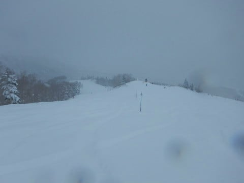

積雪は10cmほどだけど．

雪が軽いから，結構な雪煙が上がるよ！

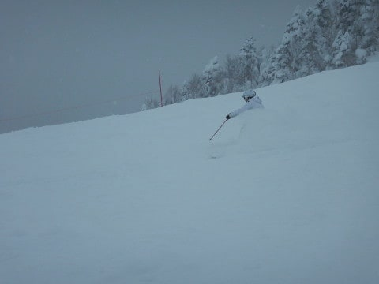

白樺コースも，プチ新雪！

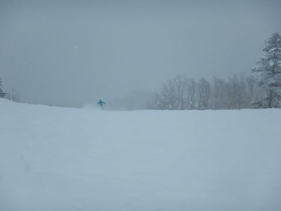

もう，今日はどこに行っても，

朝は全面新雪状態！

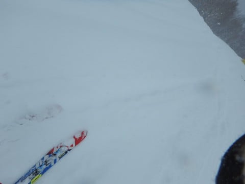

さらに．今日は昼間の最高気温も-9℃と

冷え冷えの一日で．

終日雪が降り続け．

時折視界が悪くなるほど強く降ったので．

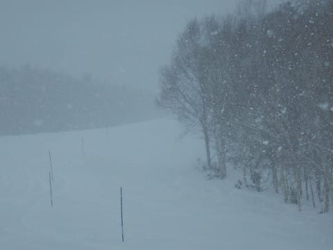

あまり滑る人が多くない，ブナコースや…

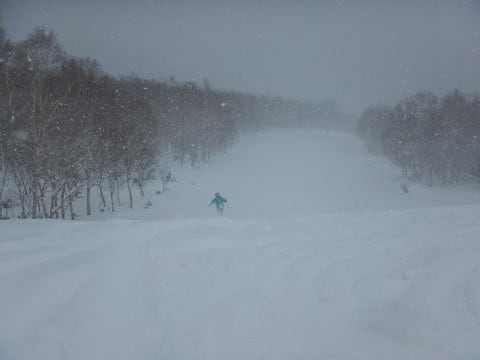

オリンピックコースは，昼ごろになっても

柔らかい雪がコース上に乗っていて．

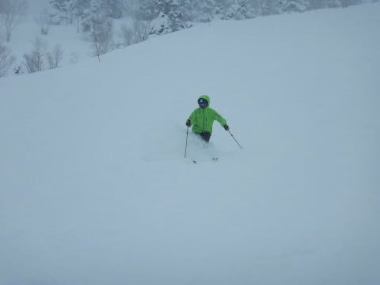

午後までパフパフ感のあるコース状況

でした～！

ただ，

3が日最終日の本日．

パノラマコースや，GSコースはちょいと

滑っている人は多めで．

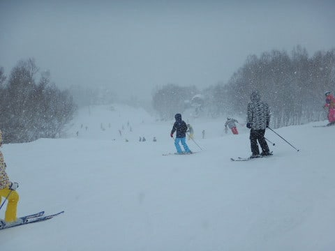

人が多かったこれらのコースは．

朝は新雪だったけど．

昼ごろには，新雪が蹴散らされてしまい，

全面荒れ荒れ凸凹バーンに…（ちょい涙）

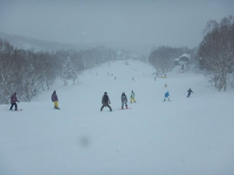

でも，ゴンドラは終日ガラガラで，

最高でもこの程度の待ち時間．

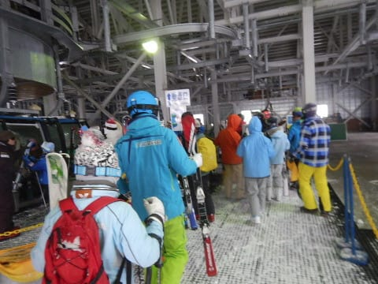

吹雪気味の本日．

昼間の最高気温も-9℃と，かなり

寒かったので．

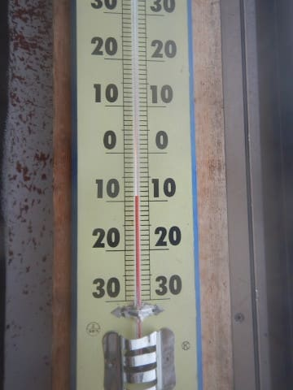

リフトに乗ってると，凍死するかと思うほど

寒かったので．

リフトに乗ろうと思う人は少なく．

当然のごとく，リフトは待ち時間0ですね…

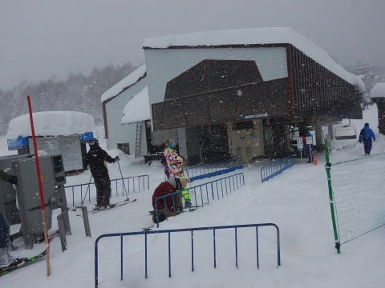

ってな感じなので．

午後も遅くなると．

滑っている人もかなり減ってきましたね…

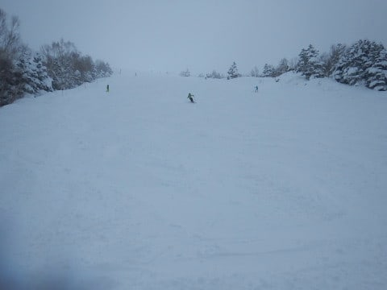

そして．

夕方になると．

完全貸し切りバーン化！

人がいないゲレンデを，好き勝手

滑れるよ！←いや，悪天候で凸凹が見えないうえ，寒くてたまらないから誰も滑ってないだけだから．

そこを喜んで滑れる人はそうそういないから

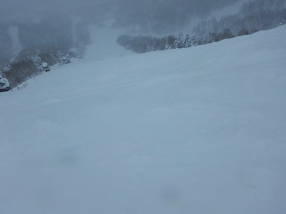

ということで．

終日雪降りで，寒くて視界が悪くて，

午後はコースが荒れ荒れの，ちょっと辛めの

一日でしたが．

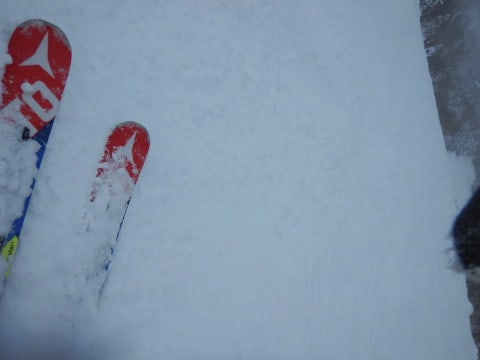

今日もリフトストップまで，しっかり

滑ってきたのでした…

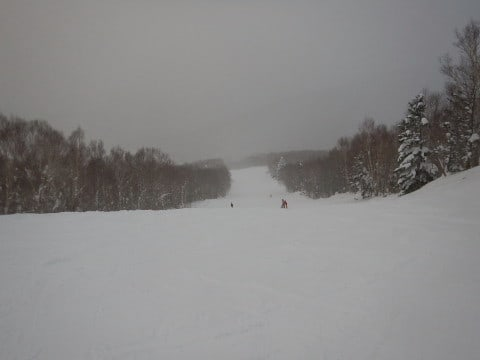

その後，5時間運転して自宅に戻ってきましたが．

…6日間連続スキーで．

結局毎日ナイターに繰り出し．

さらに元日は早朝まで逝って行って

しまったので．

さすがに疲れました…

…いや．いろんなツッコミが入りそうなので

言っておきますが，私も人間ですので，疲れますから！！

ということで．

明日はスキーをせずに一日のんびりする

予定です…

## 💬 コメント一覧

### 💬 コメント by (若杉勲71)
**タイトル**: Unknown
**投稿日**: 2019-01-04 10:16:22

すごすぎる過密日程ですね。年末年始だけ二週間自宅に帰るのですが、sさんの臨場感溢れるレポートのおかげで、心が志賀高原に飛べます。オリンピックでモデルになっているのは、ゆみりんさんご夫婦っぽいですね。7日からずーーっと行きますので、またお声掛け下さいね。

### 💬 コメント by (ホンダ)
**タイトル**: 今日はサイコーの天気
**投稿日**: 2019-01-04 15:10:58

今日のヤケビは朝は曇りでしたが10時過ぎからメチャクチャ良い天気でした。大変気持ち良く滑れましたよ〜。明日はどうですかねー。

### 💬 コメント by (hiro)
**タイトル**: お世話になりました！
**投稿日**: 2019-01-04 15:51:58

昨日は、何本も一緒に滑っていただきありがとうございました。しかも貴重なレクチャー付き！家族中感激しております！大御所様とも滑れまして光栄でした！今週末以降もタイミングが合いましたらお声掛けさせていただきます！

### 💬 コメント by (はっち)
**タイトル**: やはりヤケビにいらしたんですね
**投稿日**: 2019-01-04 17:55:05

３高中心に廻っており、すれ違いだったようですね。　近いうちにヤケビでお会いできればと思います。　ちなみに今日(４日)は、ピーカンのスキー日和でした。　ただ人が多くて午前のうちにGSは凸凹になってきましたが。。。

### 💬 コメント by (サトシ父)
**タイトル**: 明日から最後の…
**投稿日**: 2019-01-04 19:02:10

今の車で最後の志賀高原です。8年間ガンバってもらいました、少し寂しい気もします。年末Ｓさんにご挨拶できず残念でした…銀のお札欲しかったなぁ(ヤケビで何故かよく見かけます)。

### 💬 コメント by (まーさん)
**タイトル**: ３日の横手山
**投稿日**: 2019-01-04 20:32:22

横手も死ぬほど寒かったですよ、おまけに吹雪いてホワイトアウトの世界で泣きが入りましたが、４日は打って変わっての好天で焼額山からジャイアントまで最高でした。

### 💬 コメント by (michi)
**タイトル**: Unknown
**投稿日**: 2019-01-04 20:53:02

昨日はお疲れ様でした。

昨日と打って変わって今日は今シーズン最高の天気、雪質でしたよー。

朝一はとても人が少なく平日だからと思いましたが10時過ぎると1ゴンもリフトも結構混んでました。でも夕方になっても白樺や唐松は大回りできて楽しめました(^^)

### 💬 コメント by (Skier_S)
**タイトル**: 明日から志賀高原へ復活！
**投稿日**: 2019-01-04 23:17:20

＞若杉さま

明日朝3時（というか，今晩深夜）からまた志賀高原へ移動です．

6日までの滞在なので，入れ違いですね．

来週3連休にお会いしましょう！

＞ホンダさま

いい天気だったようですね…今日は．

うらやましすぎます…

でも．明日もいい天気になるはず！

私がゲレンデに復活するから，

神様は私のために，晴れにしてくれるはず！

…ホントに明日晴れたら，志賀高原の天気を

決めているのは私だと思ってください（笑）

＞hiroさま

3日はご一緒いただきありがとうございました～！

いろいろ大御所の方々ともお会いできて

楽しかったですね（笑）．

また来週以降も毎週焼額にいますので，見かけたらよろしく

お願いします～！

＞はっちさま

ありゃ？昨日いらしてたんですね…

全然お見かけしませんでしたね．

天気が悪かったので，リフトは寒くて耐えられず

1ゴングルグルでした．

明日もいらっしゃるようなら，またお会いしましょう！

＞サトシ父さま

あ…銀のお札をお渡しし忘れていました…．

すみません．

次はいつ志賀高原へいらっしゃるのですか？？

年末も何度かすれ違っていたのですね…

お声がけいただければ，いつでも銀のお札をお渡しいたします～！！

＞まーさんさま

横手山は寒かったでしょうね…

横手は吹雪くと，焼額比20％増しくらいの寒さですから（笑）．

4日はやっぱり天気良かったんですね…

…いいもん．

悔しくなんかないもん！！（すごい悔しい）

＞michiさま

3日はお世話になりました！

また娘と一緒に滑っていただきありがとうございました．

今日も滑ってらしたのですね…

晴天の元日に滑れなかった分，取り返せたでしょうか（笑）．

明日もいい天気になってほしいなぁ…（懇願）

