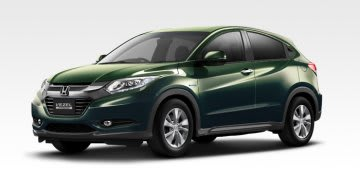

# VEZEL HYBRIDに乗ってみた…試乗レポート

📅 投稿日時: 2014-06-27 01:28:45

えー．

月山のリフト運休が，7月15日まで延長になったようで…

…営業開始しても，Tバーはもう営業終了しちゃってる

可能性が…

今年も雪が多いシーズンだったので，ちょいと

残念な感じがする今日この頃ですが．

まぁ，私はもうシーズン終了宣言しちゃったし，

ま，いっか．

ってことで．

本日は．

ホンダから発売になった，FITベースの

SUV風モデル，ヴェゼル．

こいつに乗ってきたので，試乗インプレッションをば…

---

VEZEL　HYBRID　4WD

(HONDA HPより拝借）

今回試乗したのは，ハイブリッド，それも4WDの

モデルです．

とりあえず．

FITベースですけど．

FITとは，全く別の車ですね～．

ステアリングを含む，内装の質感はいい感じ．

静粛性，タッチ＆フィールの高級感，

足回りの完成度，すべてベースのFITを

凌駕しています．

スバルで言えば，XVとXVハイブリッドの仕上がりが

全然違いますが（見た目はほとんど一緒だけど），

その感じに近いか…

エンジン音は，かなり静か．

FITのハイブリッドだと，踏み込んでエンジンが

思い切り回っているときのエンジン音はかなり

にぎやかだけど，そこの遮音はしっかりしていますね～．

でも，車重が重いからか，FITハイブリッドより

エンジンが止まっている領域が狭い気が…

バッテリー残量があるのに，結構エンジンが

回りっぱなしでした…．

電動パワステも，しっとりした感じになり．

高級感はFITよりずっと上．

でも，パワー感はFITと変わらず．

踏み込むと頑張るけど，1.5Lのエンジンを，

かなり気合いを入れて引っ張っている感じ…．

モーターのトルク感もあって，実際にパワーは

出てるんだろうけど，

この，1.5Lのエンジンの回転数が上がって，

苦しそうにパワーを出している音が，

加速感をスポイルしている…

「あれ？このエンジン音でこの加速感？」

って感じで，ちょいと重苦しい感じというか，

回転数が高めのエンジン音が何だか，こう．

ちょっと残念な感じ．

…このあたり，2LエンジンのXVハイブリッドの

方が圧倒的に気持ちいいかな．

今回，残念ながら，平地の街中での試乗だったので，

コーナーを攻めた時の反応は全く分からず．

当然，4WDならではの特性は全く分からず．

雪道とかどうなのかがちょっと気になるところ

ですが，4WDがようやく電子制御カップリング

方式になったようなので，デュアルポンプ4WDより

かなりマシになったのでは…と，ちょっと期待．

ただし…

VEZELハイブリッド．

4WDでナビつけると300万近くする車です．

LEVORG1.6GTアイサイトやXVハイブリッドと

ぴったり同じ価格帯．

うーむ．

まだ，VEZELの4WDの完成度はわかりませんが．

スバル4WDの雪道での安心度を知ってしまい，

LEVORGも，XVハイブリッドも，VEZELより

ずっとエンジントルクが太く，走りを重視した

ワクワク感が有る車で．

さらに，アイサイトの完全停止まで自動追尾の

オートクルーズの楽さを知ってしまった今．

同じ値段なら，アイサイトがついてくる

XVハイブリッドかレヴォーグがいいかな～．

## 💬 コメント一覧

### 💬 コメント by (megalith)
**タイトル**: Unknown
**投稿日**: 2014-06-29 21:50:55

コメント遅くなりました。m(__)m

レヴォーグ試乗されたんですね。

自分の所のディーラーもようやく1.6GT-Sが試乗車として入ったようですが、まだ乗ってません。（汗）

さて、VEZEL HYBRID実はうちの上司が去年の発売と同時に買ってきました。(^_^;)

しかも、ナビ付き・専用通信装置(回線はどうもSoft Bankらしい)込みの最上位車を。

聞いたら、「4WDハイブリッドのベーシックモデルはすでに3ヶ月～5ヶ月待ちだったが、この車種なら1台分枠が開いているので、発売と同時に納車できるということだったからこれにした。」だそうで・・・・

燃費は具体的な数値は忘れましたが、乗り方によりますが相当良いそうで、冬も問題なかったそうです。

驚いたのが、PC等インターネットで燃費データ等表示できる点ですね。

専用通信でHONDA専用サーバーとやりとりしているので面白いみたいです。

まぁもっともSkier_Sさんもスバルにハマりこんだ1人ですし、これからアイサイトがどう進化していくのか楽しみましょう。（笑）

### 💬 コメント by (Skier_S)
**タイトル**: megalithさま
**投稿日**: 2014-06-30 18:59:34

もう、私はスバルにはまりまくって

ますので…(^_^)

vezelもいい車なんですが、ちょっと

お値段高いかな～、と。

最上級グレードだと、簡単に300万円

越えますから…

燃費至上主義なら、ありの選択肢だと

思いますよ！

### 💬 コメント by (koppel)
**タイトル**: はじめまして
**投稿日**: 2014-07-06 20:48:21

はじめまして。北海道在住で、ＳＵＶに乗り換えようかと情報収集中です。

ちょうど今日、ヴェゼル試乗してきました。

ハイブリッド4ＷＤのX-Lです。

エンジン音の部分、私も同じ感じがしました。

なんか、違和感あるんです。たいしてアクセル踏んでないのに、

エンジンがすごく頑張ってる感じで。

乗り心地は予想以上に良くて驚き、内装の質感も悪くないし、燃費も良さそうなのですが、

どうもエンジンのフィーリングがピンとこなくて悩んでいます。

ホンダのＭＯＰナビはiPhone使ってる私からすると連携しやすそうで魅力

なんですが、おっしゃるとおり車両価格で300万円越えなので、フォレスターや

エクストレイルと全く同じ価格帯になってしまいます。

３車とも試乗して比較した感じでは、エクストレイルやフォレスターの方は

違和感ないんですよね。アクセル踏んだだけ前に進む感じで。

今、すごく頭悩ましてます。

### 💬 コメント by (Skier_S)
**タイトル**: koppelさま
**投稿日**: 2014-07-07 00:36:33

初めまして～！

ようこそ，駄文置き場へ…

VEZELですが，おそらく乗った多くの人が

同じ感想を抱くかと…

モーターアシストが効くはずなのに，

やっぱり1.5Lのエンジンってところに無理がある

のかな～，って感じです．

やはり，エクストレイルやフォレスターの2.0L

エンジンのほうが，楽に走れますが…

でも，燃費はやはりVEZELハイブリッドの方がいいと思うので．

燃費を重視するのであれば選択肢かな～，と．

ただ．

3万㎞走ったら，ガソリン代で10万円くらい

差が出るかも…

気持ちよさと，1万㎞あたり3万円くらいの

ガソリン代．

どっちを取るか…

という個人の主義によるかと（笑）．

ちなみに，燃費ハイブリッドではないので，

それほど燃費は良くないですが，XVハイブリッド

という選択肢もありますよ．

コーナーを攻めた時の走りや

乗り心地は，SUVの中でピカイチでした…

### 💬 コメント by (koppel)
**タイトル**: VEZELハイブリッド購入しました
**投稿日**: 2014-09-06 14:18:52

2ヵ月ぶりに訪問いたしました。

結局、私はVEZELハイブリッドにしました。

理由は、7/10発表のリコール対応です。

実は、その直後にリコール対策済の試乗車に乗ったのですが、明

らかに改善されてました。ハイブリッド走行とエンジン走行の切り

替わりなどがスムーズで違和感なくなってました。

そして、装備が意外と充実していて、見積とると結構安く済むことも

プラスに働きました。

4WDのHV-Xを購入しましたが、標準装備として、

LEDヘッドライト(ハイビーム、フォグは違う)、LEDルームランプ、

カーテンエアバッグ、サイドエアバッグ、シャークフィンアンテナ、

リアスポイラーなどがあります。もちろん、シートヒーターやヒー

ティッドドアミラー、フロント撥水ガラスなども標準。

また、ラゲッジ部は巻き取り式のトノカバーとハードタイプのラゲッジ

ボードと選べる（どちらもオプションですが）のも良かったです。

値引きも、22万円ほどとリコールがあったせいか、思ったよりあり

ました。あと、車体が小さい割には車中泊できるのもGoodです。

### 💬 コメント by (Skier_S)
**タイトル**: koppelさま
**投稿日**: 2014-09-07 23:14:27

購入おめでとうございます！

VEZELになりましたか…

リコール対象後，そんなに変わったんですか！？

私も試しに乗ってみないと…

私も走りなら絶対スバル車だと思いますが，

燃費重視ならVEZELの選択肢で正解だと思います…

雪道を走るとか，山道をガンガン走るとかなら

絶対スバル車をお勧めしますが，

＃雪道でのスバル車の安心感は別格

街中を走っている分にはVEZELで問題ないですし，

1.5Lのコンパクト車ベースの車なので，

燃費は良いかと．

スバルにもXVハイブリッドがありますが，燃費重視の

車ではありませんし（笑）．

とりあえず，せっかくの高い買い物です．

満足のVEZELライフをお過ごしください！

