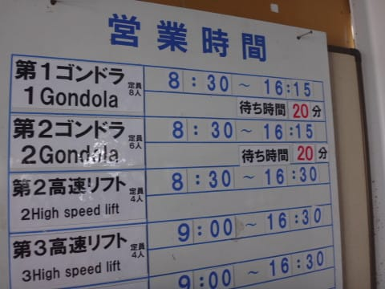

# 2月26日，日曜の志賀高原速報モード…晴れ時々雪，ゲレンデは硬めだったよ

📅 投稿日時: 2017-02-27 03:06:41

🏷️ カテゴリ: [2017スキー滑走日記](c7d777cecfc91bdf0fa464ad62c6d49ab.md)

なんだか．

本日も日付が変わった後に帰宅し．

そのあと3セットの板をワクシングしたり．

板の手入れをしていたらこんな時間…（涙）．

だもんで．

そうです．

今日も日曜夜定番の，速報モードにて…

えー．

結構冷え冷えの本日朝，

すっきり晴天でスタートです！

…でも．

すっきり晴天ということは．

…そうです．

積雪がなかったということで．

ゲレンデはかなり固めのバーン…

しばらく経つと．

ゲレンデは大量のコロコロが現れて，

ちと怖い感じに…（涙）．

さらに追い打ちで．

ゲレンデは意外と人が多く．

…そして，ゴンドラ20分待ちの案内が…（涙）．

＃第1ゴンドラは，実際は10分も待たなかったけど

しかし．

昼過ぎまでは．

すっきり気持ちいい晴天で，

ゲレンデが固めだったから，午後になっても

コブになって荒れることなく．

夕方になってもコブコブにならず，

こんな感じのフラットバーンだったから．

固めのバーンが好きな人は，

午後になってもハイスピードバーンで

楽しめたかも…

…ただ．

ところどころこんな感じでしっかり固いので．

エッジをしっかり手入れしてないと怖いですけど（笑）

で．

午後は時々雪が舞うタイミングもあったけど…

この雪は積もるほどではなく．

リフトストップまでフラットバーンだったので．

固い斜面とはいえ，それはそれで楽しめたかな…

って感じで．

また明日，詳細レポートします～！！
