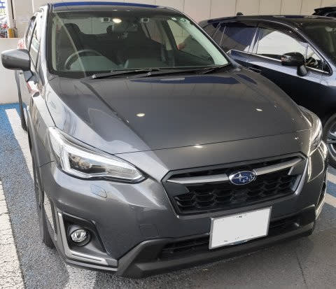
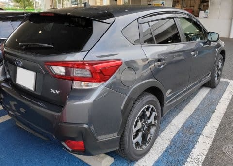
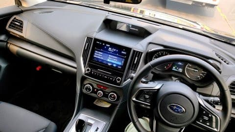
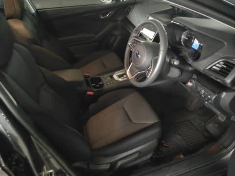
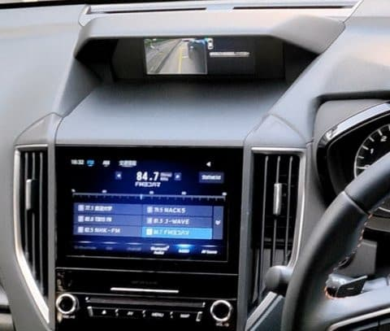
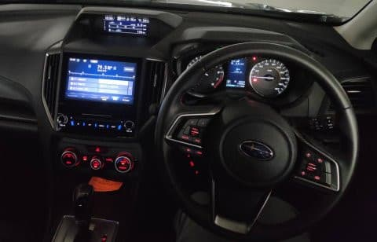
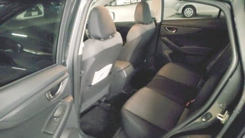
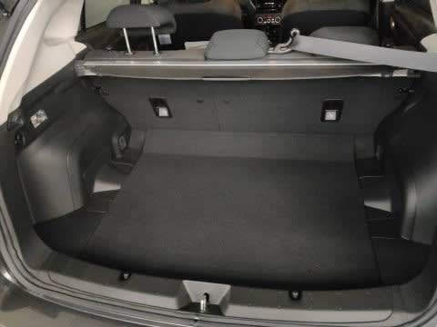

# スバルXVの1.6i-LアイサイトC型に試乗してみた

📅 投稿日時: 2020-09-14 01:26:59

🏷️ カテゴリ: [車試乗](c07dec5709d34bd74e1f6cb9c8291061b.md)

えー．

LEVORG君の1年点検に車を出した時に，

代車を借りて．

その代車が，試乗車として使っている，

XVのD型の1.6Lだったんですが．

…せっかく乗ったんだし，ちょっとこいつの

試乗レポートを書いておきましょうか…

すでに現行C型の生産は終了し，

10月からビッグマイナーチェンジ版のD型に

切り替わるということもあり，今さら感も

ありますが．

とりあえず，C型のXVの試乗レポートをば…

まず，見た目ですが…

まぁ，好き嫌いがはっきりする車だと思いますが．

私は好きです（笑）．

でも，1.6Lのエンジンにしては車体が

デカすぎる感じがしないではないかも…

で．

内装は…

200万の車として考えれば，

車格以上の質感！

…ってか，250万円以上する2.0Lの

グレードと内装は変わらないので，

価格以上の内装感があるのは当然かな．

ただ，この車．

試乗車ということもあり，本革シート以外の

オプションがほとんどフルでつけられていて．

視界拡張のサイドカメラもついてるし．

（一番上のインフォメーションディスプレイに

　カメラ画像が写っている）

ステアリングもオプションの本革仕様だったので，

高級に感じたってのもあります…

リヤシートは，必要十分な広さかな．

ってか，現行LEVORGよりちょい広いくらい．

トランクは…

まぁ，これだけあれば普段使いで

足りなくなることは無さそうな感じ．

ってことで．

実は，この型のXV．

2.0ハイブリッド仕様のe-BOXERは

[過去に乗っている](e4f28c967b496bd3e1c332daea77dd747.md)のですが．

今回，1.6Lの出来はどうかな？

ということで．

じっくり走ってみます…

とりあえず．動き出しは…

結構静かな，高級な感じですね．

そして，段差乗り越えもジェントルな感じで，

ボディはかなりがっしり感がありますね…．

で．

ちょっと加速してみると．

…う．

ボディが重く感じる…

というか．

端的に言って，アンダーパワーに感じます．

踏み込んで行けば，絶対的パワーは

「まぁ，こんなもんかな」

って感じで出てくるのですが．

加速の最初の，アクセルを踏んでから加速Gが

出てくるまで．ちょっと待つ感じがあります…

加速Gが出てくるまでに，CVTがローギヤ側に

落ちて，回転数が上がって，それからやおら

出力が出てくる…

という感じで，ラグもあるし．

さらにエンジン回転が高まりエンジン音が

頑張り始めるので．

エンジン音の頑張りほどスピードが出てないよ！

…という感じになります．

うーむ．

やはり，1.4tを超えるボディに，1.6LのNAはちょいと

アンダーパワーか…

でも，クルーズに入ると回転数もぐっと落ちて

静かだし，いい感じ．

あ，この車．

パドルシフトがついているので．

こいつであえてマニュアルシフトして，

エンジン回転を引っ張りながら

パコパコシフトしていけば，ラグを気にせず

加速できますよ～！

高速の加速とか，いざ加速したいって時に，

アクセル踏み込みと同時にシフトダウン

すれば，エンジンは頑張ってます！って

音を出しますが，パワーは出ます（笑）．

そして．

ステアリング．

これは，この車格以上のいいステアリング

フィールです．

ただ，ちょっとインフォメーション感が

少ないかな…

とはいえ，電動パワステもものすごい滑らかで，

不自然な反力もなく，全く違和感なし．

最近の車は，全体的にステアリングフィールが

かなり改善されてますね…

で．

足回り．

これは，段差の乗り越えやショックの吸収に

関しては，かなりいい感じなんですが…

e-BOXERの時は，かなりいい感じを受けた

このサスペンション．

1.6Lのこいつに乗ると…

ちょっとロールの収束が遅く，

突き上げを受けた後のボディ上物の動きが

大きめに感じます．

感覚的に，バネレートとダンピングが

e-BOXERより弱くしてある感じ．

e-BOXERの方が150kg以上重いので，

バネレートもちょい高めにできて，

かつばね上の重さで，上物が安定してた…

ってのがあるのかもしれません．

スタビライザーも，e-BOXERより

弱くしてあるか，あるいはリア側は

外してあるとかかな？

前にe-BOXERがすごく良かっただけに，

上物がちょっとゆらゆらする感じが

e-BOXERより強く感じたのが

残念…

いや，とはいえ，e-BOXERより50万円以上

安い車と考えれば，かなり上出来です．

比較的良くできている足だと思います．

かなり滑らかに動きます．

ってなことで．

走った感じは，e-BOXERのほうが

1グレード高い車だな，と思わせる

だけの差がある感じでしたが．

230万円で4WDで，

さらに高速道路でほぼ自動運転と言える

アイサイトツーリングアシストが

着いてますから．

この完成度なら，

エンジンパワーがもう少し欲しいところを

我慢出来れば，

結構お買い得な車なんじゃないか…？

と思った，Skier_Sだったのでした．

## 💬 コメント一覧

### 💬 コメント by (ぽぽきち)
**タイトル**: Unknown
**投稿日**: 2020-09-14 07:57:11

1.6xv乗りです現行アイサイトはツーリングアシストがついてます、進化しています。スキー、ボード大好きです、当地コロナ暖冬でスキー場が倒産しました。今年も札幌手稲に遠征予定。

### 💬 コメント by (Skier_S)
**タイトル**: ＞ぽぽきちさま
**投稿日**: 2020-09-15 00:52:19

コメントありがとうございます～！

1.6Lでもアイサイトツーリングアシストがついているのが

いいですよね…

スキー，ボード大好きですか！

これからもご愛読お願いします～！！

### 💬 コメント by (匿名)
**タイトル**: Unknown
**投稿日**: 2020-10-25 11:03:22

AnotherSKI スキー試乗レポートまとめ　のコメントをいつも参考にしています

今回は　BR9レガシィの車検か　乗り換えかの参考にさせて頂きました

### 💬 コメント by (Skier_S)
**タイトル**: ＞匿名さま
**投稿日**: 2020-10-25 20:26:07

XV，1.6LだとBRレガシィからの乗り換えはちょっときついと思います…

2LならOKです！

ただ，今は2Lは全てe-BOXERになってガソリンタンクが48Lなので，

長距離乗る人は給油頻度が上がるかも…

