# 2023/3/5(日)の志賀高原焼額山スキー場の速報レポート！…終日晴天，気温が上がって雪はしっとり重めに(涙)．人もちょい多め

📅 投稿日時: 2023-03-06 03:37:53

ってなことで．

今日も当然，ラストリフトまで滑ってきた

わけですが…

帰り道の上信越道，坂城近辺の工事車線規制

渋滞なんかで時間がかかり，帰宅は

深夜12時…(涙)

だもんで．

今日も帰宅日恒例，速報モードにて！

えー．

本日は，予想通りの晴天でスタート！！

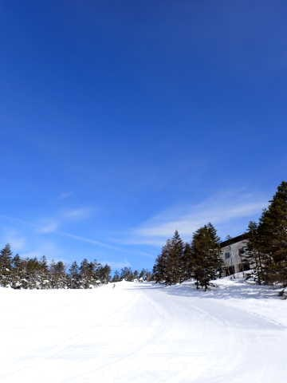

あさイチの気温は-5℃程度で，

冷え込みはそれほどではなかったけど．

いつも通りのシマシマがお出迎え！

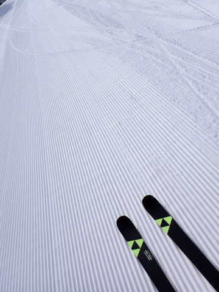

ちょっとだけ表面が崩れていくような

感じの雪で，やわらか最高バーンでは

なかったけど…

でも，晴天シマシマを堪能！！

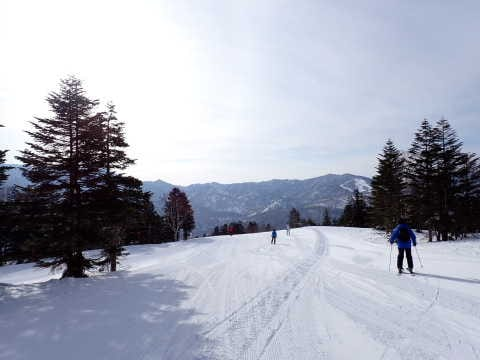

朝のうちは雪質も良かったし．

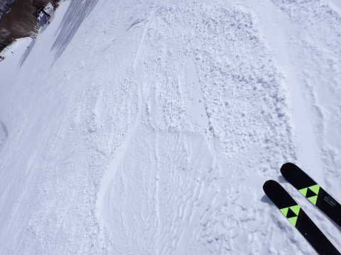

見事な晴天のフラットバーンを

飛ばしたい放題というゼイタクを

満喫できたけど…

昼前には…

なんだか，気温もわずかながらプラスに上がって

しまい．

雪がボソボソに固まり始めたかと思うと…

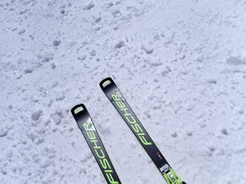

GSコースや唐松コースの落ち込み部分の

日当たりのいいバーンは，ボソボソの

ダマダマ雪になっていきました(泣）

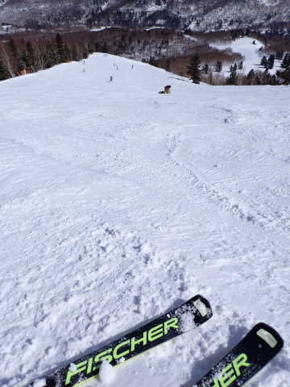

上の写真，一見まともな雪にみえますが…

握ると固まっちゃう，完全春の雪です…(涙)

あぁ…春がやってきたか…(激泣)

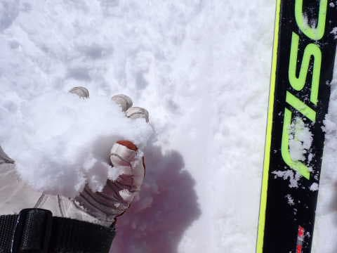

午前中は人も多めで，ゴンドラもゲートの

外に列が着く程度に混むこともあったけど．

焼額第1ゴンドラは午後はゲート外まで

並ぶことはほとんどなく．

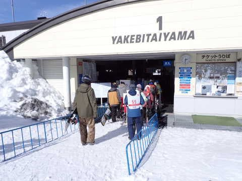

午後はゲレンデの人も減っていったけど…

でも，日差しで雪が緩んだので．

雪は重めだし，柔らかくなってきたこともあり，

午後はボコボコと言わないまでも，多少

荒れた感じになってきました…

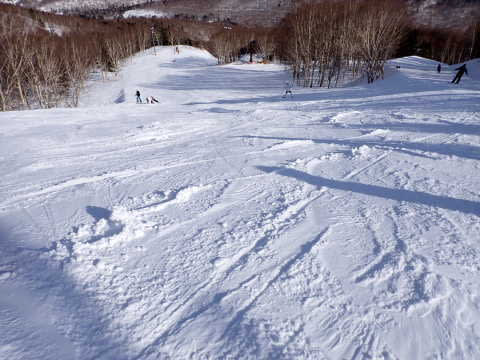

ってな感じで．

春の雪になってきてしまった本日の

志賀高原でしたが．

晴天で寒くなかったし，

3月になったことを考えると

そこまで雪はザブザブにならなかったので…

春スキーだと思えば，結構いいコンディション

だったのかも？？

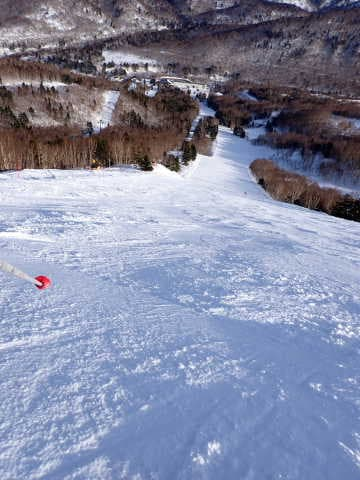

春ですねぇ…(泣)

しかし．

普通なら，3月第1週は志賀高原ならまだ

トップシーズンの雪のはずなんだけどなぁ？？

でも．

これから1週間，さらにもっと気温が

上がるので．

次の週末，11，12日は完全にザブザブ雪の

春スキーになりそうです…

というより．

3月上旬なのに，1週間ずっと850hpaの

0℃線が志賀高原より北にあるって

どういうこと！？？？

ありえない…(激涙)

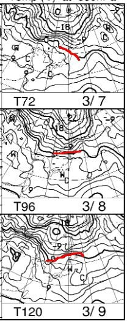

　

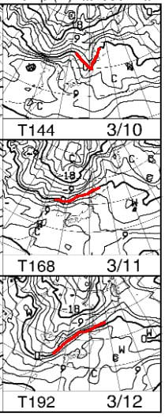

これから1週間，

志賀高原でも降れば絶対液体になる気温

が続くけど．

とりあえず1週間，降らずに済みそうというのが

せめてもの救いか…

とりあえず．

これからまた，このBlog読者全員で

寒いギャグを言い続け，

日本を激寒にするしかない！！

Repeat after me!

「これドイツのだ？」「おらんだ」

「ソ連でひげ剃れん」

「イランに入らん」

「タイに行きタイ」

「カナダの彼方」

「若気のイタリヤ」

…寒い…かなり寒くなってきた…

## 💬 コメント一覧

### 💬 コメント by (シルバー＿ヘッド)
**タイトル**: Unknown
**投稿日**: 2023-03-06 09:58:46

初めまして。何時も楽しく読ませて頂いております。昨日、念願？の挨拶ができました。スキー場では、スッと滑っていかれるので、まさかのゴンドラで会えたのはラッキーでした。厚あつのGS板跳ね返りが良さそうですね。やはり、焼額山はGS板が良いと思います。自身がもう少し果敢に滑れたらご一緒したいです。ブログ読者で楽しませて頂きます。

### 💬 コメント by (新米パパ)
**タイトル**: Unknown
**投稿日**: 2023-03-06 09:59:17

土曜はお疲れ様でした。

ウェアも変え、キャラも芸風も変えてきましたね。

第3週にまた焼額山にうかがうつもりです。

劇速のヤケビキッズ達も人数が減りました？

### 💬 コメント by (スシネコ)
**タイトル**: Unknown
**投稿日**: 2023-03-06 12:09:30

坂城の工事は4月末まで24時間通しで実施されるようですね。昨日は更埴インターで一度降りて坂城インターから乗り直しました。10分ぐらい遠回りでしたがどちらが正解だったのでしょうね。

来週からは殺人コロコロとザラメ雪との闘いになるのでしょうか。心して参戦せねば。

それでは私からも日本を激寒にするために一句。

「ニュージーランドの乳児乱童」

（乱童･･･アニメ幽遊白書に登場する妖怪）

### 💬 コメント by (ダウンヒル)
**タイトル**: Unknown
**投稿日**: 2023-03-06 13:11:31

Sさまお疲れ様です。

寒くなれ～!

【アルミ缶の上にあるミカン】

### 💬 コメント by (tomorrow)
**タイトル**: Unknown
**投稿日**: 2023-03-07 08:09:17

今日は、いつも楽しく拝見しています。

志賀に行くときの天気予報、頼りにさせていただいています。

この日の「鉄腕ダッシュ」焼額山で巨大雪玉作りでしたね。

無茶しよるなぁ～とテレビを見ていました。

東館前の「ひらなり」（雪玉）の写真はお持ちでしょうか？

### 💬 コメント by (レインボー75)
**タイトル**: Unknown
**投稿日**: 2023-03-07 15:35:06

火曜日の志賀高原情報

春、陽光うららかな日。帰路(13時30分)の蓮池+8℃　上林+14℃。早く来ないと雪が溶けちゃいますよー。

でも、ゲレンデは絶好調。うはうは滑りまくる何人かのサボリーマンを見かけましたよ。

白樺、唐松、オリンピック、GS、全て快適。ダウンヒルは捨てて、目指すはエキスパート。

非の打ち所のない斜面。R25の重すぎる借り物板が勘違いさせてくれる。快楽快楽！

信州プレミアム割を使わないといけないので、グランフェニックスでカキフライ定食。

この割引がないと、庶民にはなかなか。

帰路のパノラマ、サウスは、陽が照ってぼこぼこだったけど、柔らかくてまだ大丈夫でした。

### 💬 コメント by (Skier_S)
**タイトル**: コメント回答遅れました
**投稿日**: 2023-03-08 08:36:36

＞シルバーヘッドさま

日曜はありがとうございました～！

まさか駐車場が隣だったとは…

焼額の朝イチは，強いGS板が最高ですね～．

また焼額でお会いしましょう！

＞新米パパさま

キッズ達も中学生になると，部活などでなかなかスキーに来れなくなりましたが…

でも，新世代キッズ達が増えてます！

第3週は，仕事がピークなので…私はスキーに行けない可能性が（涙）

＞スシネコさま

坂城渋滞は40分かかりました．

一度降りた方が速かったと思います．

4末まで片側交互通行が続くなら，来週以降も一度降りるのが正解かな？

ただ，ヘタすると高速は一旦降りた方が値段が上がる可能性があるので…

料金を調べないと．

＞ダウンヒルさま

…ダメです．まだエネルギーが志賀に届いてないのか，寒くなってないようです…(笑)

＞tomorrowさま

鉄腕ダッシュで放送されてましたね～！

車の帰り道で見てました．

写真は持ってないです…

＞レインボー75さま

サボリーマンたちがうらやましい…

気温が上がったわりには良い状況だったみたいですね．

今日，明日も気温が上がります…

金曜は天気が崩れそうです．

週末は晴れそうですが，やっぱり冷えない．

冷えてほしい…

### 💬 コメント by (通りすがり)
**タイトル**: Unknown
**投稿日**: 2023-03-09 00:44:34

坂城渋滞、40分でしたか。

単独なら中央道の方が良さそうですね。

### 💬 コメント by (Skier_S)
**タイトル**: ＞通りすがりさま
**投稿日**: 2023-03-09 02:40:09

いや…小仏トンネル渋滞もあるし，どっちが早いか微妙な感じでした…

