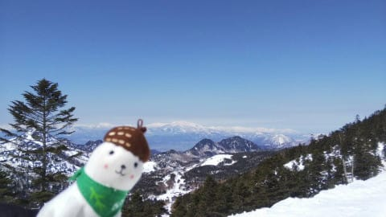

# 2021/3/11(木)の志賀高原スキー場は晴天！…そして，13日(土)は雨だけど，14日(日)は雨じゃなく雪…それも吹雪気味？

📅 投稿日時: 2021-03-12 01:11:45

🏷️ カテゴリ: [日記](cc4b5682fb7b8b144980957a978653fb0.md)

ってなことで．

本日も，まずは優秀な特派員の志賀高原レポートから！

どうやら今日も，朝からすっきり晴天で．

朝は-4℃とそこそこの冷え！

そしてゲレンデはシマシマ！

とはいえ，かなり硬めだったようです…

でも，ギリギリエッジが嚙む硬さ

ということで．

硬いのが好きなこの特派員は喜んで

いたようですが…

しかし，すっきり晴天で．

かなりいい感じのスキー日和

だったようです…

気温はそんなにひどく上がらず，

午前10時ごろのオリンピックコースは

ちょうどいい固さに緩み，楽しかった

ようです．

ちなみに，今日の焼額．

修学旅行生がいっぱいいたようですが．

ゴンドラが混むことは無かったようです…

そして．

さすがに昼間は気温が上がり，

午後には+5℃くらいまで上がっちゃったようで．

午後になると，標高が低いところや日当たりの

良い東斜面は，雪が緩んできたようですが…

奥志賀エキスパートコースは，それほど

ひどく緩まなかったものの．

圧雪車が不良で，きれいに圧雪が

かかってなかったようです…

一の瀬は昼近くになっても硬めに締まった

いいバーンで．

締まった感じながらもエッジはかかり，

いい感じだったとのことですが．

標高が高い寺小屋も，硬い下地に削れた雪が

うっすら乗っている感じで，結構

良かったみたいですね…

意外と標高が低い西館が，柔らかいながらも

しっかりエッジが食い込み，誰も滑って

無いからかフラット斜面で．

予想外に良かったという

報告が入ってました…

ってな感じで．

気温が意外と上がったものの．

かなり雪が硬くなってきたからか，

午後になっても全体的にゆるゆるに

なることは無く．

夕方まで驚きのフラットバーンだった

ようです…！！

プラス5℃まで上がったのに，

ラストのバーン状況がこんなに良いとは…

うらやましい…！

ってなことで．

すっきり晴れなのに，志賀は全体的に

春雪になることは無く．

最後までフラットバーンを滑れた，

良い日だったようです…

こんな日に滑れて，

いいなぁ…

で．

12日の金曜は，朝から晴れで，

朝は硬めのバーンで始まりそうですが．

昨日の予想と違って昼間はそれほど

気温が上がらず．

意外と締まったバーンで滑れるかも…

昼過ぎから雲が増えていき，

夕方は曇り，

…ただ，夜から液体が降ってきます(涙）

13日の土曜は，昨晩からの液体が

降り続け．南風が吹く荒れた天気(涙）

雨は時折強く降り，雪がすごいことに

なっていきそうな感じで．

…やはりこの日は，

普通の神経を持っている人はスキーを

しない方が良さそうな一日です(泣）

で，14日の日曜ですが…

昨日は，日曜は朝が雨，気温が上がると予想しましたが．

予想，変わりました

850hpa図を見ると…

赤く印した0℃以下のエリアが孤立して，

まるで志賀高原を覆うかのように

なっているので…

志賀高原は，マイナスをキープしそう！

だもんで．

日曜は明け方から雨が雪に変わり．

朝は-3～5℃くらいまで冷えてそう！

朝はガチガチバーンの上に，

5-10cmくらい新雪が乗ってるかも？

で，地上天気図を見ると．

降水域が日本海側を覆っているので．

日曜の志賀高原，一日パラパラと雪が

降り続けそうですね．

昼間は0℃近くまで気温が上がるので，

ちょっと重い雪になるかも

しれませんが…

うーん．

せめて，雨で雪が解けた分，積もって

欲しいところだけど，期待薄か…

しかし．

平日の特派員レポート．

いい天気の写真が続いているのに．

なぜ，狙ったかのように週末の

天気が悪いのか…

おそらく．

今週末土日にスキーに行く人に．

かなり日ごろの行いが悪い人がいるんじゃないかな？？

…だれだ！！日ごろの行いが悪い奴は…！←自分の可能性は１ミクロンも考えていないのか…？

## 💬 コメント一覧

### 💬 コメント by (スシネコ)
**タイトル**: Unknown
**投稿日**: 2021-03-12 09:17:47

おはようございます。昨日は特派員さんからいろいろなマメ知識を教えていただきました。ありがとうございました。

今朝の山頂マイナス1度。硬いバーンに圧雪ピステで上達勘違いバーンとなっております（楽だ！）。

さらに昨日より人がいなくて駐車場も1列めがまだ4台。

コースがガラガラなので私のような下手っピーでもオリンピック高速大回りを安心して練習できます。

人と言えば、西館に修学旅行生が泊まっておりその数500弱とのこと。昨日は4ロマも動いていましたがカラマツコースは数百人の学生さん（ボード）が密に上から下まで座り込んでいて、ラストまで大変な光景でした。今日も避けた方が良さそうです。

### 💬 コメント by (レインボー73)
**タイトル**: Unknown
**投稿日**: 2021-03-12 15:43:04

金曜日の志賀高原情報

ずっと曇り空だったおかげで、雪質がキープされました。スシネコ様情報どおりなので手間が省けます。

パノラマ、カラマツ、シラカバは、硬い高速バーン。西館の（ノットにしたて）高校生の動きを見て１ゴンへ。

ＧＳは硬くてとばせるけど、バーンが見にくい。オリンピックも然り。

シラカバやサウスでは、ボードの高校生がコース幅いっぱいに広がることが多くて困りました。先生が教えてあげないとだめですよね。

だけどシラカバ、カラマツは視野良好。昼前になってもズクズクにならない好条件だったけど、昼食を湯田中で評判の関英ドライブインでとるため早退。gotoeat対応で、カツ、もつ、ラーメン、うどんなどが、超値打ちに提供され、しかも安い。月火水は休みが多いので注意。先日テレビでも取り上げられた人気店。ボリューム満点ですよ。

### 💬 コメント by (Skier_S)
**タイトル**: 明日は雨（涙）
**投稿日**: 2021-03-13 00:31:48

＞スシネコさま

昨日は特派員な皆様と一緒に滑ってらしたのですね…

いつまで志賀高原滞在ですか？

明日は雨なので，覚悟のほどを…

＞レインボー73さま

かなり固めのバーンの一日だったみたいですね．

午後はちょっとザラメになったみたいですが…

そして，関英ドライブイン，行かれたんですね！

私も行ってみたいのですが…

前を通ることは多いけど，まだ立ち寄ったことはありません(笑)．

