# 2019/5/6(月)，ついにGW最終日！志賀高原スキー場レポート，速報モード…朝は晴れ．気温が高くストップ雪に(涙）．午後は曇り～小雨

📅 投稿日時: 2019-05-07 02:13:03

🏷️ カテゴリ: [2019スキー滑走日記](c3e4496fc0fb7f9c17ff21214a35b1ace.md)

終わってしまった…

なんということか．

10日間もあったGWが．

終わってしまったではないか…っ！！

ってことで．

久しぶりに帰宅しましたが．

相変わらず，帰宅時間は深夜です（泣）．

だもんで．

帰宅した日のいつものパターン，

本日のレポート，速報モードにて…

まず．

本日も早朝から参戦しますが…

早朝は晴天でスタート！

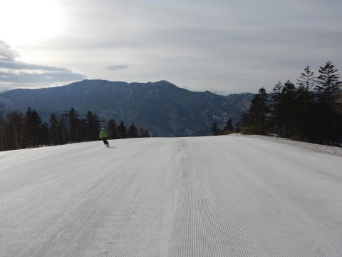

あさイチは，一応シマシマでしたが…

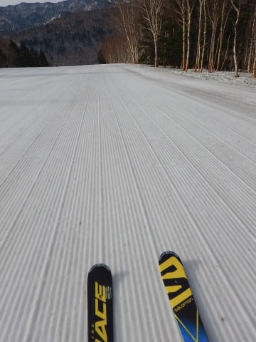

早朝からプラス気温で．

すっきり晴天で，日差しも強く…

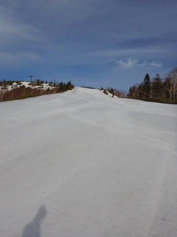

あっという間に雪は緩んでいきます（涙）

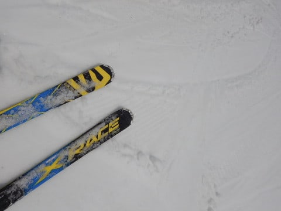

朝9時ごろには，

ゲレンデの雪は張り付くストップ雪に

なり始めてきたので．

奥志賀の様子を見に行ってみましたが…

残念ながら，こちらもストップ雪（涙）

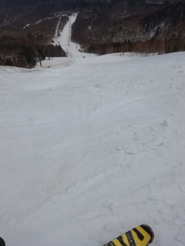

いや，雪はたっぷりあるんですけどね～．

で．

一の瀬方面へ行ってみますが…

一の瀬ファミリーはコース真ん中に

穴が開き始めていて．

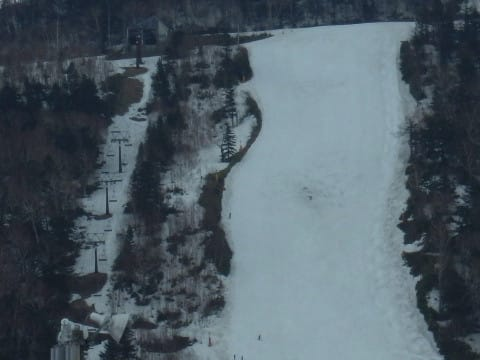

うーん．

雪も重く，やはり張り付き気味で．

正面バーンはちょいと

滑りにくい感じ…（涙）

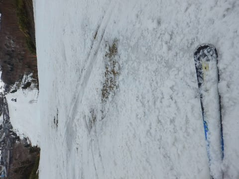

寺子屋は，一の瀬よりは滑るけど．

でも，やはり緩斜面でストップしてしまう

感じで．

うーん．寺子屋もダメか…（泣）

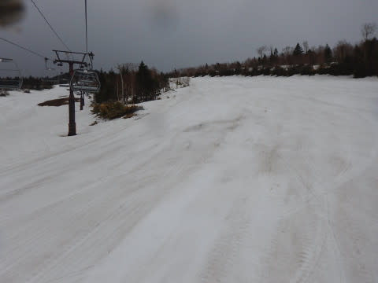

と，寺子屋を滑っていた，午後2時ごろ．

…小雨が降ってきました（涙）

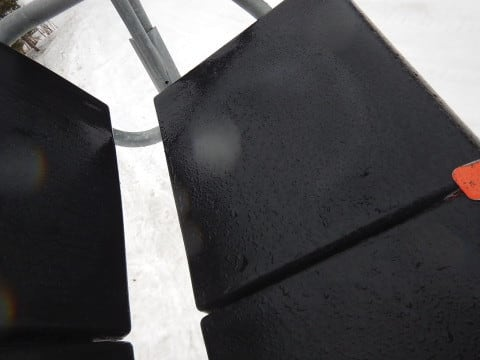

遠くで雷もゴロゴロなりはじめ．

落雷の危険があるという理由で．

午後2時ごろに，志賀全エリアのリフトが

止まっちゃいました（涙）

でも．

午後3時ごろには雨も止み．

リフト営業も，無事再開！

ラストは焼額に戻りましたが…

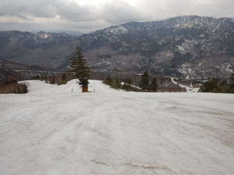

もう．

午後の雪は．

「なんとか滑れる」というレベルの，

非常に滑りの悪い，重い雪でした…．

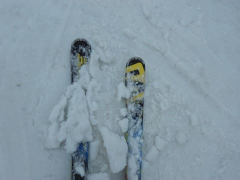

そんな雪の中を．

シーズン営業ラストの4時まで．

今日もしっかり滑り倒してきたのでした…

いやーー．

しかし．

雨やらリフト営業中止やら．

いろいろ波乱に満ちた営業最終日でした…

詳細レポートは，また明日！

## 💬 コメント一覧

### 💬 コメント by (ろーさん)
**タイトル**: Unknown
**投稿日**: 2019-05-08 08:36:59

Sさま。ヤケビでお会いした、ろーさんです。

あれから、かぐらへ転戦し、5日を最後に、シーズンを終了しました。

かぐらは、まだ雪がたっぷりあり、コブの溝でも、土は出ていませんでした。

これからも、物欲選手権など楽しみににしています。

### 💬 コメント by (はなげ親分)
**タイトル**: Unknown
**投稿日**: 2019-05-08 14:20:12

あ～、終ったなぁなんたて思っていたら渋峠で積雪ですか❗️

土曜日のスタッドレス履き替え止めて、行っちゃおうかな～

### 💬 コメント by (はっち)
**タイトル**: Unknown
**投稿日**: 2019-05-08 18:06:15

熊の湯と横手山・渋峠はまだ営業してますよ！

週末のレポ楽しみにしています！

### 💬 コメント by (Skier_S)
**タイトル**: 一日投稿休みました（涙）
**投稿日**: 2019-05-09 04:38:04

＞ろーさんさま

GW後半はかぐらだったんですね．

かぐらのシーズンは，今月末まで続きますよ！

まだシーズン終了は早くないですか（笑）．

また来シーズン，志賀高原でお会いしましょう！

＞はなげ親分さま

まさかの渋・横手は新雪だったようですね…

さすがにもう新雪は残って無いですが，今週末も

行っちゃってください（笑）

＞はっちさま

今週末から，5月いっぱいはかぐらに通う予定です～！

でも，かぐらは混むんですよね…

またレポートしますので，お待ちください～！

