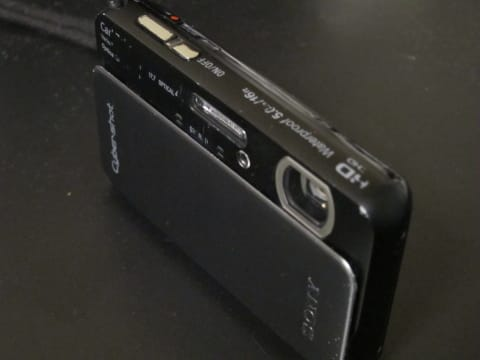

# 2013年11月　フィリピン・オスロブ　子連れでジンベエを見るぞっ！　おまけ

📅 投稿日時: 2014-08-18 00:55:36

ということで．

オスロブ旅行記は終わったのですが．

…実は．

今回の旅行で．

一つ悲しい出来事があったのだ…

それは．

ジンベエシュノーケリングにエントリーした時のこと．

これまで，メインカメラ兼スキー用ビデオカメラ兼シュノーケリング用カメラとして，

大活躍してきた，[わが愛用デジカメ，Tx20](ecf2754342d380ea1db09caa20d935657.md)．

こいつが，電源が入らず，ウンともスンとも言わなくなったのだ…（涙）．

超大事なジンベエシュノーケリングで，カード読み込みエラーだとか

電池切れだとかで，撮影ができなくて，死ぬほど悔しい

思いをしないように．

バックアップとして，ダイビング用のメインカメラ，

S90とこのTX20の2台を持ち込んでいたので，撮影は

できたものの…．

シュノーケリングが終わって，船の上に上がって，

電源を入れようとチャレンジしても．

全くカメラは反応せず．

うーむ．

これまで，何度もシュノーケリングに

連れ出して，大丈夫だったこのカメラ．

ついに，水没させてしまったか？？？

と，電池ブタを空けてみるものの．

中から水が「ざーっ」と流れるようなことはなく．

電池を取り出してみても，

電池が水没した時特有の茶色い汚れは

ついておらず．

一見，カメラ内部は無事に見える…

とりあえず，このあとは妻のカメラと

私のダイビング用カメラで乗り切ったけど．

＃カメラを3台も持ちこんでいる私

もしかしたら，乾燥させたら無事動くんじゃないか…

とか，甘い期待でいろいろチャレンジしてみたものの．

ついに復活せず．

これまで，スキーに海にと大活躍してくれたTX20は．

わずか1年半でお星さまとなってしまったのだった…

まぁ，こんな感じで，

わずか1年半とはいえ，2万5千枚も撮影し，

もうかなり使い込んだ感じだったし．

仕方がないかな…という気もするけど．

＃ということで，[TX30を買った](e9d0187dffefa89fa8f4f8a86c24c0a22.md)のでした
