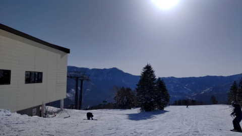
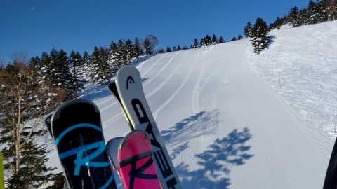
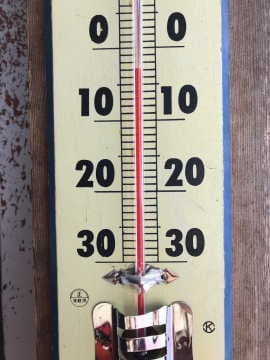
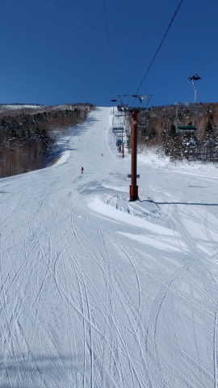
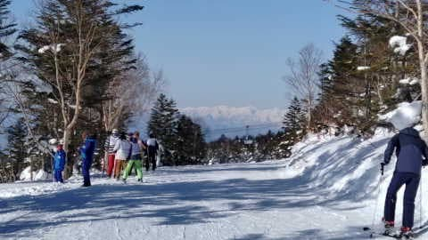
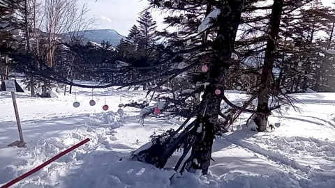
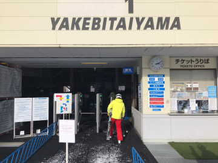
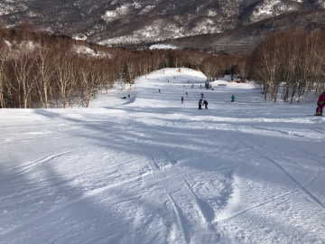

# 2月12日(日)の志賀高原スキー場，特派員レポート…気温が高く雪は荒れ気味．標高の低いところはちょっと滑りの悪いところも

📅 投稿日時: 2023-02-13 02:03:35

ってなことで．

2月のトップシーズンというのに，

志賀高原に行かなかった週末を

過ごしたSkier_Sです（涙）

あぁ…今日の志賀高原．

槍やミサイルと言わないまでも，

スキー場に私の怨念が降ったんだろうか…

と，志賀高原の各特派員からの

写真を見るわけですが…

…晴天ですね（涙）

そして，見事なシマシマですね（激泣）

あさイチの気温は-3℃と，この時期に

しては異常に気温が高いけど…

でも，朝のうちはマイナス気温で

いい雪だったみたいですね…

すごい最高のバーンコンディションに

見えますが…

私の目の錯覚かな？？

ただ，今日は昼間に気温がかなり上がり，

さらに日が射す晴天だったので…

昼前には結構雪が緩んだらしく．

最近では，焼額でバレンタイン恒例に

なっている，木々にぶら下げられた

雪のハート飾りが登場していたようですが．

昼ごろにはかなり溶けかけてたみたいです…

ちなみに，焼額以外では多少混んでいた

リフトもあったみたいですが．

焼額のゴンドラは意外にもそれほど混まな

かったみたいですね…

しかし，日差しが強く，気温が高かった本日．

標高が低い西舘やサンバレー方面は，

ちょっと滑りが悪い雪になったようで．

さらに標高が高い焼額も，ちょっと雪が

しっとりした感じに緩み，

そのせいで，夕方は雪がちょっと荒れ

気味のボソボソになったみたいです…

うーん…

天気が良かったみたいだけど．

この時期にありえない高温になったのは，

私の怨念が志賀高原に届いたから

なのかな～…←違うから

で．

明日，13日(月)の志賀高原も，昼間は

0℃を超えるかというくらい気温は高めで，

曇り～時折雪がぱらつく天気．

その後，14，15日の火・水は激冷えの雪降り！！

…ただし，雪はドサドサ降らなさそうで…

14，15日でそれぞれ10～15cmずつくらい

積もる程度かな…

で．16，17日の木・金は雪降りのあとの

そこそこの冷え込みの晴れで，

絶好のスキー日和になりそう！！

…そして，週末の18，19日は…

微妙…

気温が上がりそうだけど．

どんな天気になるかはまだ分からない

状態です．

でも．

来週は私は絶対に志賀高原に復活する

予定なので．

私が行く週末は最高冷え冷え雪が

積もった晴天になるはず！！

なるはずなのだ！！！

来週末，すごいいいコンディションになったら，

それは私のおかげですので…←だから何度も言うけど，違うから

## 💬 コメント一覧

### 💬 コメント by (レインボー75)
**タイトル**: Unknown
**投稿日**: 2023-02-13 06:28:04

ごめんなさい。毎晩多忙で発信できませんでした。やけび第三高速は、16日以外は、今月いっぱい動く予定だそうです。朗報です。

### 💬 コメント by (レインボー75)
**タイトル**: Unknown
**投稿日**: 2023-02-13 14:09:45

月曜日の志賀高原情報

朝の湯田中は小雨。上林+1℃。標高1200m(防平橋)から小雪に。蓮池0℃。

いつものようにニゴンスタート。さあ乗ろうというときに「故障です。１時間かかる予定」の発表が！

また四ロマからだあ。遅い！いちごんから白樺→唐松。みぞれっぽい雪で雪面が見にくい。唐松、第三はコロコロ発生で今一つ。

オリンピックは珍しくアイスバーン。GSサイドは圧雪されてたとか。

ウエストサイドで昼食の時、ウエアが重いことに気づく。雪も強くなってきたし、昼で終了。帰路、標高1020m地点のカーブで、横転している軽ワゴンを目撃。他に二台が絡んでいるようで、スリップとは思えないので、無理な追い越しかなあ？

昨日曜日にも事故を目撃しました。標高850m位の橋脚のすぐ上。事故の一番の名所です。山から下ってくると、日当たりのいい所からループに入るので、ついつい油断するのですが、陽の当たらない橋脚辺りはすごーく滑りやすいので気をつけてくださいね。

### 💬 コメント by (Skier_S)
**タイトル**: ＞レインボー75さま
**投稿日**: 2023-02-14 02:58:34

今日はかなりの湿った雪だったみたいですね…

明日以降は冷え冷え雪になりますよ！！

でも，朝はブーツパフ程度で，そこまで積もらなさそうです…

とはいえ，昼間も降り続けて，昼だけで10cmくらい積もりそうです．

