# 2日連続天気予想！…1月15，16日の週末の志賀高原スキー場の天気は，晴れ~曇り，気温はそんなに冷えなさそう

📅 投稿日時: 2022-01-13 02:51:29

🏷️ カテゴリ: [スキー天気予想](c6554f5c3c106093b511a8daae23757e8.md)

えー．

今日の志賀高原情報が，いつもの

おこみん特派員から送られてきましたが…

なんと．

　猛烈な風でゴンドラだけじゃなく，

　一部リフトも止まりそうな感じ

と予想した本日．

意外なことに，焼額は第1ゴンドラが

動いたようです！！！

ただ，焼額第1ゴンドラは動いたものの．

寺小屋・横手山は終日運休，

奥志賀も第1ペアのぞいて全滅，

東館ゴンドラも営業せず，

焼額も第2ゴンドラ営業できず

という，強風吹雪の一日だった

みたいです…

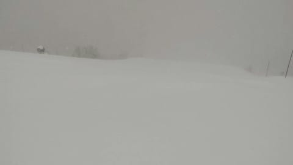

あさイチの気温も-15℃と，

予想ぴったりの冷え込みで．

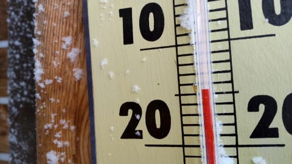

朝までに雪は10~20cm積もり，

オリンピックコースは脛パフ程度の

積雪だったようです…

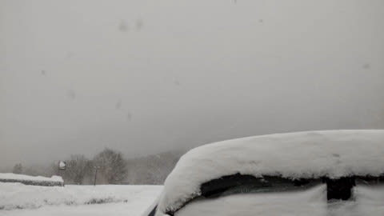

イチゴンが動いたのは想定外でしたが．

それ以外は大体私の予想通りの一日

だったようですね…（自画自賛）

ってなことで．

昨日は週末までの志賀高原の天気を予想しましたが．

今日は土日の天気の詳細を予想してみましょう…

…の前に．

昨日の記事で，13日の予想を

　志賀高原は終日雪がぱらついたり

　止んだり．一瞬雲が切れて日が

　射すタイミングもあるかも．

と書きましたが．

13日の午後9時の天気図を見ると

すごいことになっていたので，

ちょっと予想修正を…

どんなふうにすごくなっていたかというと．

13日の午前9時の地上天気図はこんな感じで，

等圧線が北西-南東の右下がり．

これは西風で志賀は降らないパターンなので，

「一瞬雲が切れて日が射す」天気図

なのですが…

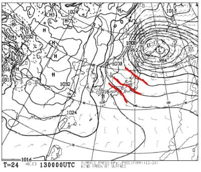

13日の夜9時の地上天気図は，見事に

南北にまっすぐ等圧線が立った縦縞

になってます！

これは…志賀でも積もる天気図！

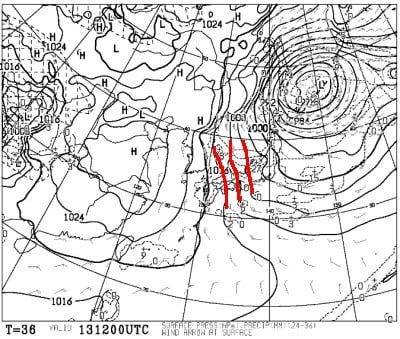

…さらに．13日夜9時の500hpa

気温図を見ると．

志賀高原には，大雪の目安である

水色の-30℃線どころか，

ドカ雪の目安である赤色の-36℃線が

かかってますよ…！

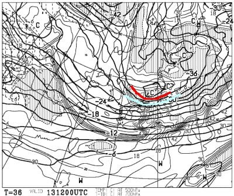

だもんで．

13日の予想は，午前は晴れ間も見えるが，

午後はだんだん雪が強くなっていき，

夜は激冷え吹雪になっていきます…！！

で．

14日金曜の天気図は，昨日と

変わらず縦縞の予想なので．

14日の予想は修正する必要なく，

この日はドカ雪になりそう…

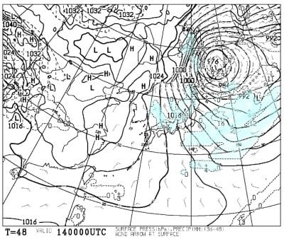

ってなことで．

肝心な週末の天気図，

15日(土)の850hpa図を見ると．

この日は志賀にかかっているのは

水色の-6℃線．

この日は14日に比べると気温が

上がりそう…

でも，昼間も-3℃程度かな？

そこそこの冷え込みです．

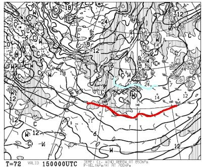

で，地上天気図を見ると．

西からひたひたと高気圧が

近づくので．

午前中は雲が多く，雪もぱらつくかもだけど．

午後はすっきり晴れていきそう…！

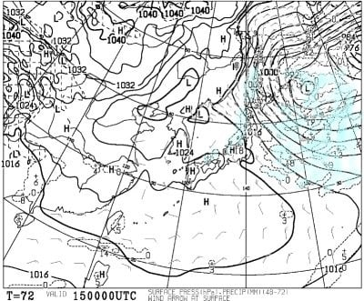

続いて，16日(日)の850hpa図を見ると．

この日は志賀にかかっているのは

水色の-3℃線．

これは…気温がかなり上がりますね．

焼額山頂で，気温はギリギリ0℃を

越すかどうか，という天気になりそう．

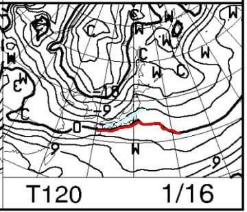

そして，日曜の地上天気図を見ると．

この日は日本の南側は高気圧に

覆われるものの，東北付近に低気圧が

見られるので…

うーん．難しいけど，午前は晴れ気味，

午後は雲も多くなる…っていう程度かな．

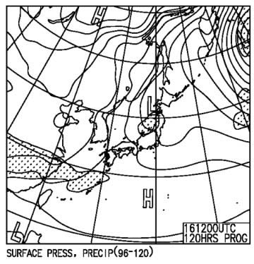

ってなことで．

まとめると．

13日(木)：朝は曇り，わずかに雪がぱらつくか？

　朝の気温は-10℃を下回る程度．

　午前は時折日が射すタイミングが

　あるかもしれないけど，午後は

　雪が降り始め，夕方には強い降りに．

14日(金)：朝から雪！終日雪！

　朝は-15℃の激冷え！

　前日からの積雪は30cm程度かな？

　脛~膝パフ．

　終日新雪が降り積もるエンドレス　

　パウダーデー．

　奥志賀ゴンドラは強風でアウトかも．

15日(土)：朝は曇り空．かすかに雪が

　ぱらつくか？

　前日の夜からの積雪は5~10cm．

　あさイチの気温は-9℃程度で，

　柔らかめの圧雪！

　午後に向かって天気は回復，

　日が射していくが，昼間も山頂は

　-3℃程度．

　終日トップシーズンの良い雪で

　滑れそう．

16日(日)：朝は晴れ！

　あさイチの気温は-6℃程度．

　いい感じのトップシーズン

　シマシマバーン！

　昼間の気温は上がり，0℃を超えそう．

　日当たりのよいバーンは雪がちょっと

　緩むか…

　午後に向かって雲が増えていき，

　夕方は曇り空になる．

ってな感じでしょうか…

この週末，土日とも朝から晩までずっと

晴天とはいかなさそうですが．

この週末も雪は冷え冷えだし，

土曜は午後に向かって晴れ，

日曜は午前中のうちは晴天

になりそうなので，この週末も

いい感じの週末になりそうです…！！

いやー．

この冬は，このまま例の踊りを踊らずに

済むシーズンであってほしい…

## 💬 コメント一覧

### 💬 コメント by (みこみん)
**タイトル**: Unknown
**投稿日**: 2022-01-13 09:35:34

はじめまして。

初めてコメントさせていただきます( ´∀｀)

いつも、ゲレンデ状況の予想、ご報告、楽しく拝見しています。

今夜から志賀高原へ行く予定しておりましたが、悪天候のようですので、一日ずらして明日出発することにしました。

土日は、なかなか良さそうですので、今から楽しみです♪

今年は、たくさん滑りに行けることを…祈ります🙏

たまにコメントさせていただきます。

どうぞよろしくお願い致します☃️❄️

### 💬 コメント by (かず)
**タイトル**: Unknown
**投稿日**: 2022-01-13 11:36:04

明日最悪1ゴンだけでも動いてほしい！今シーズンはパウダーばかりで新しい2枚の板のる機会が1回もありません…なのにもう今週末 来季モデル試乗会です…笑

### 💬 コメント by (レインボー74)
**タイトル**: Unknown
**投稿日**: 2022-01-13 16:15:34

木曜日の志賀高原情報

朝の上林-6℃　蓮池-11℃。車の中のお茶が、今シーズン初凍結。寒いっす。

今日は新雪無しなので、フィッシャーRC180。

まずはパノラマからカラマツヘ。なんか上手になった気分(ヤケビは雪も圧雪もいいので勘違いバーンと言われてます)。

オリンピックもGSも、非の打ち所がない。これは天からのご褒美なのか？幸せすぎます。

一ノ瀬パーフェクタに入ると、ややカリカリだったのに、急斜面に入るといきなりの非圧雪。前を行く高速隊が転倒するのを、笑いをこらえて心配するふりをした私でした。

ファミリーはやや硬めの20000に適した斜面。

高天の銀嶺昼食のあとの西舘は、悪くないけどヤケビが良すぎたので、一路ヤケビヘ。

いやあ楽しかった。楽しすぎてとばしまくったので、足がパンパン。明日の強風が心配です。

### 💬 コメント by (アリス)
**タイトル**: Unknown
**投稿日**: 2022-01-13 18:40:34

S様

今日は久しぶりの全体リフト、ゴンドラ全部運転。

8:15のダイヤスタートで、ダイヤ、唐松一番滑走で自己満足です🙆

1ゴン下、2ゴン下もやはり、ヤケビのシマシマは最高級です☀

久しぶりの寺子屋ですが、何かブナ平に似てゴースト化してる感じがします😅

### 💬 コメント by (地元民)
**タイトル**: Unknown
**投稿日**: 2022-01-13 21:18:20

天気予報あたりです。

朝は青空が出ていたのに、昼頃から雪が降り始め、２時すぎには平地でも猛烈な降りに。

午後８時までに30〜40㌢の降雪。山は大変なことになっていそう。

まだまだ降り続きそう。下手すりゃ新雪100㌢?

### 💬 コメント by (Skier_S)
**タイトル**: 明日は積もるよ！
**投稿日**: 2022-01-14 01:33:03

＞みこみんさま

初コメントありがとうございます～！

明日はどんな天気でも滑る！…という人じゃなければあまりお勧めしないので，

土日で正解です！

土日は穏やかな天気だと思うので，楽しめますよ！

またコメントお待ちしてます～！

＞かずさま

明日は北風なので，北風には強いイチゴンは動く可能性も…

＞レインボー74さま

今日は嵐の谷間の穏やかな日です．

また明日はひどい天気になるので，ご覚悟を．

明日の朝は駐車場の雪搔きが要りそうです…

＞アリスさま

今日は楽しめたようで良かったです…

平日スキーがうらやましい．

明日はまた荒れますので，覚悟して下さい…

＞地元民さま

ふふふ．

私の予想はすごいんです！（志賀高原限定）

平地で午後8時までに30～40cm！

今晩も降り続きますので，明日はかなりの雪になりそうですね…！

