# 今日は蓼科山に登ってきた

📅 投稿日時: 2019-10-07 01:26:14

えー．

なぜか今日も深夜帰宅の，Skier_Sです．

ってことで．

昨日は志賀高原に行く予定だったのが，

志賀の天気が悪かったため，

急遽予定を変更し，

[根子岳＆四阿山に登り](ef3a4570a362093e4a1ad3a6e48183d67.md)ましたが．

今日こそ，志賀高原の紅葉を見に行こう！！

と思ったところ…

なんと．

朝6時の段階で，志賀高原は雨（涙）

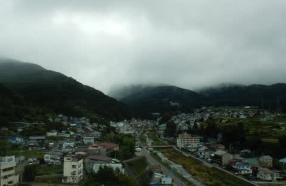

山の上は，雲にすっぽり覆われて．

全然視界が効かなさそう…（泣）

だもんで．

大変残念ながら．

今日も志賀高原に行くのは諦めて．

浅間山にでも行ってみるかな…

と，浅間山方面に向かったわけですが．

菅平を超えたあたりで．

浅間山も，雲にすっぽり

覆われているのが見えました…（泣）

…四方を見渡すと．

南の方が，まだ雲が少なそうなので．

「ここから南なら…八ヶ岳方面か？」

ということで．

八ヶ岳近辺で．

コースタイムが比較的短い，

こんな山に行ってみました～！

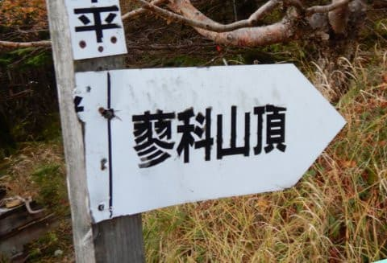

蓼科の登山口まで行っても

天気が悪ければ，

今日は山歩きは諦めよう…

と，半ばあきらめていたところ．

蓼科近辺は天気が比較的良く．

登山道はすっきり晴れじゃないですか！

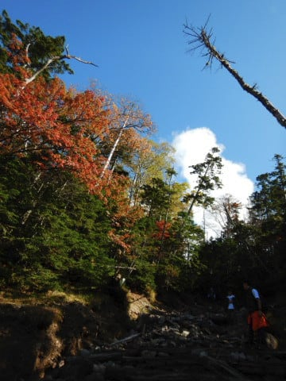

ところどころ紅葉している中，

快適に登って行けます．

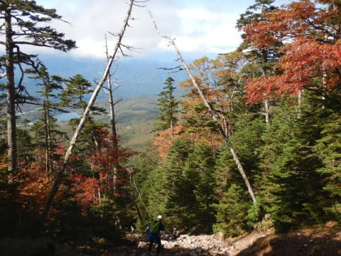

いやーーー．

晴れててよかった…

コースは後半部分はかなりの急登で．

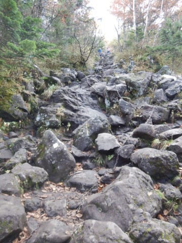

こういうところをよじ登ること

20分ほど．

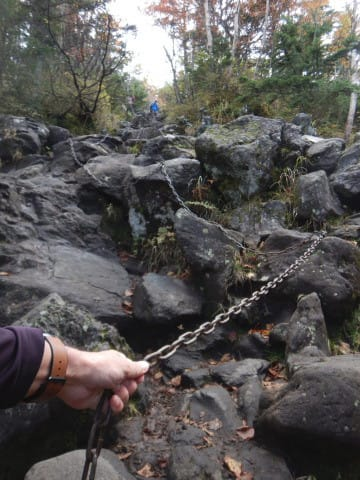

結構な急斜面で手こずりましたが．

時間自体はそれほどかからず，

駐車場から1時間20分ほどで

山頂へ到着！

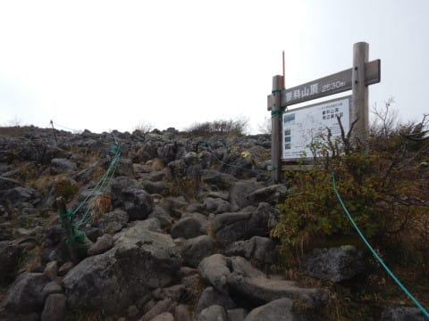

さて．

山頂の景色を堪能するぞ…！！

と思ったら．

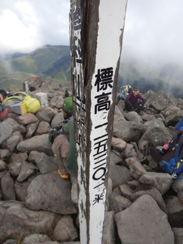

いや…

登山道と山頂は晴れてるんですが．

周りの視界は残念ながら

良くなかったです…

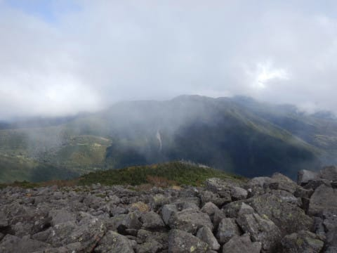

まぁ．

今日は晴れた中，登れただけ

良しとしよう．

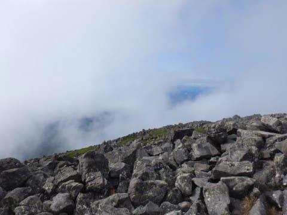

とはいえ．

時折雲が切れるタイミングで，

景色を見ることができたので．

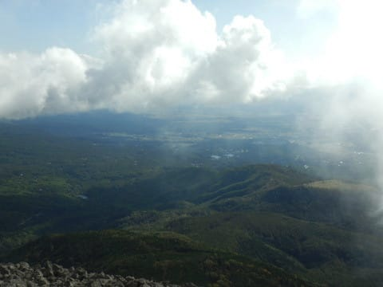

まぁ，良かったよね…

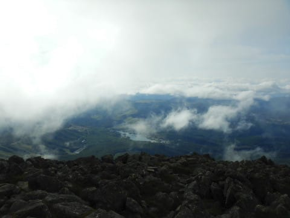

ってなことで．

帰りは急登を逆に降りなければならず．

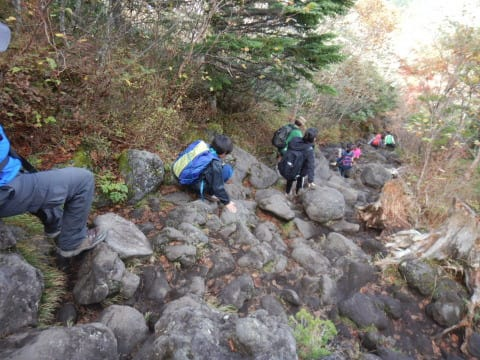

結構，この下りが厳しい…

20分で登った，休憩所から上の

後半部分，降りるのに30分以上

かかったよ…

でも．

山頂から駐車場まで，

トータル1時間30分ほど．

志賀高原から移動したので，

登山口到着が午後1時と，

かなり厳しい時間でしたが．

山頂での休憩時間を含めても，

駐車場から3時間半ほどで

ピストンできる，時間的には

お手軽な山でした…

とはいえ，標高差が650mほどある，

体力的にはなかなか厳しい山なので．

トレーニングにはちょうど

良かったかな～

ってなことで．

2日連続で百名山を登って，

ストレス解消＆スキーシーズン前の

体力強化がはかれた，満足の週末を

過ごした，Skier_Sだったのでした…
