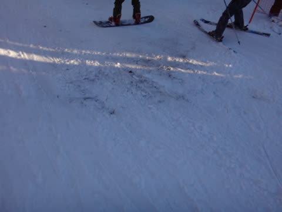

# 12月3日，土曜日の志賀高原・焼額は…晴天，ポカポカ陽気の一日

📅 投稿日時: 2016-12-03 19:25:21

🏷️ カテゴリ: [2017スキー滑走日記](c7d777cecfc91bdf0fa464ad62c6d49ab.md)

というわけで．

ついに．

ついに始まりましたよ～！

私の志賀高原のシーズンが，ついに

始まりました～っ！

ということで．

記念すべき，今シーズンの志賀高原初日．

スキー場へのアプローチは，雪道ですね～．

積もっている雪はわずかとはいえ…

ゲレンデに期待できるか？？

と．

ゲレンデまでやってくると．

高天ヶ原は…

…

…まだまだか…（涙）．

人工雪があるところ以外，まだまだ茶色い

感じですね…

で．

やってきたのは．

当然ですね．

わがホームゲレンデ，焼額！

実に．

実に，

3月末以来…

8か月ぶり！！

帰って来たよ～！！

本日，志賀高原で動いているのは．

熊の湯第2ペア下半分，第4ペア

高天ヶ原の下部緩斜面のトリプル，

一の瀬の下部緩斜面，ペアの短いほうだけ1本，

焼額の第4ロマンスリフト1本．

…これだけです．

ええ．

たったこれだけ（涙）

まだ高速リフトは1本も動いてません（泣）

この中で，一番距離が滑れるのは焼額．

すっきり晴天のゲレンデに出ると…

うほう！！！

シマシマっ！！！

コースにはこんな看板も出てるけど…

いや，朝イチは結構硬めの，しっかり締まった

ハイスピードバーンだぁ！

…雪は一見柔らかそうに見えるけど．

こんな感じで，下地はがっつり硬い人工雪で．

結構スピードが出ますよ…！

いや，

最高！

ちょっと硬めだけど，朝イチ最高！

…と，思っていたら．

あうーーん．

…1本滑ったら，リフト約5分待ち…（涙）

今日は午前中はずっとこんな感じのリフト待ちで．

結構混みました（泣）

第2高速が動いてないので，1本しか

動いてないこのリフトに人が集中しますわな…

だもんで．

2-3本は気持ちよかったけど．

それ以降は，ちょっとゲレンデの人口密度も

高め…

そして，コース下半分の緩斜面は，まだ人工雪を

つけてある幅も狭く，ちょっと廊下気味．

とはいえ…12時を過ぎると，リフトがガラガラに

なってきました！

これはいい！

…と，思ったら．

気温が高く，まるで春スキーのような晴天

ポカポカだった本日．

今度は雪が融けて，ちょっとゲレンデが荒れてきました…（残念）．

そして．

コース下部，リフト乗り場近辺は．

ちょっと雪が茶色くなってきて…

こんな感じになっている部分はごく一部ですが，

ちょっと，傷つけたくない板は履きたくない

感じになって来ました…（悲）

だのに．

昼はいったん減ったリフト待ちですが．

午後1時を過ぎると…

ありゃーー！

またリフト待ち復活…（涙）

でも．

午後のリフト待ちは，午前ほどひどくなく．

タイミングによって3分～0までのばらつきが

ある感じかな．

で．

午後3時ごろになって，日が傾いてくると…

うおおおお！

なんてことだ．

今度は気温が冷えて，

ゲレンデがかなり手ごわいほどに硬くなって

来たよ…（涙）

エッジが立ってない板や．

マイルド化が超進んだ板では絶対無理なレベル．

マイルド化が進んだ板だと歯が立たず．

かといって新しい板だと石ころ踏まないか，

ちょっと心配…

という微妙なゲレンデを．

今日も日が陰る，リフトストップの

夕方4時まで，

滑り続けたのでした…

うーん．

しかし．

今日は朝イチのコンディションは良かったけど．

焼額で動いたのは遅いペアリフト1本．

あの雪不足の去年でも，オープンの週に

焼額は第4ロマンスと第2高速の2本のリフトが

動いてたというのに．

まさか，雪不足の去年より動くリフトが少ない

スタートになろうとは…（泣）

夜9時現在．

3日夜は人工降雪機が動かせないだろうから，

　前日からの人工降雪の積み増しは無し．

という[予想](e3969ffbd3d0454fc7a8429f50195f3b8.md)通り，

おそらく気温が高いため，

人工降雪機は動いてません…（泣）

明日も，第2高速は動かなさそうです．

うーん．

あした，いきなりの降雪があって．

一気に志賀高原が全面滑走可能になる…

って奇跡が起きないかな～←ありえないから．それ．絶対
