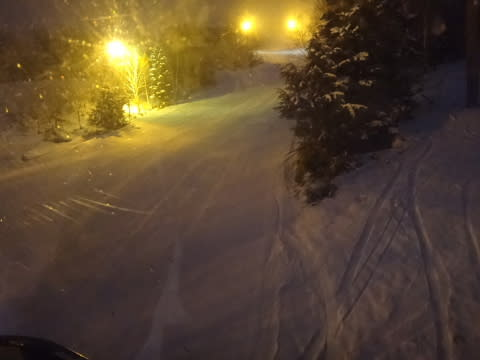

# 3月12日土曜の志賀高原…冷え冷え，曇り時々晴れ，ところによってアイスバーン（；_；

📅 投稿日時: 2016-03-12 22:47:07

えー．

読者の皆様におかれましては．

私が必死に踊り続けた，

11日に奇跡の積雪があって週末は

最高のコンディションに復活する踊り

の効果で．

1mほどの積雪があったことを期待されているのではないかと

思う今日この頃，皆さまいかがお過ごしでしょうか．

…

はてさて．踊りの効果は…

…踊りの効果は…

…いや．

今，なんだか変な写真があったような気がするが．

とりあえず，本日のレポートをば…

えー．

今朝，志賀高原に登ってくる道は…

うん．

わずかに積雪があるな．

昨日の夜から，ごくわずかに積雪があったようだな．

ってことで．

いつも通り，焼額第1ゴンドラで山頂に出ると…

ふむ．気温は-8℃．

予想の-10℃以下には冷えてないものの…

この時期にしては，結構な冷え冷えですな！

で．

朝イチは薄い雲がかかっているものの，

日がさすいい天気！

ゲレンデは…

1cmほどの，うっすら新雪が乗ってるけど…

うほうっ！！

これは…しっかり固めに締まった，エッジががっつり効く

ハイスピードシマシマバーン！！！

これは，かなりスピードが出る！

うはははははは！

やはり，私の予想通りっ！

…大事なところなので繰り返すと．

　　朝イチのゲレンデは，冷え冷えのいい雪が圧雪され，

　　その上に冷え冷え雪がうっすら積もった感じで．

　　Goodコンディション！！

という私の予想通り，

かなりいいコンディションだ～っ！！

朝のうちは，しっかり日がさした焼額．

いや，

朝イチ最高っ！

しっかり締まったハイスピードバーン，最高！！

…先週の高温でブッシュだらけになたオリンピックコースが，

ほとんど積雪がなくてクローズのままだったのが惜しいけど…（涙）．

でも．

雪がアイスバーンではなく．

しっかり固く固まったような雪だったので．

午前中は全く荒れることなく，フラットなまま！

雪質も，気温が冷えていたので，結構よかったですね～！！

南斜面の日差しが当たるごくごく一部，ちょっとしっとりした

雪になった部分もあったけど…

ほとんどの部分は，しっかり締まった雪のままだったので，

昼を過ぎても大回りの板を履いてずっと滑れる好コンディションを

キープ！！

…雪が少なくて，一部土が出始めているところがあるのが惜しいけど…

でも．

午後になっても，GSコースは一部を除いてしっかり締まった雪で，

コースが荒れることもなく，超快適大回りバーン！！

…と，思ったら．

ちょっと一瞬，コース上の人が増えるタイミングも…

とはいえ．

ゴンドラ待ちは今日もなく．

ゲートの外まで人が並ぶことはなく，最大でもこの程度．

3月週末の，最高待ったときでこのくらいしかい人がいないって…

…経営大丈夫か？？

そのほかのタイミングは，ゲレンデの人も

せいぜいこんな感じで．

天気は，朝から晴れたり曇ったりを繰り返し，

時々雪がちらつくという…

これもまた．

全くぴったり私の予想通りですな．

大事なところなのでくりかえ…（ビシィ！）←読者からの激しい突っ込み

…午後になると．

さすがに，一部アイスバーンが出てきたところもあったり．

日が当たって雪が緩んだ部分は，ちょっとグラニュー糖っぽい

雪になったようなところもあったけど．

第1ゴンドラのGSコース側は，こんな感じになった場所は

ごくわずか．

基本的に，終日快適ハイスピード大回りバーンをキープして．

「これは…4月の雪か？」という状態が続いた

2，3月から考えると．

昼間もマイナス気温をキープしてくれて．

けっこう好コンディションな一日でした！！！

午後，ちょっと山頂付近にガスが出て，視界が悪いのが，

ちと残念だったけど．

かなり満足できた，今日一日だったのでした～！！！

…

…

…

で．

まだ続く．

そう．いつものナイターです．

…本日は，一の瀬ダイヤモンドじゃなく，

焼額のナイターへ繰り出しました…

だって．

今日が今シーズン最後のヤケビナイター営業だったんだもん…

ヤケビナイターに，今シーズンの別れを告げておかないと…

と，繰り出した焼額ナイター．

うはははは！

今日も焼額クオリティのぴかぴか圧雪バーンだ！！！

…

と，喜んで滑っていたけど．

ちょっと残念なことに．

ボロボロと崩れていく雪で

崩れたのがこんなコロコロになっていき．

残念ながら，気持ちいいかっ飛ばしバーンじゃなかったのが，惜しい…（ちょっと残念）．

でも．

しっかり焼額ナイターへ，今シーズンのお別れを

してきました…（寂寥）．

あー．

焼額ファーストトラックも明日が今シーズンラストらしいし．

そろそろ，「今シーズン最後の…」

というフレーズが出てくる時期になっちゃいましたね…

…

なんだか．

気のせいでなければ．

今シーズン，まだ，本格シーズンインしていないうちに，

終わりが来ちゃってるんですが…

今シーズン，一度もパフパフパウウダー滑らないまま終わるのか…（泣）．

＃太板買うの我慢しといてよかった…

## 💬 コメント一覧

### 💬 コメント by (aqura)
**タイトル**: おはようございます
**投稿日**: 2016-03-13 07:37:47

日曜日の今朝は、気温が上がりそうですねぇ((涙))

土曜日は、第１ゴンドラスケートで、ふらふらいろいろ滑って、終わりは、車がある第１ゴンドラ駐車場へ……。

ゴンドラ終了へ、「まだ良いですか、あー、良かった」と、飛び込む人U+2757  もしかして、トビ主様ですか？

### 💬 コメント by (Skier_S)
**タイトル**: aquraさま
**投稿日**: 2016-03-13 08:03:03

あら？

見られてましたか…

最後のお客で飛び乗ったのは

私です…(^^;)

### 💬 コメント by (Goku)
**タイトル**: 見られてますよ～
**投稿日**: 2016-03-13 10:17:28

おはようございます。

昨日もお世話になりました。

焼額山を出た後、一の瀬方面はガスっていてよろしくなかったです(T_T)

ヤケビで滑っていれば良かった・・・

それにしても天気予報、ズバリ的中でしたね！

それと、かなりの方に目撃されていますね～

もうバレバレです（笑）

### 💬 コメント by (Skier_S)
**タイトル**: Gokuさま
**投稿日**: 2016-03-14 00:56:37

ふふふ．

天気予想，すごいぴったりだったでしょう．

…異常気象の今シーズン，実に珍しく，

志賀高原の普通の冬の天気図だったので，

ほぼ予想がつきました(笑)

…しかし．

Gokuさんがいつも言うように，

知らないところでいろいろ目撃(?)

されているんでしょうねぇ…

なるべく焼額では行儀よく過ごさないと(笑)

