# 12月7，8日の週末のスキー場の天気は…結構冷えて雪降りの週末になりそう！志賀はドサドサ積もるほどの雪降りじゃないけど，冬らしい感じかな

📅 投稿日時: 2024-12-05 03:25:38

🏷️ カテゴリ: [スキー天気予想](c6554f5c3c106093b511a8daae23757e8.md)

うーん…

やはりこの2日間ちょっと気温が高めで，

昼間に人工雪を打つことができず，

夜も人工降雪機がフル稼働できるほどの

冷え込みじゃなかったというのもあり…

熊の湯スキー場，リフトを降りたあたりは

ちょっと雪が薄くなってきているみたい

です…(涙)

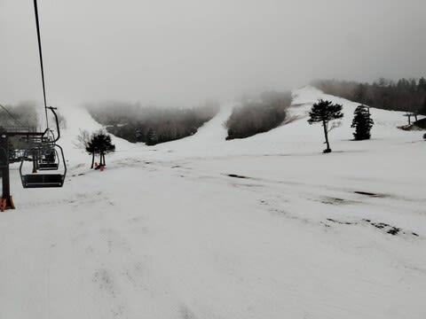

雪質自体は悪くないようですが，石ころが

結構出ているので，新しい板を履いていくのは

避けたほうがいい状態みたいです…

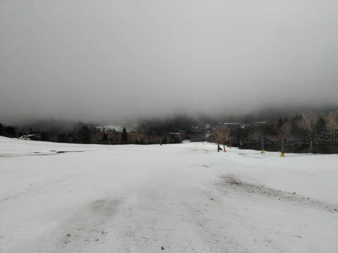

ってなことで．

先週にちょっと降ってゲレンデ状況が

改善したかと思いきや．

また冷えが弱まってしまい．

このままだとヤバそうな感じになってきた

今日この頃ですが…

果たしてこれからの天気はどうなるのか？？

ホントに冷えるのか？

冷えるだけじゃなく，雪も積もってくれるのか？

…と，気になるところ．

とりあえず，毎週水曜深夜恒例の天気予想を

やってみましょう…！

まず．

5日(木)の850hPa気温図から見てみると…

ここ2日ほど気温が高めだったものの．

明日からまた赤いお℃線は志賀高原より

南まで下がって，人工降雪機が動かせそうな

気温になってきましたよ…！！

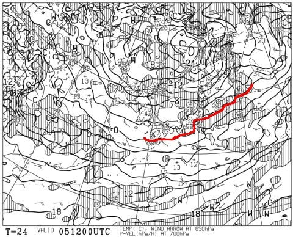

で，この日の地上天気図を見ると．

日本海側に雪雲がかかっているけど…

これ，完全西風なので，志賀には雪雲が

届かないパターン(泣)

志賀は晴れそう…

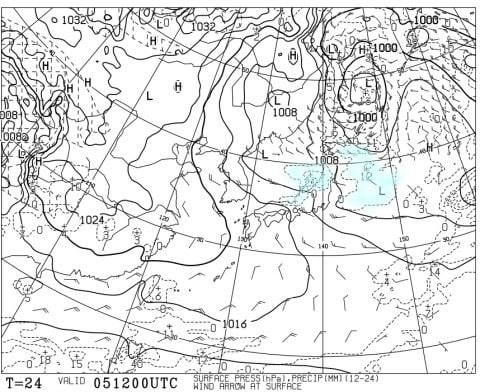

次に，6日(金)の850hPa気温図ですが．

5日よりもさらに冷えが進んで．

志賀高原には-3℃線がかかるくらいですね…

とりあえずこの日は，志賀高原なら

昼間でもガンガン人工降雪が動かせる

レベルの冷えです！

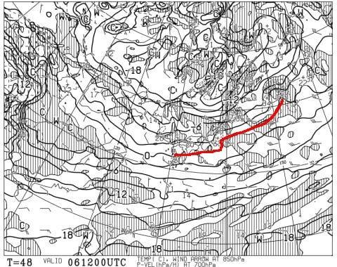

そしてこの日の地上天気図を見ると…

日本海側に寒気の吹き出しの雲が出てます！

風も微妙に北に回ってきたので，志賀でも

少しは積もりそうな感じ…

うーん．一日で10cmくらい積もるかな？

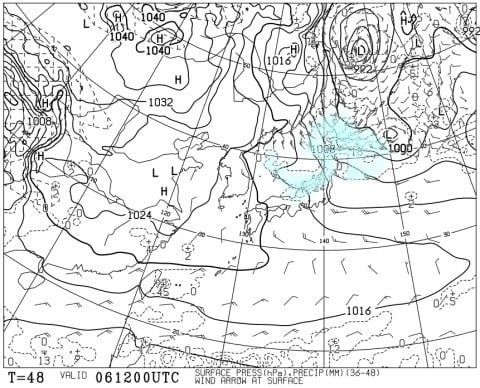

そして肝心な週末，7日(土)の850hPa図ですが．

この日もそこそこの冷えで，朝は-5℃を下回り

そうな感じですね…

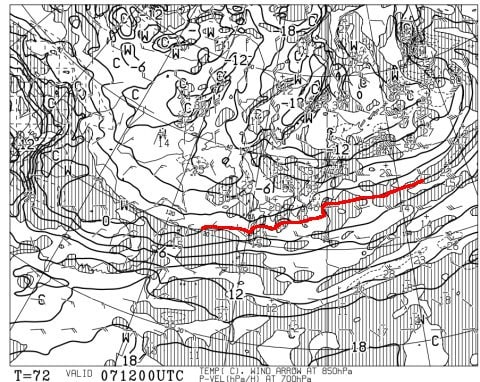

で．この日の地上天気図は…

をを！！

久しぶりに見ました．

日本海に帯状に延びるのは…

おそらく今シーズン初のJPCZ！

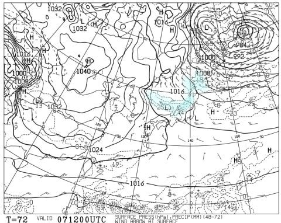

JPCZ付近を拡大すると…

この，日本海に延びる帯状の降水域，

JPCZがきれいに見えてますよ…！！

うーん…JPCZが東にたなびいているので

西風．

志賀はそこまで積もらないかな…

でも，44という数字が見えるので，

新潟付近は最大積雪44cmになる

降水量があるということですね…

これだと土曜は日本海側はかなり積もりそう！

…西風で志賀は積もらないけど…（泣）

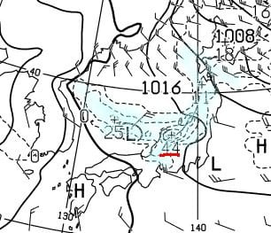

で．翌8日（日）の850hPa気温を見ると．

をを！志賀高原には水色の-6℃線がかかるので…

これ，あさイチは志賀なら-10℃近くまで冷える

かもしれないですね…！！

結構冷えそう！！

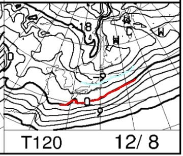

で．冷えるだけじゃなく…

天気図も西高東低で，本州中部がちょうど

等圧線が縦縞になる見事な冬型で．

日本海側に降水域が見えているので…

これ，雪も1日で10cm，運が良ければ

20cm積もるかも…！！

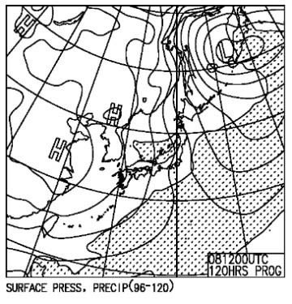

ってなことで．

まとめると．

5日(木)：前日の夜から人工降雪機が動かせるけど，

　志賀高原は天然雪が’降らないので，バーン

　状況はあまり改善されないか…

　志賀高原のあさイチは，硬い下地の上に

　圧雪された新雪数cmで意外と滑りやすい．

　終日晴れのち曇り．

6日(金)：朝は晴れていても，午後は天気悪化し

　雪が降りだす．

　午前中は気温も高めだが，午後はかなり寒く

　感じる．

　雪がうっすら積もって，そのうえで人工降雪機

　でバーンコンディション回復に向かう

7日(土)：朝までに志賀高原は10cm弱積もる？

　朝の気温は-7~8℃と冷え込みが強く，

　朝のバーンは冷え+うっすら積雪で

　いい感じ．

　気温冷え冷えで一日雪が降ったりやんだり，

　時折強く降る．

8日(日)：朝までに10cm，運が良ければ

　20cm積もってるかも？？

　朝の気温は-10℃近くまで冷え，

　ゲレンデは冷えたいい雪質の雪が

　圧雪され，その上に新雪が乗った

　コンディション．

　終日雪が降り，時折強く降る．

　昼間だけでも5cmくらい積もるか？

…という感じでしょうか．

大雪というほど積もらないけど，

土日は冷えて雪が降る，真冬の天気に

なりそう…！

週末の後も冷え続けそうだし…

14日の週末は，オープンするゲレンデも

さらに増えそうで．

いい感じで12月がスタートしていって

くれそうな感時ですよ～！！！

## 💬 コメント一覧

### 💬 コメント by (レインボー77)
**タイトル**: Unknown
**投稿日**: 2024-12-05 13:31:00

木曜日な志賀高原情報

一ノ瀬に向かっていたら、なんと高天ががら空き。聞けば福岡の高校生は昨日のナイターで終了したとか。降って沸いた好条件！11時40分までの２時間半で、スキーヤーは最大で10名弱、最小は2名。係員が5名だから、申し訳ない感じ。

サンデースキーヤーからみたら羨ましすぎる環境ですが、短いコースなので普通人ではやっぱり飽きるんですよね。

高天は-3℃で降雪機を稼働していましたよ。11時には0℃になっていましたが、この週末は期待できそうです。

現状ではパノラマ、カラマツはほぼ地肌なので、7日のゴンドラの稼働は難しそうに思います。

西舘の雪も今は全滅してます。

### 💬 コメント by (Skier_S)
**タイトル**: ＞レインボー77さま
**投稿日**: 2024-12-06 08:46:27

焼額のパノラマ・唐松はまだ人工雪打ってませんか…

今週末のゴンドラ．第2高速運転は厳しそうですね(涙)

土日にどっさり降ってくれることを期待…

とりあえず私は今週末も焼額スタートです！

