# 2021/11/13(土)のイエティ詳細レポート！…終日晴天だけど気温は低め．コース混雑したけど，この時期にしては少ない方かも？

📅 投稿日時: 2021-11-15 00:50:05

ということで．

昨日速報レポートした土曜のイエティ，

今日は詳細レポートです！！

えー．

まず．

いつも通り朝9時のオープン前を

狙ってYetiにやってきますが…

朝8時半ごろの駐車場は，第2駐車場が

まだいっぱいになり切っておらず．

今日は激烈な混みではなさそうな予感…

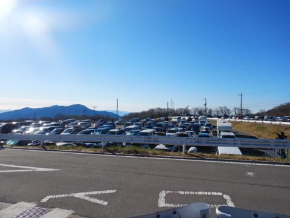

そして，朝9時オープンのコースに

出ますが…

残念案ことに，ちょいと今日はミスって

しまい．

コースオープンわずかに遅れました…（涙）

でも，まだコースにはシマシマが！

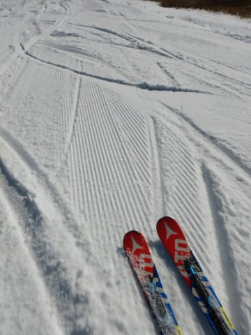

コース幅も順調に広がってます！！

廊下状態なのは変わらないけど，

オープン直後の倍くらいの広さまで

広がったかな？？

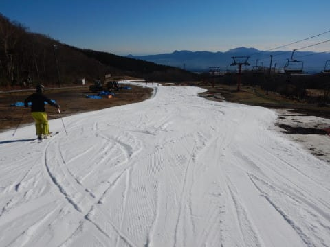

で．

今日は終日すっきり晴天で，朝から

最後まで富士山が綺麗に見えていたんですが…

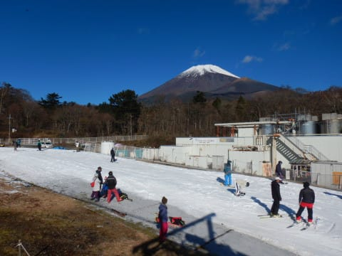

でも．

晴天なのに気温はしっかり冷え込んでいて，

日が射してもそれほど雪が緩まず．

「もう11月も中旬だねぇ…」

って感じでしたが．

…でも，雪がちょっと緩んでくれないと．

アイスクラッシュの雪は，砂のように

板が潜っていくので，ちと滑りにくい…

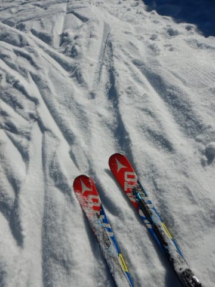

で．

朝のうち，人が少なかったのは3本目まで．

9時半を過ぎると，ゲレンデ上の人口密度は

ぐんぐん上がっていき…（涙）

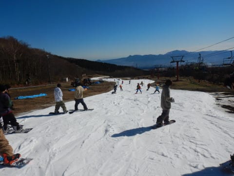

10時ごろには，かなりのリフト待ちに

なっちゃいました（泣）

…でも．

2週間前の，10月29日の土曜の混雑よりは

マシかな？

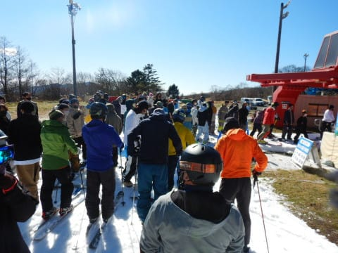

そして．

10時半から，クワッドとペアの2本体制に

なり．

今日もペアリフトは終日待ちなし！

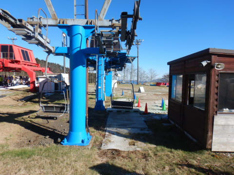

ペアが動いたおかげで，クワッドも

一瞬人が減りましたが…

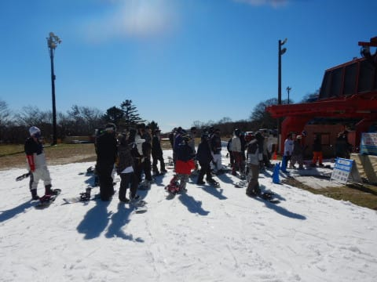

でも，2本のリフトでコースに人が

送り込まれる分．

やっぱりコースの人口密度は上がり

ます（泣）

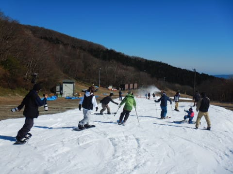

時折，運がよければ人が少ない

タイミングもあるものの…

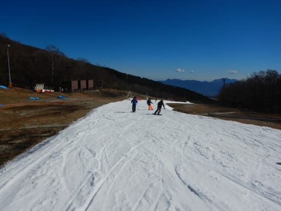

でも，大体コース上はこんな感じの

人口密度で．

リフト待ちも，平均がこのくらいでしたか…

長い時はもっと長く，これより短くなる時も

あり，結構待ち時間に波がある感じでした．

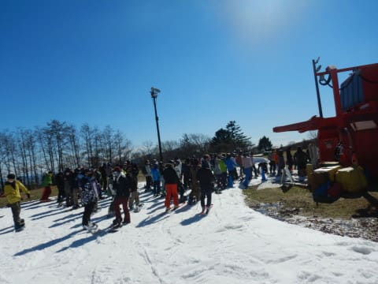

とりあえず．

結局この日は，終日晴天だった

わけですが．

気温はそれほど高くなく，日差しが

あった割には雪はそれほど緩まず．

今シーズンは雪も厚めで，コースに

穴が開くところも無かったのが

良かったかな…

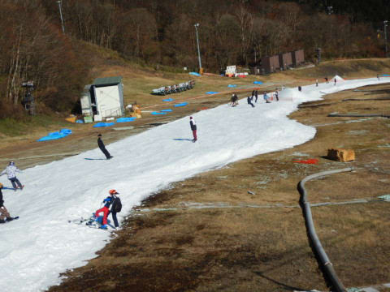

ただ．

なぜか午後になっていくと人が増えていく

このスキー場．

16時のコース整備前でも，リフト待ちは

短くなることは無く．

むしろ長くなってきた感じで…

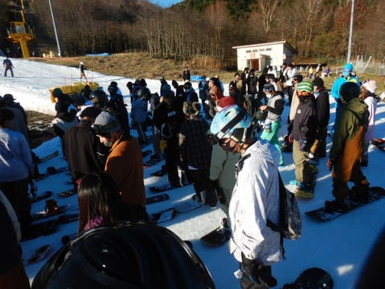

最後まで，コース上の人口密度は

しっかり高かったですね…（涙）

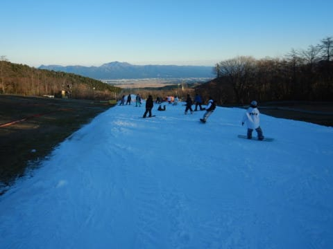

最後はちょっとコースも荒れ気味に

なってきましたが．

ドロドロに溶けて凸凹になったというより．

あまり融けなかった砂のような雪が

溜まって凸凹になった感じ…

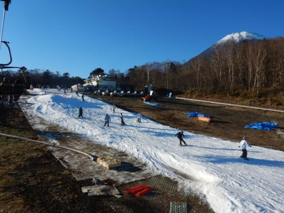

ってなことで．

コース上は混んだものの．

雪は比較的滑ったし．

コースに穴が開くようなこともなく．

比較的コースコンディションは良かった

ので．

ついつい朝9時から16時のコース整備まで，

休まず滑ってしまったのでした～！

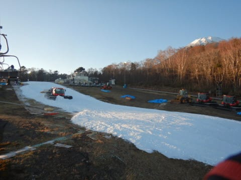

…で．

そうです．

今日はあさイチのシマシマを逃した

こともあり．

当然のごとく，コース整備終了後の

ナイターオープンの17時を狙うわけで…

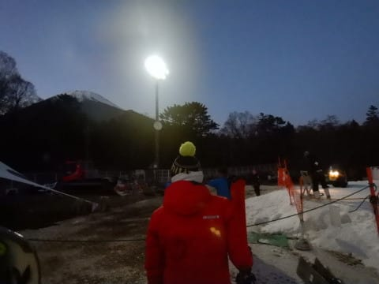

今日はコース整備が早く終わったのか．

17時より5分ほど早めにコースオープン！！

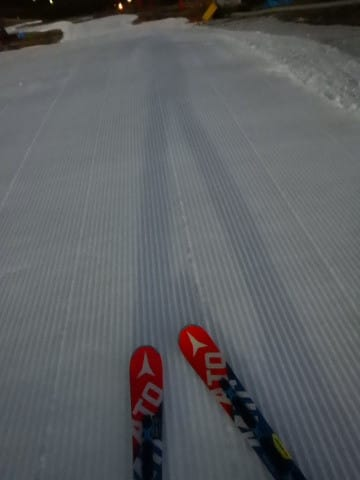

そして，いつものシマシマをいただきます！

今日はポールポジションではなく，

前に人がいたものの…

うはーー！

やっぱりシマシマ最高！

もう，この1本が今日来た目的の半分と

行っても過言ではないっ！！

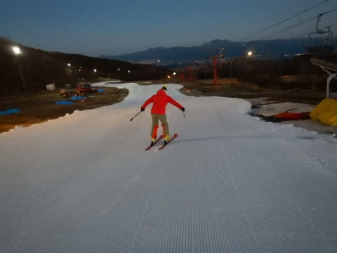

ってなことで．

本日ここに来た目的の半分，

ナイターオープン直後の快感シマシマを

堪能したわけですが…

人が少なくて気持ちよかったのもオープン

から2本目まで．

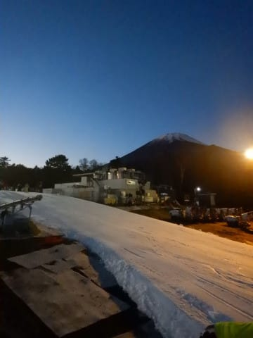

その後はコースの人がみるみる増えていき…

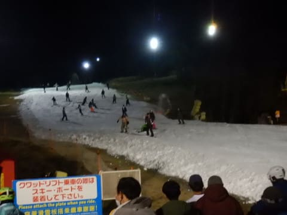

オープンから30分後には，リフト待ちも

かなりの長さに（泣）

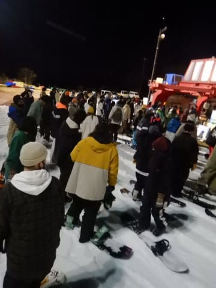

今日も，ナイターもクワッドとペアの

2本体制で．

ペアリフトは待ち時間が0だったものの…

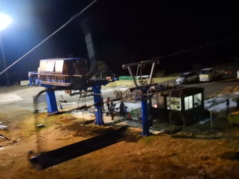

クワッドリフトは5分待ちを超えてきて．

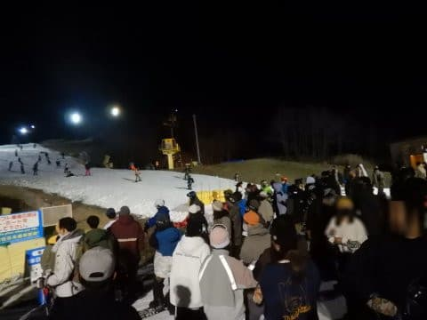

さらに，コース上の人口密度もかなり

高くなってきました（泣）

薄暗い中，この人口密度はかなり

厳しい…（涙）

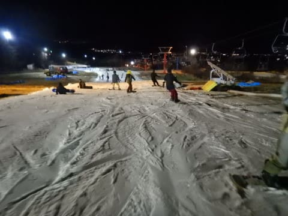

ということで．

今日も18時過ぎに退散したのでした…

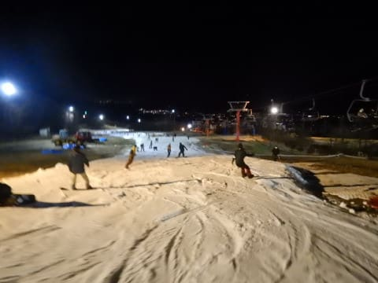

とはいうものの．

土曜は終日天気も良く．

それでいて，気温は冷えていて．

板の滑りも良かったし．

意外と楽しめた一日だったかな～！

…でも．

さすがにそろそろ，Yetiに飽きてきましたね…

…ちがうスキー場を滑りたいんだけど．

どう天気図を見てみても．

おそらく20，21日の週末もイエティに

ならざるをえないな…

やっぱり…（泣）

## 💬 コメント一覧

### 💬 コメント by (ひゃくりん)
**タイトル**: Unknown
**投稿日**: 2021-11-15 19:50:25

私も土曜日に滑っており、

ご挨拶をと思い、Skier_S//さんを探してみました。

スキーヤーの数は少ないので探しやすそうでしたが、

スノーボーダーから見ると、

スキー板はどれも同じに見えて、

見つけることができませんでした（汗

横手山オープン案内が出ましたので、

今週は横手山でしょうか？

### 💬 コメント by (Skier_S)
**タイトル**: >ひゃくりんさま
**投稿日**: 2021-11-15 23:38:27

意外と簡単に発見できるといううわさがありますが、ボーダーの方には

確かに見つけにくいかも…

今週末横手がオープンしても、シーズン券が使えないので

おそらく交通費がかからないYetiで滑っていると思います…

おそらく横手、混むと思いますので。

