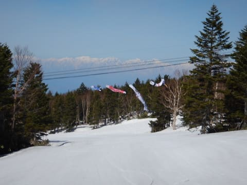

# 2019/5/5(日・祝）GWラスト2日の志賀高原スキー場は…天気はすっきり晴天！朝イチは良かったけど，気温が上がって午前中から滑りが悪い雪に（涙）

📅 投稿日時: 2019-05-06 00:04:55

ということで．

ゴールデンウィークも，残すところ

あと2日となってしまいましたが．

本日も懲りずに滑り続けてきたので．

いつも通りの志賀高原レポートです！

…まず．

早朝勝負のこの時期．

言うまでもなく，当然のごとく

朝6:30の早朝営業から参加するわけで．

早朝のゴンドラに乗り，

山頂に着くと…

うげげげ．

早朝スタート時点で，すでに気温+4度ですか…（涙）

だけど．

本日も晴天ピカピカの焼額山．

明け方は放射冷却でかなり冷え込んだようで…

ゲレンデはいい感じで固まり，

表面がうっすら緩んだ，最高のシマシマバーン！！

もう，毎日続く，シマシマの写真に

「見飽きた」との声が聞こえてきそうですが…

でも，誰が何と言おうと．

この時期は，朝のシマシマが最高なのだ！！

3月や4月でスキーシーズンを終えちゃって．

このシマシマを味わえないとは…

もったいないっ！！

GW後半でも，まだまだこんなゲレンデを

滑れますよ～！（ただし早朝限定）

しかし…

これが，明日営業終了のスキー場とは

思えない…

まだまだ全然滑れるのに．

ホントに明日で営業終わっちゃうの？？

どう考えても．

このゲレンデを，明後日以降は滑れないなんて…

間違いなく，もったいないお化けが

団体で襲ってくる．

もったいないお化けが襲わなくても，

私が襲う！！

…というくらい．

早朝は，とてもあと2日で営業終了とは

信じられない，最高の快感コンディション…

でも．

早朝1本目で表面が緩み始めていた

コースは．

早朝開始1時間後には，もう結構緩み始めて．

早朝営業終了ごろには，

かなり表面が重く，ずっしりした

雪になってきました…（涙）

だもんで．

そうです．

いつも通り．

通常営業開始と同時に．

滑走禁止が解除されるパノラマコースへ，

Go！

そして…

いつも通り，シマシマAgain！！

いやーー．

やっぱりこの時期は，朝に限りますな！！

そして．

シマシマハンターとしては．

同じく，通常営業と同時にオープンになる

唐松コースへ，シマシマをいただきに

いってくるわけですが…

…右側の土のエリア，増えましたね（涙）

でも，一番左のコブライン．

ここから見える範囲には，コブ溝も

抜けてないようですね…

（厳密には最後の方に1か所，土が出てきてたけど…）

しかし．

昨日ちょっと穴が開き始めた，

唐松コース最後の落ち込み部分．

うーん．

穴が大きくなり，コースが左右に2分割

されちゃいましたね…

今年はGSコースにガンガン人工雪を

打った分，唐松コースの人工雪の打ち方が

ちょっと甘かったのかな？

でも．

明日の最終日までは，全然問題なく

滑れそうですね．

ここ以外は．

まだまだ雪がいっぱいありますよ～！

とても明日営業終了のスキー場とは

思えませんよ～！

…とはいえ．

強い日差しが差し込み…

気温も朝10時には+10℃に達し，気温がぐんぐん

上がっていった本日．

（写真は午後2時ぐらいの最高気温

朝9時半ごろには．雪がかなり緩んで…

ちょいと滑りが悪い雪になってきました（涙）

やっぱり，この時期は早朝勝負なんだな（泣）

雪はたっぷりあり．天気もいいにもかかわらず．

雪の滑りが悪くなっていくと．

ゲレンデの人は一気に減っていきます…

雪はたっぷりあるんだけど．

大変残念なことに．

雪がちょいと粘つく感じで．

強烈なブレーキ雪ではないけど．

ちょっと滑りが悪い感じ…

そのせいで，ゲレンデには

ほどんど誰もいないほどの人口密度に

下がってしまうんですが．

その代わり，人が少ないので．

ゲレンデは恐ろしいほど荒れません…

滑りがあんまりよくないけど．

昨日と比べると，今日はかなり

人が少なくなっていて．

サウスコースやビギナーズコース，

営業終了時間まで，フラットバーンを

キープしてました…

ただ．

この時期．

人が滑らないと，雪の上に汚れが浮いて，

すごいことになってきますが…

ってなことで．

滑りの悪い雪に悩まされながらも．

パノラマコースや

サウスコースなど．

比較的荒れの少ない雪を．

ひたすら夕方まで滑り続け

ましたが…

午後は雨が降るかも？？

という，TVなんかの天気予報と裏腹に．

結局，夕方まで晴天が続いた本日．

最後の方は，GSコースの一部など，

荒れたところもありましたが．

明日で営業終了とは信じられない量の雪を．

今日も日が暮れるまで滑りつづけ．

いつも通り，営業終了の16:00まで

滑り倒したのでした…

いや．

しかし．

10連休だったこのGW．

もうあと明日だけで終わりなのか！！

短い．

短すぎる！

あと10日くらい滑っていたい気分…

泣いても笑っても，明日がラスト営業日の焼額．

明日は朝は晴れだけど．

午後は雲が増えていき．

夕方から天気は崩れそうだけど．

リフト営業中は降らずに

ぎりぎりもってくれそうかな…

…しかし．

このゲレンデが，明日で営業終了

しちゃうとは…

繰り返しになるけど．

信じられないなぁ…

## 💬 コメント一覧

### 💬 コメント by (michi)
**タイトル**: Unknown
**投稿日**: 2019-05-06 17:02:11

一昨日でシーズン終了しました。

今シーズンもいろいろありがとうございました。

ゲレンデレポートや試乗レポートはまだまだ続くようなので楽しみに拝見したいと思います。

### 💬 コメント by (Skier_S)
**タイトル**: >michiさま
**投稿日**: 2019-05-07 02:14:58

シーズン終了ですか…

まだまだ1か月くらいは滑れますよ～！(笑)

今シーズンもお世話になりました．

私のシーズンレポートはまだまだ続くので，引き続き見てやってください．

