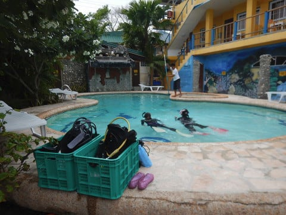

# 小学校5年生（10歳）の娘に，ジュニアオープンウォーターのダイビングCカードを取らせてみた…その5

📅 投稿日時: 2018-09-21 04:10:16

ってな感じで．

昨日は死んでましたが．

…今日もこんな時間…（涙）

でも．

2日連続ネタ投稿無しというわけにいかないので．

睡眠時間を削って書くのだ！←別にお金をもらえるわけでも何でもないのに，

何がそんなモチベーションになってるんだろう…

ってな感じで．

本日は娘のCカード取得体験記，ラストです．

では，どうぞ～！

--

という感じで．

プール実習と海洋実習2本で1日目が終わったわけですが．

2日目は…

朝イチに，最後のプール実習です．

…でも，どうやら，実習というより．

「シュノーケル＆フィンを着けて300m泳げるか」

「10分間水面に浮いていられるか」

という，泳力チェックだけやったようで．

1時間も経たずに，プール実習終了！

午前の後半から，ファンダイブ組に混ざり．

ボートに乗っての海洋実習です…

で．

ファンダイブ組の私と実習組の娘，

同じポイントで違うコースで潜り．

エグジットのころに，ボートの周りで

合流しましたが…

なんと．

海洋実習3本目にして．

普通にしっかり中世浮力を取って，

中層を泳いで行ってるよ…！

この，娘が泳いでいる姿を見て．

海洋実習中だと見抜ける人は少ないの

では…？？

というくらいの慣れっぷり．

その余裕．

とても小学生には見えんぞ…お前．

で．

2日目の午後は，ついに海洋実習ラストとなる4本目．

このラスト1本は，もう細かなスキル練習は

終わってるので．

完全ほとんどファンダイブですね…

ファンダイブ組と同じドロップオフ沿いを，

華麗にドリフトダイビングしていくわが娘．

海洋実習でボートダイブのドリフトって…

ちょっとレベルが高い気が（笑）．

でも，もう，慣れたもんだわ…

ということで．

4本目の海洋実習を終えて．

インストラクターさんをして．

「泳ぎ慣れてる．海にも慣れてる．

　何の心配もありません！」

と言わしめたわが娘．

なんの問題なく，無事合格！！

晴れてジュニアオープンウォーターのCカードを

Getしました～！

ってな感じで．

プール実習，海洋実習については．

大人だから，子供だから…

というよりは

海に慣れているかどうか

が大きく効いてくるようで．

海に慣れていて，海をそんなに怖がらない

子供であれば．

10歳児でも全く何の問題もなく．

実習はあっさり終えられると思います…

というわけで．

学科は多少苦労したものの．

実習では特に苦労せず，Cカードが取れましたが．

…でも．わが娘．

まだボートダイビングしかやったことないんですよね…．

おそらく．

大人と違って，10歳の子供にとってつらいのは，

重いタンクと器材を背負って，海岸を歩いての

エントリーとエグジットだろうから．

ボートダイビングで海洋実習ができたのは，

子供向けには良かったのかも…

とりあえず．

子供をダイバーにしようかな…という方がいたら．

10歳になったら，Cカード取れますので．

ぜひ，ダイバーに仕立て上げてください…

どこで取らせようか？

と悩んだら．

今回お世話になったモアルボアルの

[エメラルドグリーンダイビングセンター](http://emeraldgreen-moalboal.com/)なら

対応してくれます…

というか．

娘に「実習すごい楽しかった～！！」と言わせてくれた

アサミさんがいますので（2018年現在）．

おススメしておきます．

イワシの群れを見ながら実習できます（笑）．

おそらく旅費入れても，国内で取るより安いかと．

アサミさん，いろいろありがとう

ございました～！
