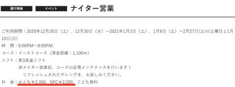
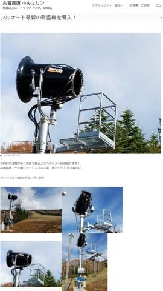
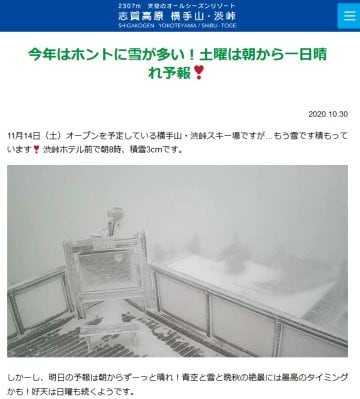

# 志賀，一の瀬ファミリーにも人工降雪機増強…そして明日，私はYetiにて2021シーズンイン！

📅 投稿日時: 2020-10-31 00:09:13

えー．

今日，Yetiがオープンしました！！

2021シーズン，スタートです！

…そして，私も明日，Yetiでシーズンインです！

いやー．

2020シーズンがボロボロの状態で終わった時は，

もう2021シーズンはスキー場が営業

できないんじゃないかと思いましたが…

なんとか無事，シーズンが始まりそうです！！

で．

昨日は，焼額の4月からの早朝営業が

値上がり＆2ゴンになるというニュースで

ショックを受けたわけですが．

…昨日，書き忘れてましたが．

今シーズンの焼額シーズン券の申込書には，

通常営業とナイターが滑れると書いてあるけど．

早朝が滑れるとは書いていないので．

…焼額シーズン券をもっている人も，

早朝は2500円を払わないといけない

ということですよね…

うーむ…

シーズン券が早朝に使えるなら，

早割シーズン券買ってもいいかも…？

と一瞬思ったけど．

早朝には使えないのか…（残念）

そしてさらに．

焼額のホームページに，ナイター営業の

案内があったのも見つけたけど…

え？ナイター料金，大人2300円？？

（西部プリンスクラブ会員は2200円）

（[焼額山ホームページ](https://www.princehotels.co.jp/ski/shiga/informations/night_ski_1/)より）

…私の記憶が確かなら，去シーズンは

プリンスクラブ会員が2100円だった

気がするんですが…

…ここも，100円値上げですか…（涙）

あと，今年もナイターの営業時間は

午後6時から8時までなんですね．

これが午後7時から9時までなら，

宿で夕食を食べてから来れるんですが…（残念）

まぁ，昨シーズンの某サンバレースキー場の

ように←全然「某」になってないから

営業時間が短くなった上に値上げ

というひどい仕打ちじゃなかっただけ，

良しとしなくてはいけませんね←だから，なんで上から目線？

…そして．

志賀高原のニュースがもう一つ．

[横手山に観光振興補助金補助金で
人工降雪機が増強され](https://yokoteyama2307.com/news/9848/)．

これまで人工降雪機が無かった横手山も，

熊の湯と同じ11月14日オープンとなった

ニュースは多くの人がご存知と思いますが…

どうやら，一の瀬ファミリーも補助金対象

だったのか．

一の瀬ファミリーペアリフト横にも，

人工降雪機が増強されたようです…！

（[志賀高原中央エリアホームページ](http://shigakogen.co.jp/archives/7923)より）

なるほど…こんなに人工降雪機が増強

されるから，ファミリーは例年より早い

11月20日オープンを狙うわけですか…！

無事，予定通りに例年より早くオープン

してくれれば嬉しいんですが…

とりあえず，今日も志賀高原はかなり

冷え込んで，山はかなり白くなった

ようなので．

（[横手山・渋峠ホームページ](https://yokoteyama2307.com/news/10672/)より）

このまま志賀高原オープンまで冷え冷えで

いてほしいところなんですが…

やっぱり，冷えるのは11月4日ごろまで．

それからはちょっと気温が上がりそうな

天気図（涙）．

…ちょうど人工雪を打つピークの頃に

気温が上がるという，いやらしい予報．

とりあえず，この予報が外れるよう，

このBlogをご覧の皆様は，

「山々よ冷えよ！そして降れ！積もれ！

　情熱の冷え冷え踊り」

を，これから11月の志賀高原オープンまで

踊り続けてくださいますよう，よろしく

お願いします…

物欲選手権の続きは？…という声が聞こえる…

…今しばしお待ちを…

## 💬 コメント一覧

### 💬 コメント by (ほっぽ)
**タイトル**: 10/30　イエティナイター
**投稿日**: 2020-10-31 00:21:17

Ｓさん

一足お先にシーズンインしてきました。

土日混雑すると受付、検温、リフト待ちなど、

スキーを滑る以外の部分で厳しいかもしれません。

今夜の滑走レポートはURLから見られます。

### 💬 コメント by (Skier_S)
**タイトル**: ＞ほっぽさま
**投稿日**: 2020-11-01 02:10:43

やはり，早くもシーズンインされましたか！

検温自体はそれほどじゃなかったですが，やはり土曜は混みました…（涙）

