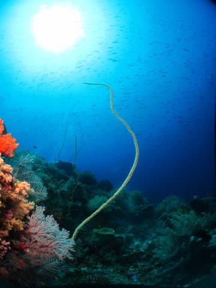
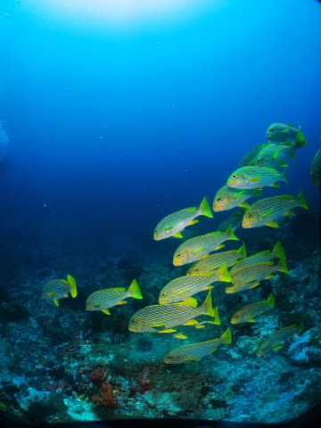

# 子連れコモドダイビングクルーズagain　その26　これぞ北エリア！！満足のクリスタル

📅 投稿日時: 2011-09-27 01:44:16

あー．

相変わらず，「徒然スキーヤー日記」というタイトルと不釣合いな，

コモドのダイビング旅行記が続きますが．

このブログのタイトルを「バブリーダイバー日記」にした方がいいのでは？

という指摘を受けてしまいました…

そんな指摘にも懲りず，コモドクルーズ旅行記続きます．

---------

さて．

「潜りに行かないで～！」と娘に懇願され．

2本目をスキップしたわけですが．

無事，3本目を潜りにいけるのか？

昼食後…3本目のダイビングの時間がやってきましたが．

そのとき．

娘はちょうどリンダさんと遊んでいる途中．

…

…ナイスタイミング！ナイスだ！リンダさん！

ということで．

リンダさんへ目で合図をして，そっとダイブデッキに

消えたわれわれ夫婦…

ごめんね．娘．

さっき1本スキップして遊んであげたから，

この1本は許して…

ということで．

3本目のポイントは，Crystal Rock.

ここは，Castel Rockと並んでコモド島北エリアを代表する，

隠れ根に潮ががんがん当たる大物ポイント．

いざ，エントリー！

で，エントリー後…潜り始めてすぐ．

まさに，BCのエアを抜いて，数m潜行を開始したばかりのタイミングで．

なんか巨大な影がもやもや動いてるんですが．

…あれ，魚？

魚だ！

魚の群れだ！

群れに向かって近づいていくと…

巨大なクマザサハナムロの群れが，頭上に広がります．

群れが，それ自体生き物であるかのように，ザーッと

流れ，形を変え…

群れがちょうど頭上を越えるとき，ダイバーのエアを避けるように，

群れの真ん中に穴が開きます…

うはー．

巨大な群れをしばらく眺めていると…

それまでゆったり形を変えていた群れが，にわかに騒がしくなり．

一気にザーッと形を変えた！

と思うと，その向こうからロウニンアジの一団が現れた！

どうやら，ロウニンアジにアタックされている様子．

かと思うと，今度はカスミアジの一群が後ろから巨大群れに迫る！

パニックに陥る群れ．

これまで，ダイバーとはある程度の距離を保っていたけど…

もう，ダイバーも無視！

こっちに向かってくる！

…われわれ5人チームで潜っていたけど．

周り中魚に囲まれ，お互いが見えない！

うひゃー！

魚に囲まれたっ！

ダイバーの周りを通り過ぎた後…

群れを追いかけて行くカスミアジが通り過ぎていきます．

うはー．

なかなかの迫力．

ちょっと群れが離れていったので．

その後はちょっと深度を落として．

こんなものを見に行きます．

ピグミーシーホース．

ちっちゃいタツノオトシゴみたいな奴ですが…

どこにいるか分かるかな？

…しかし．このポイント．

巨大群れからこんなマクロものまで…

いろいろ幅の広いポイントですな．

そのほか，いろいろゆったり眺めます．

最後の安全停止のポイントに向かう前に．

また，巨大群れに再会．

引き続き大型魚のアタックを受け，

そのたびに

ザザッ，

ザザッ，

と，群れがきらめきながら動きます．

すげーーーー．

エグジットの直前まで，じっくり群れを眺め続けました．

…おかげでエグジット時にはこんな感じに．

ちょっとヒヤヒヤもの…

しかし．

いやーーーーー．

超満足！

で．

ボートにあがってから．

私「いやーーーー！すごかった！かなりの大迫力ダイブだった！」

妻「…そう？もう1本前の方がすごかったけど」

私「…

　　…

　　…は？」

他のゲスト1「確かに，前の1本の方がすごかったよね～」

私「…えぇ？」

他のゲスト2「うん．今のよりさっきの1本の方が，ハナタカサゴとかウメイロモドキとか，もっといろんな群れがいて，もっと大きかったねー」

私「…え…」

　　

　　これよりすごい…

　　これよりすごいダイビングって…

　ど，どんなんじゃーっ！！！！

…このとき初めて．

私は，非常に運が悪いことに

最高の1本をどんぴしゃで逃してしまっていたらしい，

ということを知ったのだった…
