# 2月23日の志賀高原は…雪質最高！

📅 投稿日時: 2013-02-23 17:26:23

🏷️ カテゴリ: [2013スキー滑走日記](c91dbe557f9a69230b1600e48622fdd61.md)

えー．

本日土曜日ですが．

いやーーーー．

雪はよかったですよ．

昨晩から20から30cmほど積もったらしく．

高速は坂城からチェーン規制がかかるほど．

おおお．朝からパフパフか？？？

と，気分はゲレンデへ急ぎたいところ…

チェーン規制渋滞に30分引っかかって出遅れてしまった…（涙)．

出遅れながらもゲレンデに到着すると．

今朝の気温はマイナス15度と，

今日もいい感じで冷え込んでますね～

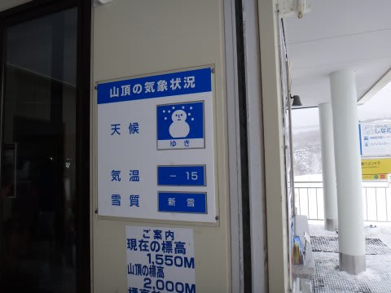

そして．

私が到着した9時時点では，晴れてましたっ！

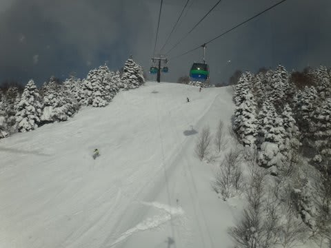

んで，ゲレンデは…

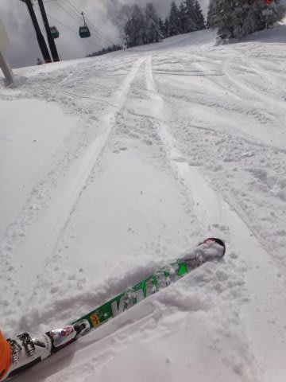

すごいやわらかい，軽い雪がゲレンデ全体を覆っていて…

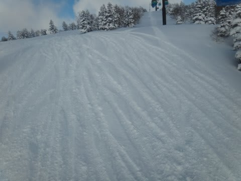

自分がうまくなったのでは？？

と錯覚できるほどの，超最高の雪質！

いやーーー．

最高っ！！！

最高だよ…

最高の天気，最高の雪質での，快楽の大回り．

もう，地位も名誉も財産もいらないっ！！

（スキーできるお金はいるけど）．

ああ，幸せ…

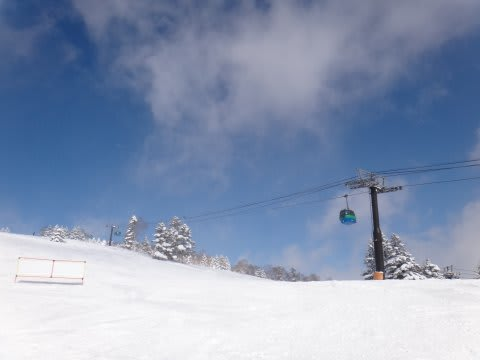

オリンピックコースは，膝下パフくらい．

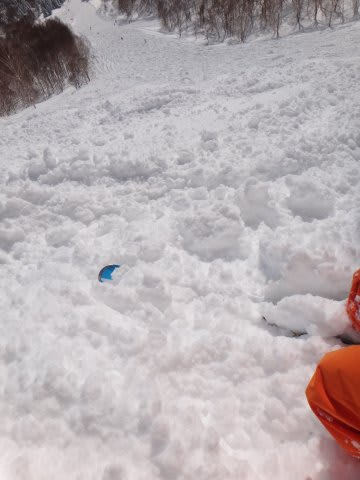

これも，超軽くてご機嫌な雪質．

いやーーー．

志賀のトップシーズンはこれじゃなきゃ！

ああ．

今日は幸せな一日になりそうだ…

と，

ここまでは順調だったんだけど．

なぜか，朝10時ごろに．

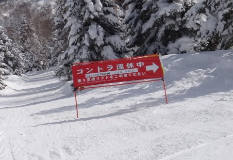

なんとっ！

焼額第1ゴンドラが故障で停止…(泣）．

なぜ．

なぜこんな最高の日に…っ！

おかげで，ゴンドラ横の第3高速リフトは結構な混雑に(悲）．

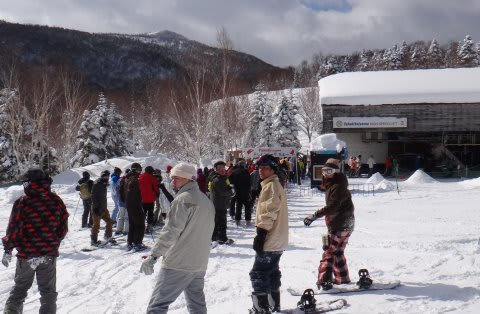

うーーん．

今シーズン，第1ゴンドラ故障で止まったの，3回目だなぁ(涙)．

で．

幸い，30分くらいでゴンドラの営業は再開したんですが…

ゴンドラが営業再開したというのに，みんな他の場所に行ってしまったからか．

いつもなら混雑する11時ごろもゴンドラががらがら．

「をを，ゴンドラ混まなくてラッキー！」

などと思っていたところ…

第1ゴンドラ．ちょっと根性が足りなかったらしく．

1時半ごろにまた故障(涙）．

そのために，

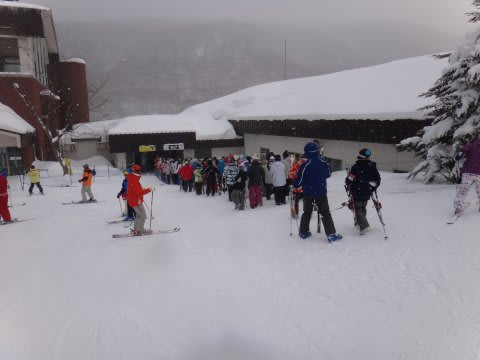

焼額第2ゴンドラが激混みになっちゃったんですけど(泣）．

そして，当然第2ゴンドラ側のコースも人が増える，と．

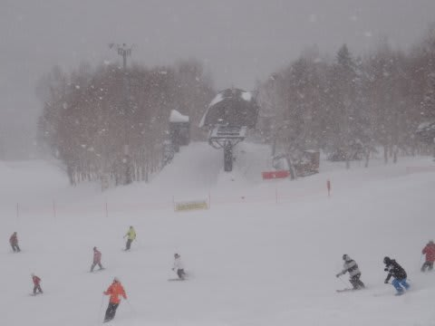

うーん．

人が多くてちょいと快適度が低い…

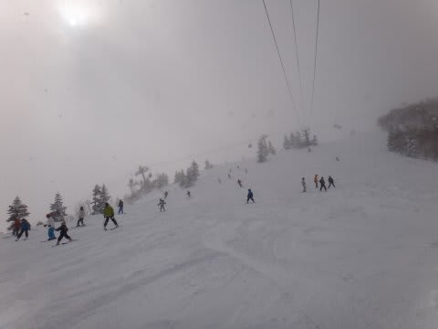

雪はいいんだけど．いいんだけど．

どうしてこういう日に第1ゴンドラ止まるの？(涙)

で，午後3時過ぎに，ようやくゴンドラ復旧しました．

このころには，コースは結構ぼこぼこになっちゃってましたね～．

でも，雪がやわらかいので，結構滑りやすかったですよ！

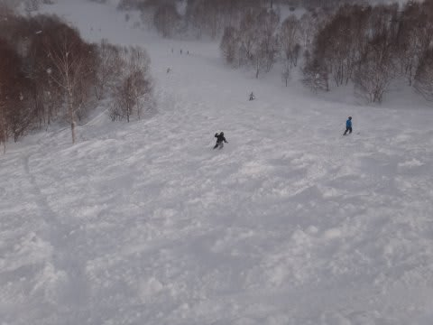

天気は，予想通りの降ったり止んだりで，時々強く降る事もあったけど…

基本的には薄日が射していて，

コースの視界もよく，

雪もよかったので．

…これでゴンドラさえ止まらなきゃ，いい日だったんだけどなぁ…

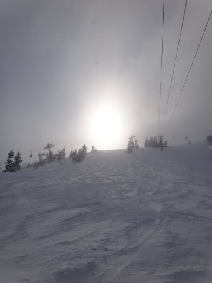

まぁ，これから夕食食べて，ナイター行って来ま～す

## 💬 コメント一覧

### 💬 コメント by (ゆうこ)
**タイトル**: 全身オレンジ
**投稿日**: 2013-02-24 19:44:55

土日は、人生で始めてスキー板をはく友達にスキーを教えていて、第一ゴンドラには1回しか行けませんでした！

でも、その一回で全身オレンジのSkier_Sさんを発見しちゃいました！

隣に立って並んでいたのですが、私も友達4人といたので話しかけれませんでした。

また、来週楽しみにしてます。

今日はSkier_Sさんの予報通りの天気で、本当に寒くて辛かったです。

今週は初心者レッスンであまり滑れなかったので、来週頑張ります！

### 💬 コメント by (Skier_S)
**タイトル**: ゆうこさま
**投稿日**: 2013-02-24 23:49:04

おおっと．

前回とウェアをまったく変えてましたが，

発見されちゃいましたか(笑）．

並んでたってことは…ゴンドラ乗り場ですよね．

うーーん．どれがゆうこさんだったんだろう…

こちらからは，まったく分かりません（笑）．

しかし，今日はパフパフ好きにはたまらない一日でしたが，

初心者の方にはつらい一日でしたね～．

私は一日中，オリンピックコースでパフパフを

満喫しましたよ！

