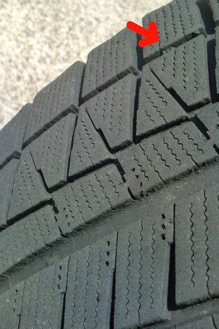

# 夏タイヤに交換してみた…2シーズン，4.3万km走ったBLIZZAK REVO GZの減り具合は…？

📅 投稿日時: 2015-05-30 01:37:51

🏷️ カテゴリ: [車](cba0e8330b3f2ded7c1addfacc75d4547.md)

ピンポンパンぽーーーん♪

徒然スキーヤー日記をご覧の皆様に，お知らせいたします．

明日，明後日のかぐらの天気ですが．

昨日の予想通り，土曜は晴れます．

時折雲がかかるかもしれませんが，にわか雨の可能性は，

ほぼゼロとなりました．

日曜は，時折雨が降るかも…という予想でしたが．

雨は降りません．

繰り返します．

日曜は，終日雲が多いですが．雨は降らない予想に変わりました．

…これは，Skier_Sが，土曜は用事で，日曜に

日帰りになったため．

日ごろの行いがいつも通りたいへん良かった

Skier_Sのために．

日曜に，雨が降らなくなったものと思われます．

以上，徒然スキーヤー日記からのお知らせでした…

パンぽんぴんぺーん♪

…という，とっても大事なお知らせのあとに．←大事というより…読者の殺意を誘っているだけでは？？

本題へ．

ちょいと古いネタになるのですが．

このGW明け．

「もう，スタッドレスタイヤもいらんべー」

ということで．

BRレガシィ君のタイヤを，夏タイヤに交換したわけですね～．

ってことで．

昨シーズン購入した，ブリヂストンのBLIZZAK REVO GZ．

昨シーズン約2万km，

2シーズン目の今シーズンは約2.3万km走ったわけで．

トータル4.3万km走ったタイヤはどのくらいの減りかいな…

…と．

外したタイヤを見てみたところ．

ふーむ．

まだ発泡ゴムも減り切ってないし．

まだ使えそうにも見える…

＃前のBLIZZAK REVO2は，5万km位で

＃発泡ゴムが減り切って，下地のツルツルゴムが出てきた…

と，思ったところ．

…あれれ？？

フロントタイヤの内側…

あうううーーーん．

プラットホームが完全に露出しちゃってるよ…！！（泣）．

フロントタイヤのアウト側は…

こんな感じで，まだプラットホームが出てないんだけどなぁ…

以前のRBオデッセイだと．

コーナーを攻めた時，ロール時の外側フロントタイヤの

対地キャンバーがかなりポジティブになるってのもあり．

フロントタイヤは，思いっきりアウト側から減っていったけど．

BRレガシィ君．

キングピン角による，ステア時のキャンバー特性なのか．

1G荷重時にすでにネガティブキャンバーなのか．

なぜか，フロントタイヤ．

イン側が減るようですね…

うーん．

しかし．

やっぱり．

スタッドレス，4万km以上走ったら，さすがに寿命か…（涙）

まだ，2シーズンしか使ってないんだけどな～…（泣）．

せめて3シーズン持ってほしいなぁ…←6万km以上もつスタッドレスなんてないから（自己突込み）

ってことで．

悲しみながらも，いつも通り汚れた下回りを…

ピカピカに磨き上げ，錆を取るという作業もこなすことで．

スタッドレスがダメになってしまった悲しさと，

スキーシーズンが終わっていく寂寥感を，

ちょっと紛らせた，Skier_Sなのだった…

## 💬 コメント一覧

### 💬 コメント by (megalith)
**タイトル**: Unknown
**投稿日**: 2015-11-01 22:39:53

ご無沙汰しています。

うちのBR君何故かメーカーのテストを受けることになりました。（泣）

事の発端は先々月終わり頃から頻発し始めたアイサイトのエラーによるオートクルーズ&追随運転の自動終了です。

アイサイトのエラー信号をディーラーで調べたらVDCからエラーが出ているということで、最初はVDCとブレーキのエア抜き作業をしましたが治らず、今度はVDCユニット新品交換しましたが数日後に再発。（泣）

ディーラーもお手上げ状態となり結果メーカーテストとなり、テスト+ディーラー休日等で都合5日入院となります。

幸いまだ6万キロに到達していなかったので(ただし約５万８９００キロですが(^_^;))費用は無償になりそうですが・・・・(^_^;)

### 💬 コメント by (Skier_S)
**タイトル**: megalithさま
**投稿日**: 2015-11-02 02:29:27

をを！

お久しぶりです…

あれ？アイサイトって6万km保証なんですか？

重要な部品は10万km保証だと思い込んでましたが…

わがBR君は73000km突破したので，もうアウトですね（涙）．

VDCからエラーって…

VDCそのもののエラーか，センサ異常による

ホイール回転の取りそびれか…

しかし，そんな故障するんですね…

5日間の入院で治ればいいのですが．

### 💬 コメント by (megalith)
**タイトル**: Unknown
**投稿日**: 2015-11-02 21:15:28

アイサイト自体は6万kmみたいですね。

ただVDC等は10万kmの様ですが。

http://www.subaru.jp/afterservice/warranty/

VDCは新品交換しましたからそのものは考えにくいですね。

今回はテスト&データ取りとエア抜きがメインなのであまり期待はしていません。(^_^;)

### 💬 コメント by (Skier_S)
**タイトル**: megalithさま
**投稿日**: 2015-11-03 01:52:52

車の走行に関わる基本部分は10万km保証だと

思っていたのに…アイサイトはやっぱり6万kmですか（涙）

また，退院して完治したかどうか教えてください～！

### 💬 コメント by (megalith)
**タイトル**: 完治・・・・したのか?
**投稿日**: 2015-11-23 21:59:49

退院して2週間。

とりあえずテストの後ブレーキのオイル交換&しっかりとエア抜きをしたということで乗っています。

現時点では再発はしていません。

完治・・・・したのか?(^_^;)

さてそろそろスタッドレスですね。

自分は今回2シーズンで終了してしまった(^_^;)DSX2と、BPから持ち越ししたアルミが錆が浮きエアー漏れするようになりセットで無料回収所で処分しました。

そして夏にネットで新たにブランドルのアルミとYOKOHAMA IG50の16インチセットを送料込みで6万円前半で購入しました。(ほとんどホイール代みたいなものでタイヤはおまけ(?)(あるいは逆)みたいな値段です)

もちろんバランス調整込みです。

今現在だと同じブラントで7万円台ですね。

お店のフリーダイヤルで話した時2.5i(アイサイト無し)なら合うけどアイサイトLパッケージではサイズが違うから合わないと言われましたが、16インチはLパッケージも使用可なので、(タイヤサイズの一覧にも書いてあるし（笑）)問答無用でネットで注文しました（笑）

便利な世の中になったものです。

今度の土日あたりで交換予定です。

### 💬 コメント by (Skier_S)
**タイトル**: megalithさま
**投稿日**: 2015-11-24 04:12:40

アイサイト，無事直ったんでしょうか…

で，タイヤの無料回収所ってあるんですか？？

普通タイヤ交換すると，廃タイヤ費用取られますよね…

無料回収があるなら使ってみたいです．

うちもスタッドレス交換しました．

タイヤだけで5万円でした．

ホイールセット6万は安いかも…

うちのBR君は205/60R16なんで

安い16インチが使えて有り難いです．

### 💬 コメント by (megalith)
**タイトル**: 再発・・・・（泣）
**投稿日**: 2015-11-27 20:53:04

タイトル通り再発しました。（泣）

ディーラーに連絡を入れて行ってみたら、今度は1周間予定(延長の可能性あり)の入院だそうです。

しかも今度はメーカーに送るか、メーカーの人に来てもらうそうで、いよいよ大事になってきました。(^_^;)

戻ってきたらレグォーグに進化して帰ってきたりして。(爆)

無料回収所ですが通常のところですよ。(^_^;)

ただ受け付ける品目の中にホイール付きタイヤと言う項目があるところに持って行ったのです。

まぁアルミホイールがアルミとして業者が売れるためこの手が使えたわけですが。

もちろんタイヤ単体はお断りと書かれています。(^_^;)

スタッドレスですがYOKOHAMAですからね(^_^;)

BSだと16インチでも現在10万円コースです。(^_^;)

### 💬 コメント by (Skier_S)
**タイトル**: megalithさま
**投稿日**: 2015-11-28 05:52:43

あらっらら～

再発ですか…

それは残念…

いっそ新車に…（悪魔の誘い）

しかし，アルミホイールセットじゃないと引き受けて

くれないんですね．

残念．

我が家は2年ごとにスタッドレス買い替えなので，

毎回アルミホイールをタダで渡していたら

ちょっとわりに合いません（笑）．

私も今年はスタッドレスはYOKOHAMAです～

iG50PLUSです～！

### 💬 コメント by (megalith)
**タイトル**: Unknown
**投稿日**: 2015-11-29 22:18:47

あ・・・悪魔の誘いには屈しないぞ・・・・多分（爆）

ちなみに今回の代車は選べたのでAWD前提ということで、インプのハイブリッドを指名しました。

何なら試乗車のレヴォーグでもいいと言われましたが、流石にちょっと遠慮しました。(^_^;)

まぁアルミが腐食してエアー漏れしていますし、BPの時から使用してすでに10年でしたからまぁ仕方がないかと。

おやなんとYOKOHAMAの新作ですか。

またインプレッション期待していますね。

ちなみに自分のはIG50の2014年製で、メーカー在庫整理のセール品です。（笑）

### 💬 コメント by (Skier_S)
**タイトル**: megalithさま
**投稿日**: 2015-11-30 02:36:57

ここは試乗車のレヴォーグに行って，

新車へ…というながれかと思ったのですが（笑）．

また，YOKOHAMAのスタッドレスは

雪道走ったらレポートしますね！

