# 2023/2/18(土)の志賀高原焼額山スキー場は…晴れのち曇り，夕方はちらちら雪．団体さんで人が多かったけど，ゴンドラ待ちもそれほどなく昼間は良かったよ！

📅 投稿日時: 2023-02-19 00:40:04

ということで．

2週間ぶりに志賀高原に復活しました～！！

いや…久しぶりに戻ってきました，志賀高原…

志賀の上り道も2週間ぶりとなると，久しぶり

感がありますが…

この時期としては，アスファルトが見えているのが

ちょっと驚き…

でも，ところどころ凍った，本格雪道

ですのでご注意を！

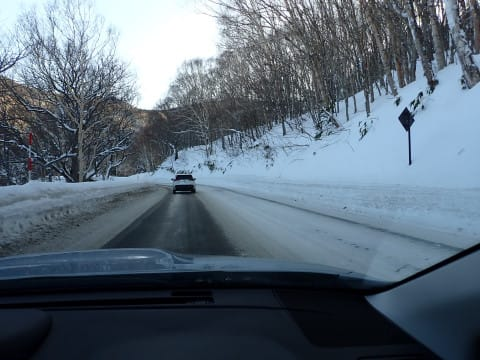

で．

いつも通り，リフト営業開始の

8:30前に到着

しますが…

今日の朝イチはめちゃくちゃ快晴の晴天！！

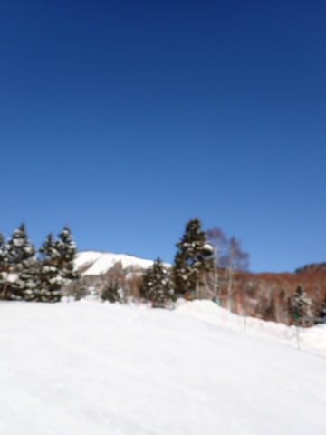

ただ，朝イチのゴンドラ待ちがちょっと

長めで…

今日はちょっと混みそうかな？

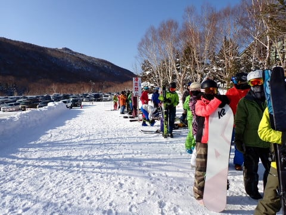

ってなことで．

8：30営業開始のゴンドラに乗って，

山頂に行くと…

朝イチの山頂の気温はこの時期としては

ちと高めの-5～6℃．

おおむね予想通りですね…

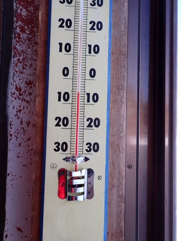

で．

ゲレンデは気持ちいい晴天で…

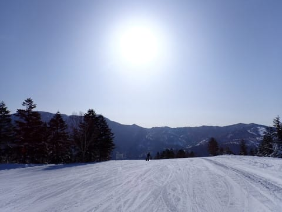

朝イチは結構締まり気味の，スピードが

乗る気持ちいいトップシーズンシマシマ

バーン！！

これだよ！！

焼額の朝イチはこうじゃないと…！！

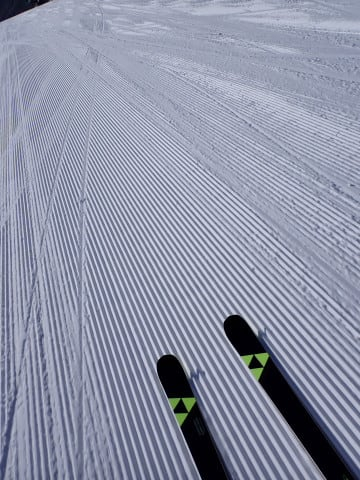

あぁ…

実に2週間ぶり．

このバーンが夢に出てくるほどだったよ…！！

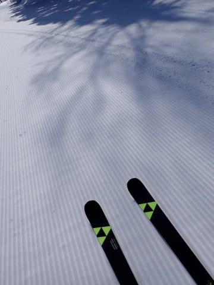

朝のうちは意外と人も少なく，

天気も良く．

雪もトップシーズン冷え冷えの最高

バーン！！

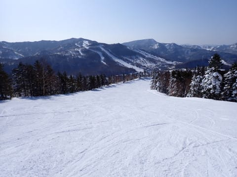

ってな感じで，朝はかなり最高だったんですけど…

9:30頃になると．

ゲレンデ上の人口密度が上がってきて…

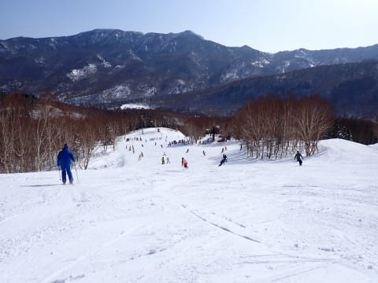

そして，第2高速リフトがすごい列に（涙）

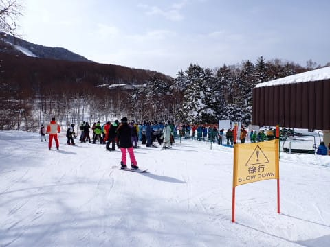

さらに，第1ゴンドラも，朝10時前には

今シーズンは見なかった，

結構長めの列になってきました…(泣)

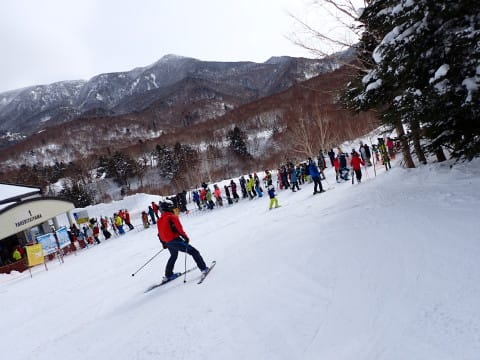

今日は日本体育大学の団体さんが大勢

いたので，一部のコースがかなり混み気味

だったものの…

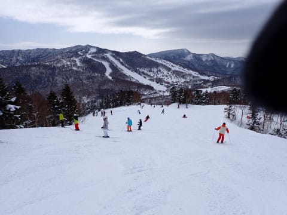

第1ゴンドラは，11時には混雑も終わって，

ゲート内の混雑に収まってきたし．

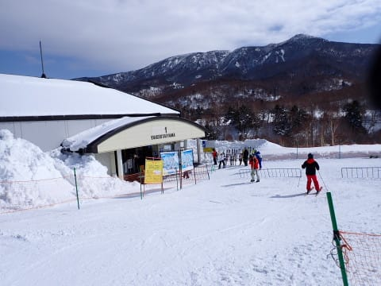

団体さんがいないコースはガラガラ！！

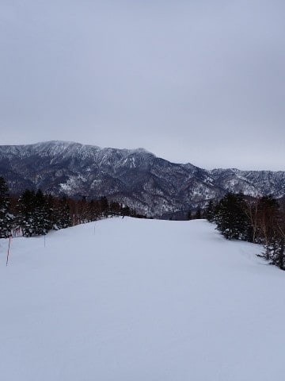

ただ，午後になってくると…

予想通り，雲が増えてきて，曇り空になって

来ました…（ちょい涙）

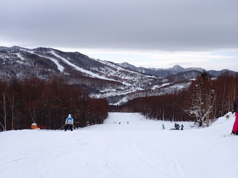

午後になっても，人が多めのコースはちょっと

人が多めのところがあったものの…

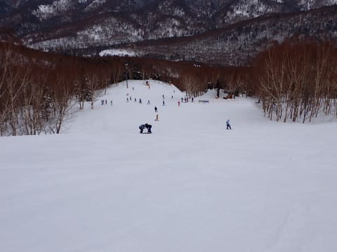

ゴンドラは，結構がら空き！！

2月の週末でこんなにがら空きでいいんだろうか…

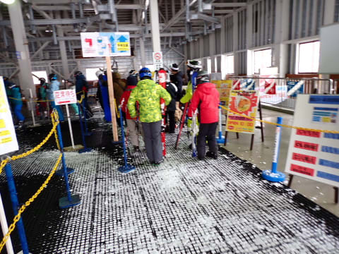

しかし．

だんだん気温が上がっていき．

昼間は山頂でも気温はプラスになって

しまいましたが…

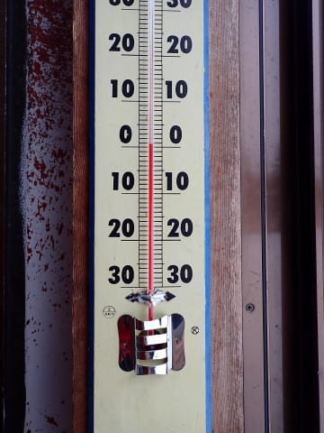

でも，逆に雲が出てきて日差しが隠れたので．

雪は悪くならず…

いい雪室をキープ！

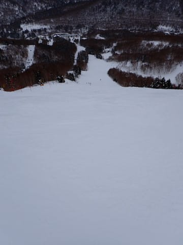

午後2時ごろから，ちょいと雪がぱらつき

始めましたが…

積もるほどではなく，ぱらつく程度．

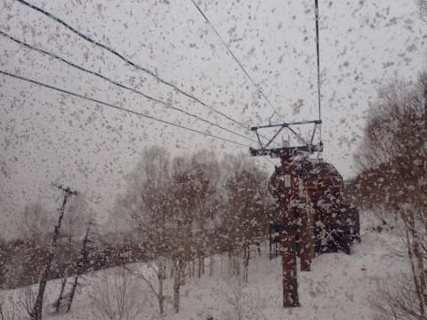

ってなことで．

本日も16:15のリフト終了まで，雪質もそれほど

悪くならずに，バーンもそれほどあれずに

過ごせて…

昼間は結構楽しめる一日でした～！！！

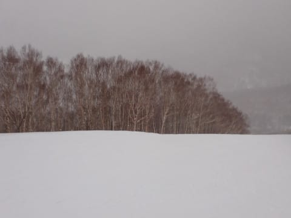

いやーー．

実に2週間ぶりのスキー．

明日は天気が悪そうなので．

今日はコンディションが良いまま楽しめたのは

良かった…

…

…ということで．はい．まだ終わらないですよ！！

2週間ぶりのスキーだし．

明日は天気も雪も悪くなるのがほぼ確定だし．

雪質がいいうちに，ナイターで楽しまないと！！

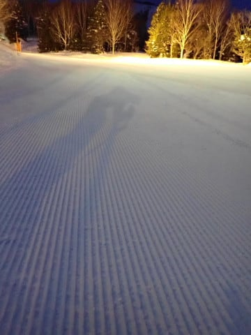

ってなことで．

いつも通り，18:00スタートの，焼額ナイターに

参戦しますが…

うほほほおほほほほ！！！

シマシマっ！！！！

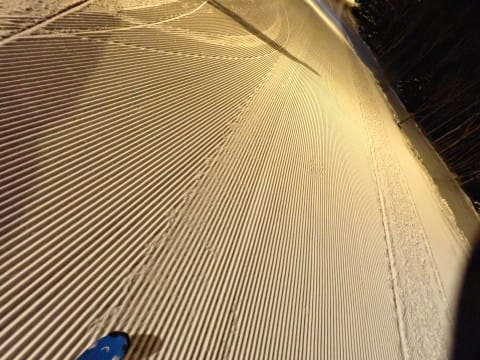

朝イチと同レベルの，最高級のシマシマっ！！

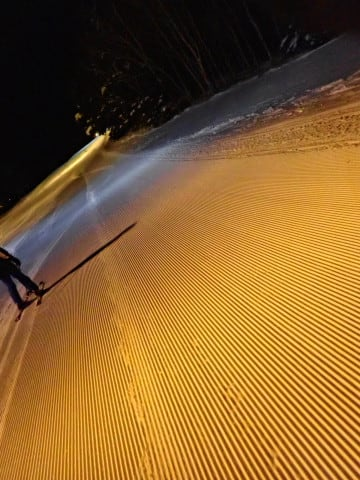

これは最高だぁ…っ！！！

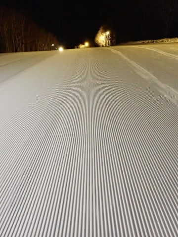

…と，思っていたら．

今日は団体さんも出て来ていて．

ナイターではありえないリフト待ちも

あり…（涙）

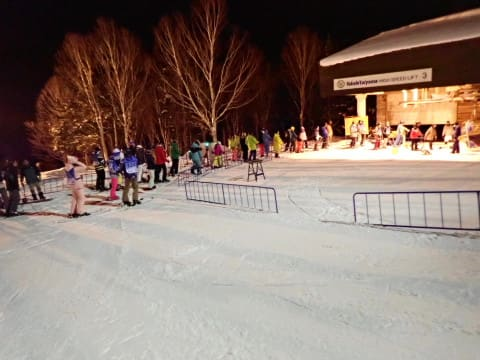

そして．

時折，ほぼ雨っぽい，ウェアにつくとびしょぬれになる

かなり湿った雪も降るときもあり…

（フード付きリフトのフードにつくとすぐ

水滴になるレベル）

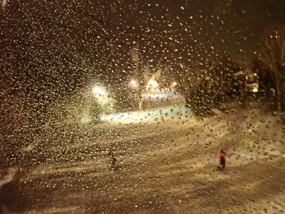

うーん．

いつもに比べると，ちょっと残念なナイター

だったかな…(ちょい涙)

でも．

団体さんがいたのは18:40～19:20までの

営業時間中半分以下の時間だったし．

シマシマを堪能できたから満足！！

…ってなことで．

土曜は楽しめたものの．

深夜12時過ぎの志賀高原．

雨が降ってます（涙）

明日の日曜もやっぱり朝から雨っぽいです…

なぜ，私が滑れる週末に限って…（泣）

でも．

明日も朝から滑ってます～！！

## 💬 コメント一覧

### 💬 コメント by (大阪のK)
**タイトル**: Unknown
**投稿日**: 2023-02-19 04:19:57

標高の高い志賀高原で雨ですか。

私が今いるハチ高原は土曜日から雨で、スキーパンツのベンチレーションから浸水するほど降りました。

今日も雨予報(4時現在降ってます😅)

でも、滑ります。

Sさんに負けないように🎵

### 💬 コメント by (富山県民)
**タイトル**: Unknown
**投稿日**: 2023-02-19 05:55:11

土曜日は志賀高原に行かれたのですね。

土曜日は午前中だけでも晴れてよかったですね。

ただ気温がこの時期としては高めですね。

深夜は志賀高原でも雨が降ったのですね。

私は土曜日は新潟県のキューピットバレイに行きました。

こちらも天気は朝は晴れてましたが昼から曇ってきました。

雪質は朝は上部は比較的良かったですが昼には気温が上がり春のような湿雪になりました。

日曜日は雨予報なのでスキーはお休みします。

### 💬 コメント by (ヒータロゥ)
**タイトル**: Unknown
**投稿日**: 2023-02-19 16:35:31

ナイターは18時５分くらいから19時20分まで参戦しましたが、ちょうどSさんとは反対のサイクルだったかもしれません。本日は雨のため早々に撤退しました。

本当にこんな２月の中旬で雨になるとは…残念至極。

来週は行けないのでここでの雨は本当に痛いです。

（まだ雨中で滑るような超人の域までは至ってません）

### 💬 コメント by (レインボー75)
**タイトル**: Unknown
**投稿日**: 2023-02-19 16:52:35

土曜日の志賀高原情報

朝から湯田中は雨。全く行く気がなかったのに、なぜかスキーウエアに着替えてた。習慣とは恐ろしい。急遽出動することに。

いちごんは故障で運休。FTも中止。

小雨がずっと降り続けるなか、勇者らは果敢に！意外といいぞ。滑るし見える。

ニゴン、二高、三高フーディーで結構楽しく滑っていたら、いちごん開始の放送が。

ゴンドラだと板を持たないといけない。それで手袋がベタベタに。やっぱり雨の日はフーディーリフトに限る。

そんなこんなで11時終了。ここまで滑っただけでも異常なのに、エス様はそのあともラスリフまで当然のように。確か手袋を絞ってましたよね。常人でないことだけは、よーくわかりました。

### 💬 コメント by (Skier_S)
**タイトル**: 今日はダメな一日だった…（泣）
**投稿日**: 2023-02-20 00:58:54

＞大阪のKさま

え…土曜から雨だったんですか…

そして，日曜も雨の中滑ったんですね…

これは立派なスキー〇カですね．

いや．否定してもダメです．疑いようのないスキーバ〇です…

＞富山県民さま

土日で志賀高原でした～！

気温は高めでしたけど，標高の高い志賀高原は，雪はそこまで悪くならなかったです．

日曜は滑らなくて正解です…

＞ヒータロゥさま

ナイター，全然気づきませんでした…

そして，今日は滑らなくて正解です．

ちっとも楽しくなかったです…（泣）

＞レインボー75さま

着替える服を間違えたんですね（笑）．習慣とは怖いですね…

私も習慣でラスリフまで行ってしまいました．

ええ．習慣です…

