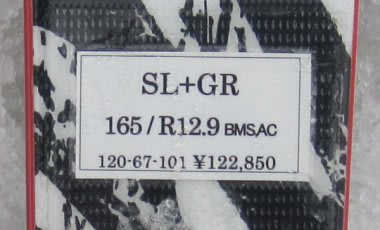

# またまた復活！2012/2013シーズンモデルのスキー試乗レポート　OGASAKA編

📅 投稿日時: 2012-05-17 02:05:50

🏷️ カテゴリ: [スキー板試乗](c0bd8048615710cee890e403a36cc9a2b.md)

で．

オガサカキャンプに参加して．

OGASAKAの板に試乗してきた，ってことは．

当然，スキー板試乗インプレッションがまた始まるわけですね．

…いい加減飽きた，っていう人も多いかもしれませんが．

まぁ，またお付き合いのほどを…

この日の試乗コンディションは，しっかり固まったアイスバーンに

薄く新雪が乗った状態．

板の性能を知るには最高な状況だったかも．

…でも．

試乗している人間が，テク・クラも指導員資格も

持っていない，いい加減なレジャースキーヤーなので．

このインプレッションは話半分に聞いて，

「こんな風に思う人もいるんだなぁ…」

という程度の参考にしてもらったほうがいいかも…

------

○OGASAKA

TRIUN SL+RC-600GR 165cm

SL競技用．

SL用には入門用のSと本格版のSLの2モデルがあるようですが．

こっちはSLのほう．

さらに，最も強いGRプレートがついたモデルです．

OGASAKAの板というと．硬い斜面でガッツりエッジが喰らいつく

イメージがそんなにないですけど．

この板は，エッジグリップが強いなぁ～

がっちり凍った硬い斜面にがっつりエッジが食いつき，

ピシッとエッジの線に乗って板が走っていきます．

プレートが強いこともあり，フレックスは張りがある感じ．

しっかりとした踏み応えだけど，圧に従ったたわみ量が

出て，たわみに従った半径で細いシュプールで回っていけます．

たわみ量のコントロールで，旋回半径の自由度を出せるタイプ．

フレックスは強いけど，板の返りはそれほど強くないです．

なので反動やおつりをもらうことなく，強い板なのに

体が遅れるとか飛ばされるとかまったくなく，

良好なコントロール性を保ったまま，ずれ量の少ない，

鋭い小回りができます．

うーん．SALOMON 24hours LMに結構近いなぁ…

それよりもっとエッジグリップが強いか？？

でも，かなり気に入った．

TC-SV+FM-600プレート　160cm

小回りベース基礎用

[前回](d20120322.md)に続く，2度目の試乗ですが．

…やっぱり，硬い斜面で履いても印象はTC-QRに似てる…

エッジを立てても滑れるけど，エッジがそれほどがんばらず

簡単にずれに入っていきます．

しかし，ずれて迎え角ができたところでの旋回性能・コントロール性は

抜群です．

山回りでがんばらず，むしろずらしていくことで谷回りに入っていく

動きを出すって板なんでしょうね～…やっぱり．

もう，SLとは対極の動きです．

…私はどっちかって言うと，しっかりグリップのSLの方が

好きなんだけど…

あー．でも．

角を立てて滑っていけば，エッジグリップで滑ることも

できますよ．

FM-600プレートでもフレックスが十分強く感じるので，

普通にゲレンデで滑る場合は，これより強いRC-600FLや

GRプレートはいらないかも．

…まだまだ続くよっ！
