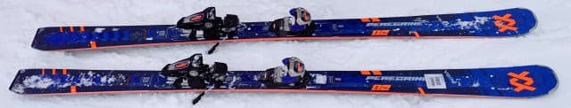
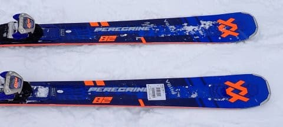
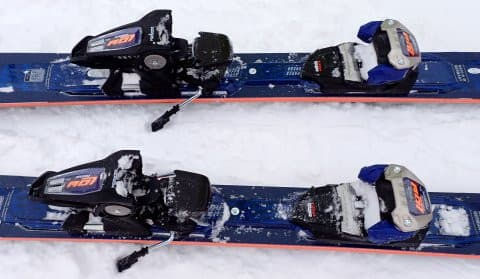
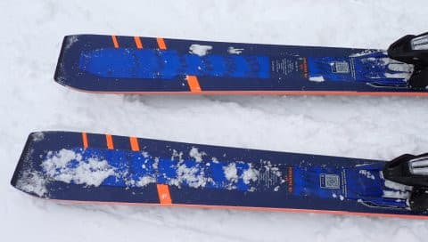
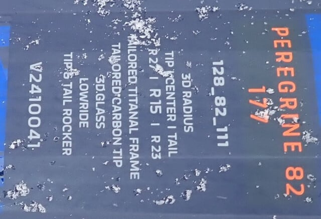

# 2025シーズンモデルのスキー板，試乗レポートその10…VOLKL PEREGRINE 82

📅 投稿日時: 2024-06-05 02:51:57

🏷️ カテゴリ: [スキー板試乗](c0bd8048615710cee890e403a36cc9a2b.md)

えー．

どうやら月山は意外と頑張って，

昨日…というか，もうおとといになりますか．

6月3日の月曜日までは板を履いてリフトに

乗れたようですね…

ただ．

ついに，昨日6/4の火曜から，月山リフトは

板を脱いでの乗車になったようです（涙）

昨シーズンも6月4日に月山に行っていますが．

昨シーズンはそれ以前の段階ですでにリフトは

板を手持ちでの乗車になっていて，

降り場も降りてからゲレンデに出るまで，

かなり歩いて登るパターンになっていたので…

今シーズンは，昨シーズンより遅くまで板を

履いてリフトに乗れたシーズンだったわけですね．

…先週滑ってきたときは，もうそろそろ

乗り場近辺ヤバいかな？

と思っていたけど．

雪が意外と少ない今シーズンにしては，

それから1週間以上，意外と頑張りましたね～…

で．

リフトは板が手持ちになりましたが．

まだ沢コースも問題なく滑れるようで．

うーん．

今週末まで沢コースがもつようなら，

…無謀な日帰り月山にチャレンジか？？？

ってなことで，本題へ．

本日も，2025シーズンのスキー板の試乗レポートです！

今回はフォルクル編です．

そして，今シーズンの積雪振り返り記事の続きは

明日掲載予定…

〇VOLKL PEREGRINE 82 177cm

オールマウンテン

私が春スキー用として絶大なる信頼を

置く，DEACON 84の後継機となるこの

PEREGRINE82．

英語の発音をそのままカタカナ表記すると

ぺリグリンとなりそうですが…

Volklの公式カタカナ表記は「ペレグリン」の

ようですね．

DEACON84よりセンター幅が2mm狭くなり，

サイドカーブもトリプルラディウスは継続

ながらわずかに調整が入って，トップとテールの

ラディウスが微妙に大きくなったこの板．

早速履いてみると…

ぐはぁ！！

これも衝撃の板…！！

DEACONよりかなり張りが強く，

メタルがかなり増強された感じ…

これはGS板か？と思うくらいのしっかりした

張りを感じます．

それでいて，ふかふか新雪がかなり

蹴散らされた後の，ところどころ硬くなり，

ところどころモサモサに突っ込むような

難しい斜面を，まるで全面均一な整地の

ように滑れちゃう…

そして．

The CURV85も衝撃だったけど，

こちらはさらに板が強く，トップ＆テールの

ラディウスも大きめということもあり．

GT85よりも高いスピード域で，

荒れた斜面をGS板のように高速

大回りで降りていけます！

結構難しい，新雪モサモサと踏み固められた

雪のミックスを，ものすごい安定感で

高速で切り裂いて大回りしていける，

この衝撃ときたら…！

荒れた雪なのに，板が全く叩かれず，

振られたりズレ落ちたりすることなしに

安心してモサモサ雪の中をハイスピードで

切っていくことができます．

しっかり踏み固められた斜面でも，ほぼ

GS系大回り板と変わらないグリップ力，

フレックスの強さを感じられ．

トップからテールまで，板の長さいっぱいの

エッジがしっかり有効に効いている

安定感があり…

グリップ感と安定感は，セミファットとしては

半端ない感じ．

この板，すごい筋の良いGS板のような感じで，

整地大回り用としてもかなり気持ちよく滑れ

ますね…

ターンを始めたときにターン弧が決まる

のではなく，ターンが始まってからでも

傾き・角付けとか板のたわみの出し方で，

乗り手の意図でターン弧を調整する

自由度が高く，　

縦に縦に落としていく滑りもできれば，

完全小回りは難しいまでも，小回りに

近い中回りまでもっていけます．

DEACONよりは張りが多少強めに

感じるので，完全小回りに近いところまで

持っていけたDEACONよりは大回り

傾向が強いですが…

DEACONよりさらに高速安定性が増して，

高速向けになった感じで，

ちょっと想定スキーヤーのレベルが

上がった感じ．

…もう少し優しい板が欲しければ，

PEREGRINE80がおススメ．

こちらはかなりフレックスが優しく

なっています．

でも，このPEREGRINE84．

かなりしっかりした板なのに，めちゃくちゃ

軽くて，軽快に振り回して動かすことも

できるという…

なんだかすごい軽いのに高速安定性が高い

GS板を履いているような，不思議な感覚．

何にしろ，荒れた斜面をカービングしていく

時の気持ちよさはぴかイチ．

普通の板だと叩かれたりなんだりと

手ごわく感じてズレズレで滑らないと

いけないような荒れた斜面を，まったく

怖さを感じず，楽しくハイスピードカービングで

滑っていける魔法の板．

これは感動＆衝撃…

The CURV GTと，ターゲットは似てるけど．

板が勝手に回っていくオートマチック性が

好きな人はCURV GTを，

自分で弧を作っていくのが好きで，

どちらかというと大回りが好きな人は

PEREGRINEを買うのがいいかな～．

GS板に近い性能が好きなら177cmを，

もう少しオールラウンドに使いたいなら

171cmがいいと思います．

とりあえず，今回の試乗コンディションが

圧雪上に10cmほど新雪が積もった状況

というのもあったかもしれないけど．

この時試乗した中でNo1の楽しさの板でした～！！

## 💬 コメント一覧

### 💬 コメント by (スシネコ)
**タイトル**: Unknown
**投稿日**: 2024-06-05 08:56:49

月山へのお仕事が入るシーズンになりハードなご様子。くれぐれも体調にはご留意ください。

で、この板。今年履かせていただいた中で一番良かったなぁ～と感じていました。素直というか、乗っていて操作性も安定性も抜群で欲しい１本でした（既にシーズン中２本とブーツも買ったので物欲選手権から退場してしまいました・・・）。

p.s.

それにしても「ペレグリン」。どうしても覚えられない・・・「はやぶさ」と呼んでます・・・

### 💬 コメント by (Skier_S)
**タイトル**: ＞スシネコさま
**投稿日**: 2024-06-06 04:20:07

PEREGRINE，いいですよね～！！

今回の試乗でも何台か売れたみたいなので，やはりみんないい板だと

感じたんだと思います…

私も，DEACONがヘタったら次はPEREGRINEですね…

### 💬 コメント by (まーくん)
**タイトル**: Unknown
**投稿日**: 2024-12-31 21:15:51

この記事を見てピレグリン82買ってしまいました😆

荒れたゲレンデでも快楽ターンができますように…

人生初の太板なので楽しみです！レビューありがとうございました！

### 💬 コメント by (Skier_S)
**タイトル**: ＞まーくんさま
**投稿日**: 2024-12-31 21:48:31

初の太板がこれなら大正解だと思います．

だんだんこれよりもっと太い板が欲しくなりますよ(笑)．

ほぼGS板なのに新雪や荒れた雪の走破性もある万能板なので，

シーズンほとんどこの板を履いて過ごすことになるかも…

私も今，シーズンの半分はDeaconを履いてます

### 💬 コメント by (Skier_S)
**タイトル**: Unknown
**投稿日**: 2025-01-21 21:26:23

＞ Skier_S さんへ

＞ ＞まーくんさま... への返信

履いてきました。これはよく回るGS板ですね（笑）

トリプルラディウスですが、実質R16くらいでしょうか。

実にオールラウンドなのでコブ含めこの板でプライズ受けてしまうかも…

### 💬 コメント by (Skier_S)
**タイトル**: ＞Unknownさま
**投稿日**: 2025-01-22 01:36:43

いや～，Peregrineはメタルがしっかり効いたいい感じの大回り板ですよ！

でも，テール気味で乗っていくと小さめに回ってくれるのが複合ラディウスの効果なのか…

どこでもどんな雪でも行ける，すごい万能板だと思います！！

…でも，コブはちょっと厳しいかな…

長さ177じゃなく，171ならいけるのかな．

