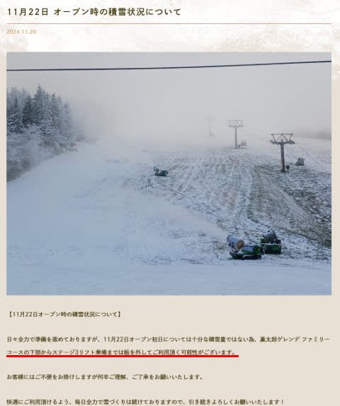
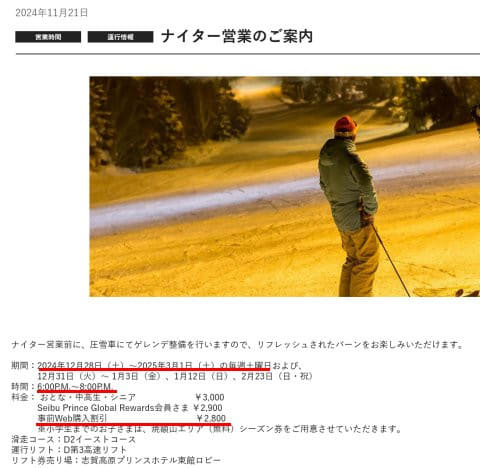
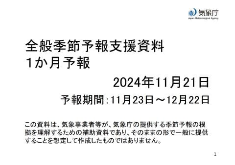
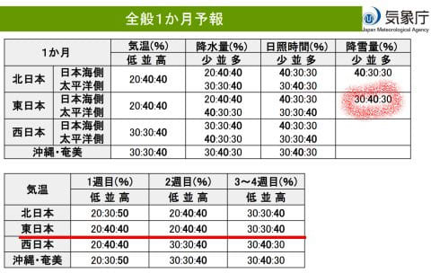
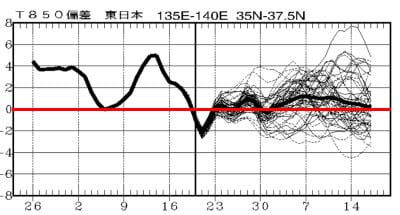

# 菅平スキー場，22日予定通りオープン！焼額ナイター情報も公開！…そして1か月予報を見ると，まぁまぁ平年並みの12月になりそう

📅 投稿日時: 2024-11-22 02:28:36

いかん…

今日は久しぶりに早く帰ってきたけど．

今週はかなり睡眠時間が短くて，

もう眠い…

なので，早めに寝たいです．

早めに寝かせてください．

ということで，今日も短め更新！

えー．

まず．

明日…というか，いつものパターンで，

もう日付が変わって今日ですね．

11/22(金)のオープンが予定されていた

菅平スキー場，予定通りファミリー

コースがオープンします…！！

…でも．

コース下部からリフト乗り場まで，

板を履いて移動できず，板を持って

歩く可能性があるということのようですが…

（[菅平高原スノーリゾートホームページ](https://sugadaira-snowresort.com/544/)より)

しかし．

アイスクラッシュを使って，10月のかなり

早い段階から雪を造っていたのに…

結局オープンは人工降雪を使って

何とかコースを作った感じですね…

菅平，アイスクラッシュだけではコースを

作れないほどの造雪能力なのか，

あるいは今年が暑すぎたのか…

どっちだろう？？

で．

本日，焼額山スキー場のホームページに，

新しくナイターの案内が掲載されて

ました～！

今シーズンは，昨シーズンよりナイターの

営業開始が1週間遅い12月28日となって，

ちょっと残念ですが…

でも，シーズン終わりが1週間伸びて，

3月1日まで営業です…！！

時間はこれまでと同じ，18時から20時の

2時間勝負．

（[焼額山スキー場ホームページ](https://www.princehotels.co.jp/ski/shiga/informations/night1/)より)

で．ナイター券は3000円と，ちょっと値上がり…

新たにWeb割引ができて，これは去年の

プリンス会員割引と同じ2800円ですか．

まぁ，実質昨年と変わらないから良しとしよう．←なぜいつも上から目線？

というところで本題へ．

このBlog読者ならよくご存じだと思いますが，

木曜日は気象庁の1か月予報の発表日です！

最近では毎週恒例となった，1か月予報の

詳細解説…

をやりたかったけど．

時間が無いのでさっくりと要点のみ

書いておきます…

えー．

この時期の予報は，クリスマスちょっと前

となる12月22日まで．

もうトップシーズンを目前とする時期までの

予想となりますが…

果たして結果やいかに！？？

結果を見ると．

1週目，2週目，3週目ともに，高温の確率が

40％と一番高いものの，ほぼ平年並みに

なりそうな感じの予想に落ち着いて

きました…！

そして，右側の丸で囲った部分，積雪も

平年並みの確率が40％と最高で，

多い確率・少ない確率が同じ30％と，

だいたい平年並みになりそうな予想です…！！

ここ数年，異常に積雪が少なかったのに

比べれば，平年並みでも十分ありがたい…っ！！！

1か月の850hPa気温グラフを見ても．

平均はわずかに平年より高いくらいに

落ち着いていて．

極端に高温にはならなさそうです！

うーん．

ここ数年，12月の異常高温に泣かされて

来たので．

平年並みになるだけで，ここ数年よりは

ずっと雪が多いと感じるはず…！！

少なくとも，これまで書いてきた通り．

22日の昼頃か冷えて，

22日の夜から24日の夜まで冷え続けます！

かなり冷えます！！

雪も降ります！

どかどか積もらないけど，10～20cmは積もり，

人工降雪機はフル稼働できます！！

運が良ければ24日あたりに熊・横手が

オープンできるかも…

それが無理でも，25日にはオープン

できるか？？

26日から27日の高温の雨が怖いけど．

そのあとはまた冷え込みそうなので…

とりあえず．

これからの冷え込みに期待！

短い記事を書いたつもりだったのに，

書きあがったのを見たら十分長かった…←どこが短め更新だ

## 💬 コメント一覧

### 💬 コメント by (ながのんちゅー)
**タイトル**: ヤケビ新コース
**投稿日**: 2024-11-22 22:39:52

こんばんは。

以前のコメントで話題になっていた新コース、今日、道の駅北信州やまのうちで24-25パンフレットをゲットし、確認しました。

やはり旧１高跡地でした。

### 💬 コメント by (アツシ)
**タイトル**: Unknown
**投稿日**: 2024-11-22 23:16:48

ご無沙汰しております。Sサマも無事シーズンインおめでとうございます。

気になることが1点あります。平均気温の考え方なのですが、この10年くらい、12月は高温傾向にあったかと思います。気象庁のいう平均気温とは、どの期間の平均を指すのでしょうか？それが仮に直近5年とか10年とかの短いスパンのものであれば、平均並といっても12月にドカドカ積もるのはなさそうに思います。30年とか50年とかの長いスパンの平均であれば期待をもてるのですが...。

### 💬 コメント by (Skier_S)
**タイトル**: 明日はイエティ！
**投稿日**: 2024-11-23 02:24:45

＞ながのんちゅーさま

確認ありがとうございます～！

パンフレットにはもう来シーズンのマップが乗っているんですね…

志賀高原索道協会にも焼額のホームページにも，まだ来シーズンのマップが乗ってないのはなんでだろう…

＞アツシさま

気象庁の平年の定義は明確で，

https://www.jma.go.jp/jma/kishou/know/yougo_hp/toki.html

「平年（値）…平均的な気候状態を表すときの用語で、気象庁では30年間の平均値を用い、西暦年の１位の数字が１になる10年ごとに 更新している。」 

と書かれてます．

つまり，今の平年値は1992年から2021年までの30年間の平均値です！！

