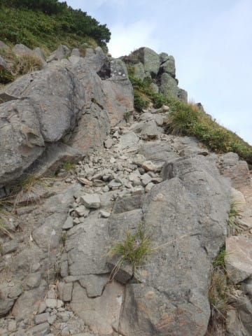

# 志賀高原の岩菅山に登ってみた4…そして大体予想通りの展開へ

📅 投稿日時: 2020-10-23 00:58:12

🏷️ カテゴリ: [登山・旅行](c1d637a11a25b457ac978d197adbdafc5.md)

えー．

本日，スバルのHPで[新型フォレスター](https://www.subaru.jp/forester/forester/)が

公開されましたが．

うーむ．

全車1.8Lターボになるんじゃなく，

2.0L e-BOXER3グレードと，

その上のグレードとして「SPORT」と銘打った，

新型LEVORGと同じ1.8Lターボを積んだ最上級グレード

の4グレード展開になり．

噂通り，2.5Lは無くなったものの．

2.0 e-BOXERがメインの展開となりましたね…

まぁ，今までも売り上げの半分はe-BOXER

だったようなので．燃費規制を考えると

そっちを売りたいのかもしれないけど…

でも，WLTCの高速モード燃費．

2.5Lは16.4km/lで，e-BOXERの16.0km/lより

良かったんですけどね…

そして，1.8Lターボの高速モード燃費．

…15.2km/L！！

…なんと，2.5L NAより高速燃費が悪いのか…

まぁ，市街地燃費は

2.5L NA：9.6km/L

1.8Lターボ：10.3km/L

と，1.8Lターボの方がいいので．

WLTCモード総合では

2.5L NA：13.2km/L

1.8Lターボ：13.6km/L

と，わずかに1.8Lターボの方がいい燃費に

なっているのですが…

とはいえ，燃費はそれほど変わらないものの，

トルクが2.5Lエンジンの2割増しになっている

この1.8Lターボエンジン．

フォレスターの方が，LEVORGより早く

試乗車がディーラーにデリバリーされる

ようなので．

この1.8Lエンジンがどんなものか，

一度試乗に行かねば…

という長い前フリが終わったところで．

本日の本題．

岩菅山登山レポートへ，Go!

ーーー

ってなことで，

前回書いたように，寺子屋山頂から約2時間歩いて

ノッキリまで到着したわけですが．

その時点で11:40．

下山ゴンドラの時間を考えると，

ちょっと岩菅頂上まで上がるのは無理だな…

…でも．

まぁ，今ここからすぐ引き返したら，

ゴンドラに戻る時間が逆に早すぎるので．

ちょっとだけ岩菅山頂方面に向かって

歩いて，すぐ引き返そう…←それはかなり危険な発想…

と．

もう，目的地に到着した気分で．

ちょっとだけ山頂方面の様子を見に行く

つもりで，岩菅山頂へ歩きはじめ．

いや…

下りよりやっぱり登りの方が，調子いいよね．

…ってか．

2時間歩いて筋肉痛も分からなくなったし．

登りの方が膝もいたくないし，

平地よりサクサク進めるよね…っ！！

…と．

気づいたら．

…あれ？？

ここは…

なんと！！！

どうしたことだっ！

…これは，気づかぬうちに山頂まで

来てるじゃないですかっ！！？？←いや，気づいてるから

…自分でも行っちゃうんじゃないかと

思ったんだけど…

やっぱり山頂まで来ちゃったか…←なんでそんな他人事みたいな言いっぷり？

ノッキリから山頂までのコースタイム45分より

圧倒的に短い25分で登り切っちゃったので．

途中で引き返す予定が，ついつい山頂まで

やってきてしまったのでした…

残念ながら雲が多めで遠くの

見晴らしは効かず．

山頂からの景色はボチボチですな…

残念ながら北アルプス方面も何も

見えなくて，前回より残念な景色だけど．

一応，山頂から

聖地焼額を遥拝する

という大事な義務を果したら…

山頂5分滞在で，すぐ下山開始！

…ホントは岩菅山は，岩菅山そのものより

岩菅山と裏岩菅の間の稜線沿いの

景色がすごくよくて，

裏岩菅の方が好きなので．

今回，裏岩菅まで行けなかったのは残念だけど…

（皆さん，岩菅まで登ったら，ぜひ裏岩菅まで行ってください）

まぁ，この体で岩菅山頂まで登れただけ，

良かったとしましょう…←登山で無理をしてはいけませんっ！！！

ってなことで．

なんとか無事山頂まで行け，

引き返し予定時間の12:30に

10分のマージンをもって，

下山スタートできました…！

（続く）
