# 9月連休石垣島ダイビングレポート　その5　ファイナル

📅 投稿日時: 2011-10-20 01:42:00

🏷️ カテゴリ: [ダイビング日記](ce3a7a8d424d112fce83ee85c81a0e344.md)

さて．

午前2本目のダイビングを終えて．

ボートの上でお昼ご飯．

なんと．

船の上でカセットコンロを使って，沖縄そばをその場で作っているではあーりませんか！

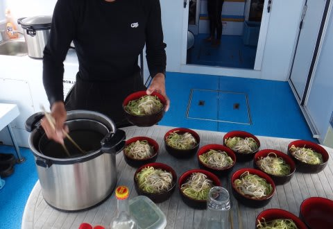

ボートの上で，ラフテーが入った暖かい沖縄そばが食べられるのはいいですな～

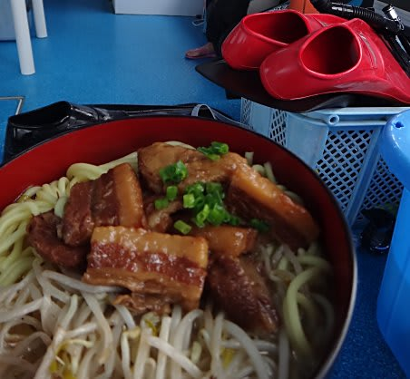

…これで天気がよければ，さらにおいしさ倍増なのに(涙）．

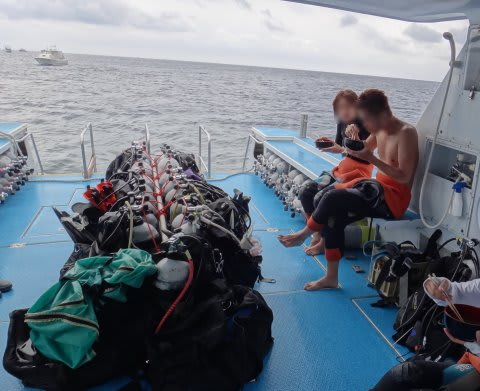

んで．

昼食後は，今回の石垣でのラストダイブ．

ポイントは「黒島灯台下」

エントリー後…

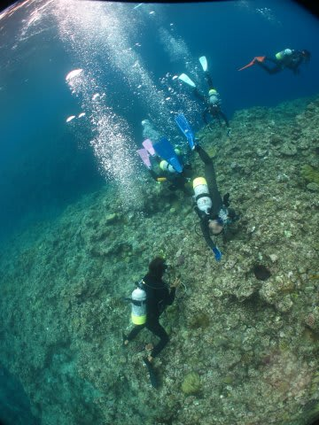

…うーむ．ここも珊瑚があまり元気じゃないなぁ…

でも，ちらちらと生きてる珊瑚は残ってます．

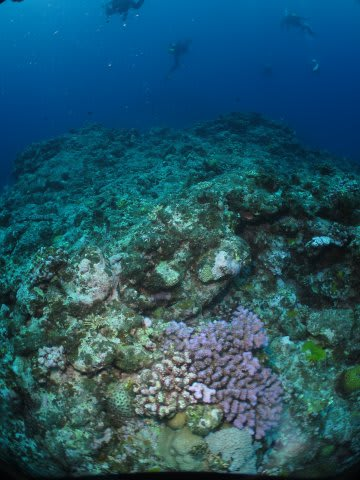

で．ダイビング中にホワイトチップシャークが出ましたね～

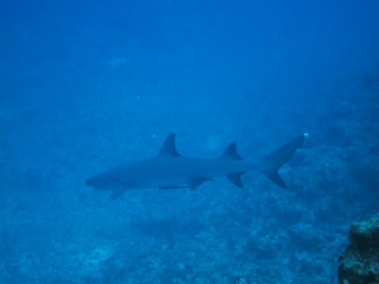

結構近い！

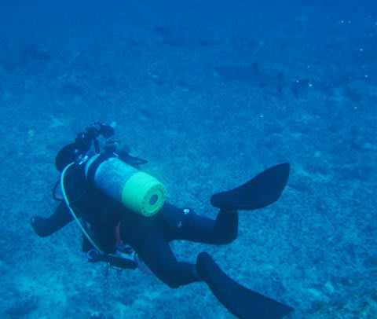

…かつて．

ノンダイバーの人に．

「ダイビング中，サメが出たらどうするの？」

と聞かれることが何度もありましたが．

正解は

「大喜びで必死に写真撮影する」

ですかね（笑）．

どうやら，ダイバーじゃない人にはサメは怖いものみたいですが…

ダイバーにとっては，ハンマーヘッドシャーク（シュモクザメ）や

レオパルドシャーク，ネコザメとかいったサメは，

それを見に行くのが目的で潜ったりするくらいですから．

怖くはないですよ～，

＃タイガーシャークだったら逃げるかも

そのほか，カメやナポレオンも遠くに出たけど…

あまりにも遠いし

（でも，30～40mくらい遠くのカメやナポレオンがくっきり見える透明度の高さに驚き)．

コモドでたっぷり見たから，まぁいいや．

ということで，ダッシュで近づかなかったので写真はなし．

という感じで，

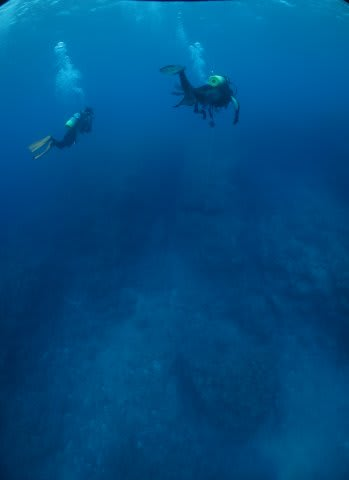

私の通算400本記念ダイブでもあった，石垣ラストダイブは終了．

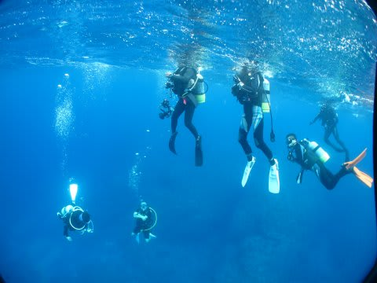

ショップに戻ると，ケーキで私の400本記念をお祝いしてくれました．

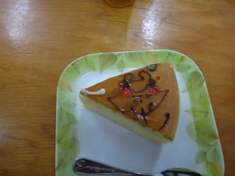

マンタの絵がえらいラブリーで和む…

ありがとう～．

という感じで，宿に戻り．

テレビをつけると．

首都圏は台風直撃…

すごいことになってるみたいだなぁ…

ニュースは全て台風関係．

…沖縄を台風が襲ってもこれだけニュースにならないのに，

沖縄を通り過ぎるとニュースになるんだなぁ．

…しかし，明日，帰りの飛行機飛ぶのか？？？？

という心配もあったものの．

次の日，無事飛行機は予定通り飛び．

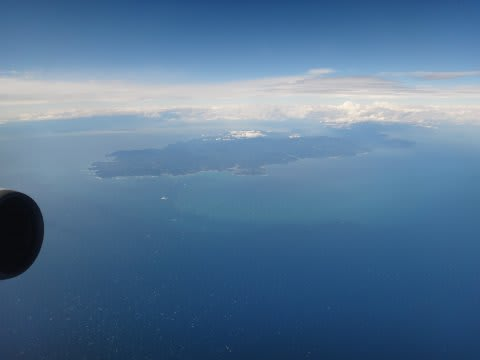

無事，帰宅できたのでした…

しかし．

まぁ．

今回．

私が潜ったエリアは，かなり珊瑚がやられていたけど．

自分が潜っていないエリアは珊瑚が元気に残っていると信じたいし．

それに，かつて1980年にもオニヒトデの異常繁殖があり，

そのときも八重山の珊瑚はかなりやられちゃったらしく．

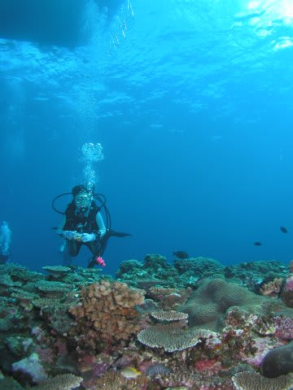

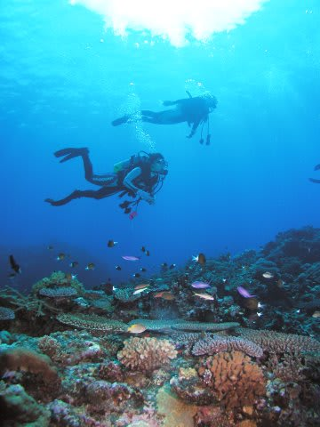

（これらは2003年～2005年の写真)

こんな感じの私の思い出にある石垣の珊瑚は，1980年にほとんど絶滅状態から

復活したものだという話なので．

やられた珊瑚も，これからの生命力で復活してほしいなぁ，と思う今日この頃なのでした．

…しかし．

石垣島のダイビングが物足りないというゼイタクな体になってしまったのは，

コモドがすごすぎた，というのもある…かも．

## 💬 コメント一覧

### 💬 コメント by (KENKEN)
**タイトル**: 石垣島レポートありがとうございます。
**投稿日**: 2011-10-21 00:46:09

レポートありがとうございました。

石垣(南エリア)の珊瑚の状況はびっくりです。

小生が今年行った西表では元気な珊瑚が見られましたので八重山の海はまだまだ大丈夫と思います。

暫く行ってませんが石垣では北部イエローサブマリンさんを良く利用しておりました。

最初の訪問(6年前)は北部エリアのあまりにも見事な珊瑚の群生に感動したのを覚えています。

ショップのログを見る限りでは北部方面の珊瑚は元気みたいです。

また当ショップはHPには書いてませんが子供も一緒に船に乗せてもらえます。

ダイビング400本そしてブログ1周年おめでとうございます。

私も大学時代を北海道で過ごし、実はスキーも大好きです。

就職後は西日本在住のためスキー場が遠くなりましたが子供が出来る前は年20日程度はスキー場に通っておりました。ここ数年休眠中ですが今年位から復活したく考えております。

これからの雪山レポートも期待しております。

＞妻が妊娠中に一人で座間味に行ったことがありますが、天気最悪でした。(妻の呪い)

嫁には未だに責められるしあれ以来一人で潜りに行かないようしています。

### 💬 コメント by (Skier_S)
**タイトル**: スキーヤーでしたか！
**投稿日**: 2011-10-21 01:35:50

西表の珊瑚が元気なのを聞いて安心しました…

石垣南～西表東にかけての石西礁湖の珊瑚は壊滅に近い状態とニュースで見て心配していたのですが，このエリアはかなりやられていてショックでした．

石垣の珊瑚は，2007年の白化の途中に最後に見たのですが，かなり「まずいなぁ…」と思っていたところ，それから子供が生まれて遠ざかっていた石垣に戻ったらこの状況．

とりあえず，石西礁湖エリア以外の珊瑚が今後も元気であることを祈るばかりです．

今年から，ぜひスキーに復活してください．

これからは，スキーレポートが始まります．

…どうでもいいのですが，私も妻を置いて潜りに行くと，状況が悪いことが多いです…

やっぱり呪われてるんですよ…

### 💬 コメント by (マルハバ)
**タイトル**: 妻の呪い・・・
**投稿日**: 2011-10-21 16:56:34

あるかもしれませんね（笑）

ウチは幸い呪いはありませんが

南の海でも冬山でも

一緒に行った時は

度々幸運な場面に出会う事があり

よく「私は幸運の女神！」なんて

言ってましたよ（汗）

### 💬 コメント by (Skier_S)
**タイトル**: うちの妻も…
**投稿日**: 2011-10-22 01:28:37

うちの妻もおんなじこと言いますね～（笑）．

「私は強烈な晴れ女だから」

「私と一緒だから，こんなに良いコンディションなんだよ」

とか…

確かに，妻といったときは台風で飛行機が飛ばないとかいったトラブルが少ない気がします．

とりあえず，置いていくといろいろ呪われちゃいますね(^^;

