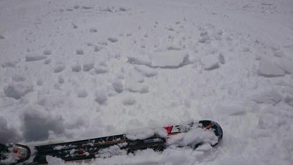

# 2021/3/9(火)&10(水)の志賀高原スキー場特派員情報！…そして，3月13，14日の週末の天気はすごく雨っぽい(涙)こりゃダメだ…

📅 投稿日時: 2021-03-11 02:53:15

昨日は死んでましたが．

今日は仕事でひと山越えました．

明日ふた山，明後日にもうふた山超えれば，

今月残るのはあと……

たくさん（涙）

年度末なんて，嫌いだ～！！！

ってなことで．

昨日は素晴らしい特派員からいっぱい写真が

送られてきたのに，皆さんにお伝えできなかったので．

3月9日(火曜)の志賀高原レポートから…！

まず，火曜は朝からすっきり晴天！

朝はわずかにマイナス気温でスタートし．

あさイチのゲレンデは結構固かった

みたいですね…

ってか，この写真．

殺人コロコロが一面に…（恐怖）

ただ，すっきり晴天で日差しが強く．

気温も結構上がったので，

雪は朝から緩み始め．

すぐに春のダマダマ雪になったかと

思うと…

昼ごろには気温もプラスにふれたこともあり．

そのせいで雪は一気に緩み，日差しの当たる

ところは完全に重い雪になっちゃった

ようです…（涙）

でも，ゴンドラ待ちもほとんどなく．

人が少なかったようなので，バーン自体は

それほど荒れなかったようですね…！

とはいえ．

なぜかまた奥志賀のウインチ付き圧雪車が

ぶっ壊れたようで…

ウインチ付き圧雪車じゃないと圧雪できない

奥志賀エキスパートコースは非圧雪となって

しまって，ボコボコになってたみたいですね…

でも．

一の瀬は比較的締まったバーンを

キープしてくれて．

標高の高い寺小屋も雪がそれほど緩まずに，

そこそこいいコンデションだったようです…

焼額や奥志賀のダウンヒルコースは，

昼間に雪が緩んでしまい，

夕方の最後には荒れた

コースになっていたようですが．

人が少ないこともあり，天気も良かったので．

ラストまで結構楽しめたようです…

で．

本日…というか．

もう昨日になる，10日（水曜）の志賀高原ですが．

この日も全く積雪は無く．

おこみんはシマシマの上に鎮座してます…

…これは，おこみんオーナーの特派員が，

別の特派員の板の前で撮ってますね（笑）．

この日は，朝イチの気温は-5℃と，

ここ数日では割と冷えた朝だったので．

あさイチのゲレンデは，かなりガチガチの

チョー硬いシマシマだったようです…

それも，ガスで視界が悪かったようで．

見えないガチガチバーンを，この特派員は

泣きながら滑っていたようです…

ゲレンデの下半分はガスもかかってなかった

ようですが．

ゲレンデの上半分はダメですね…

この写真を見ると，ゲレンデ下半分は

視界があるけど，上半分は完全ガスに

覆われてるのが分かりますね…

ってなことで，

午前11時過ぎまでは完全ガスの中だった

一の瀬上部ですが．

12時過ぎにはガスが切れ始め．

なんと，1時ごろには天気が全く変わって，

すっきり晴れたようです！！

でも，気温はマイナスのままなので．

バーンはずっと硬めの、いいコンディション

だったようです。

…ということで．

ここ数日間雪が降っておらず，

冷えてれば硬いバーン，

温まると春雪…

というコンディションが続いている

わけですが．

果たして，これから週末までの間に

雪は積もるのか否か…

定番の水曜深夜の天気予想です！

…が．

いつものように天気図を貼り付けて

細かく解説する精神力が残ってないので．

いつも最後に書くまとめ部分のみ書いて

おくと．

11日(木)：朝から晴れ！

　あさイチは-2℃くらいかな？

　朝は硬めのシマシマ．

　日差しが強いバーンはしばらく経つと

　バーンが緩んで滑りやすくなる．

　一の瀬正面とかは，昼近くまで

　硬いままじゃないかな？

　昼間は+4～5℃まで上がり，

　午後は全体的に春の雪になっていく．

　終日晴れの暖かい一日．

12日(金)：朝はすっきり晴れ！

　あさイチの気温はギリギリ0℃程度．

　あさイチは表面がちょっと固まり気味

　程度のバーン状況で，すぐに緩んでいく．

　午前中には春の重い雪になっていく．

　午後になると徐々に雲が増えていくが，

　気温は高いまま．

　夜9時か10時ごろから…

　液体が降り始めそう（涙）

13日(土)：朝から雨（涙）

　朝の気温は+2℃くらいかな？

　山頂付近は湿った雪かもしれないけど…

　どちらにしろウェアがしっとり濡れていく

　悲しい天気．

　この日は大変悲しいことに，終日

　空から液体が降り続け，

　時折強く降る．

　雪は言うまでもなく雨で濡れた

　重い雪．

　スキーをやるためには根性が

　必要な一日

14日(日)：この日も朝は雨が降り

　続いているかも…（涙）

　朝から気温はプラス．

　運がよければ，終日雨は降らずに，

　せいぜい時折雨粒がぽつぽつ

　落ちてくる程度．

　日ごろの行いが悪ければ，

　朝からパラパラ，午後まで

　降り続く．

　昼間は+5℃くらいまで上がり，

　雪は完全春のドロドロ雪に…

…ということで．

この週末まで，雪が降らないどころか，

週末を狙ったようにピンポイントで雨

という．

今週末もスキー場に行く夢を見たい

人には，かなり酷な天気に

なっちゃいそうです…（涙）

そして．

17日までこんな感じで高温期間が続くので…

うーん．

もうしばらくは全く雪が降る気配が

感じられませんね（激涙）

うーん．

今シーズン，もう冷え冷え雪で滑れないの

か…（泣）

## 💬 コメント一覧

### 💬 コメント by (レインボー73)
**タイトル**: Unknown
**投稿日**: 2021-03-11 07:53:33

下記のように試乗会あります。読者の皆様、どうぞ物欲を！

エキップ2022スキー試乗会

日程:3月13日（土）

場所:志賀高原ダイヤモンド

ダイヤモンドペアリフト脇

時間:9:00～12:00

今回の試乗器は、先週用意した基礎系とオールマウンテン系で、ロシニョール、ディナスターはありませんが変わりにVOLKL,    マスターズSL,　DICON72,

K2,

MINDBENDER-99Ti MINDBENDER-99C

DISRUPTJON-GS,Ti

DISRUPTJON-STi

LINE,-BLADE

です。

受付(お名前、連絡先等ご記入頂きます)等させて頂き、各社から試乗スキーの貸し出しもしてもらう都合、貸し出し、返却費用が、かかりますので、お一人試乗料金￥2000徴収させて頂き、ご購入時に利用できる￥1000割引チケット発行する、システムとさせて頂きます。

宜しくお願いいたします。

### 💬 コメント by (アリス)
**タイトル**: 仕事とスキーレポートお疲れ様です
**投稿日**: 2021-03-11 09:54:43

Skier_様

今週は濃霧、強風、カリカリバーン、重雪と色々変化がありましたね。

一見レポートから判断すると悪コンディションに思えますが、他地方のスキー場と比較すると志賀高原のコンディションは最高だと思います♪♪

Sさんんも寝不足なうえ仕事、スキーレポートと底なしの体力には驚きしかありません。

また週末には、志賀高原でのスキーの夢をみなくてはいけませんし・・・

私は平日スキーの味が忘れられなくて来週も仕事ズル休みして志賀入りする予定です。

レインボー様

いつも楽しい詳細レポートありがとうございます。

雪女ですが、仲代達也さんとの共演ですよね♪

『お前は若いから殺すのやめよう』ってセリフ・・・

映画の再放送を子供のとき見た記憶があります。

3/5(金）9時過ぎにヤケビのオリンピックコースでレインボーさんらしきかたと並走していました。私自身滑るのに必死でしたので、挨拶が出来ず失礼しました。

### 💬 コメント by (レインボー73)
**タイトル**: Unknown
**投稿日**: 2021-03-11 11:49:05

お借りします。試乗会の追記です。

前回3月6日に参加費を頂いた方には、お買い物券はお渡し致しませんが、参加費￥1000で、試乗頂けます。

又、ポールバーン予約しておりますので、ポールコースを滑りたい方はポールコース、ポール協力費￥1000徴収させて頂きます。

アリス様、ぜひ一度お目どおり願います。５日は腰痛と戦っていた頃ですね。今は完璧です。コルセットは離せませんが。

### 💬 コメント by (レインボー73)
**タイトル**: Unknown
**投稿日**: 2021-03-11 14:04:32

木曜日の志賀高原情報

朝の上林ー２℃　蓮池ー３℃　山頂ー５℃。風もなく寒くもなく人も少ない。

昨日を経験した若者にとって、視界がいいってなんかそれだけで満足。パノラマ、カラマツともに硬い高速バーン。ＧＳもオリンピックもなんて気持ちいい！フィッシャーRC４RC180を買ってから、硬いバーンを日に日に好きになっていく自分が不思議。道具ですねえ。

寺子屋へ行ってみると、まさなそこは龍宮城。雪よし眺望よし天気よし。ファミリーだって負けていません。スキーやるなら、今でしょ！

奥志賀エキスパは圧雪してあるもただ押し付けただけらしいので、もうだめ。

### 💬 コメント by (レインボー73)
**タイトル**: Unknown
**投稿日**: 2021-03-11 14:35:29

木曜日の志賀高原情報２

今日も銀嶺でざるそば。飽きない。

ヤケビに戻ると、やっぱりザクザクに。ヤケビから出られない人が多いので、人口過密地帯になるヤケビは、この時期荒れるのが超早すぎ。

週末の天気が心配ですね。

### 💬 コメント by (Skier_S)
**タイトル**: 日曜は雪が降りそう
**投稿日**: 2021-03-12 01:23:18

＞レインボー７３さま

スキーはやっぱり道具が大事！

道具で楽しさが全然違いますよね…

＞アリスさま

すっかり平日スキーに捕りつかれたようですね(笑)．

来週も，平日は晴れの日が多そうです．

１６日だけは雪になるかな…

