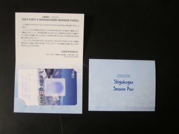
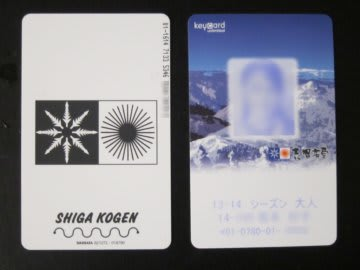

# スキーシーズン必須のアイテム…志賀高原シーズン券が届いたよ～！

📅 投稿日時: 2013-11-08 00:30:52

えーっと．

とりあえず，この週末もYetiに行くので．

まずは，この週末のYetiの天気予想を…

…えー．

土曜は晴れますね～．終日．

で，日曜は．

朝のうちは雨が降らずにもちそうなんですが．

午前中，昼前から降りだしそうな気配…

午後は時折，ざーーーっと強く降りそう．

…ってことで．

滑りに行くなら土曜かな～．

そして．月曜は．

冷えますね～．激烈に．

そして，積もりますよ～っ！山では，雪がっ！

いろんなスキー場で，積雪のニュースが流れるでしょう…

…まぁ，残念ながら，その後はすぐ気温が上がって溶けちゃいますけど．

んで．

本題に入りますと．

我が家の冬に必須なアイテム．

志賀高原シーズン券が届きましたよ～！

今年はなんだか，こーゆー入れ物に入ってましたね…

中に，シーズンパスが入ってます．

シーズンパスそのものはこんな感じで…

リフト券がICカードになった一昨年から，デザインは全く変わってないですね～．

(↑一昨年のリフト券)

ってことで．

こいつが届くと．

本格シーズンが目の前だと感じますね～．

今年も，滑るぞ～っ(焼額を）！！
