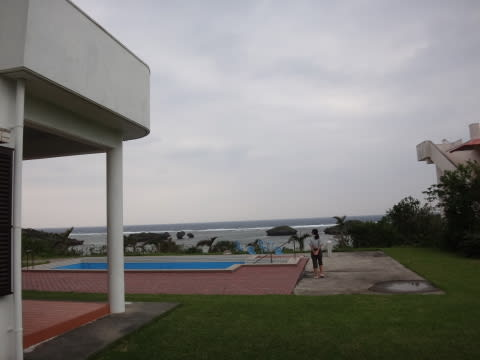
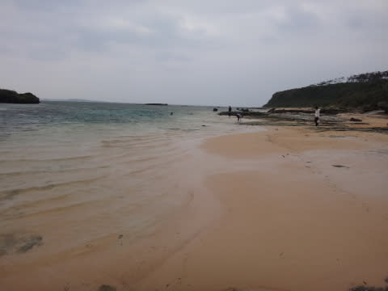
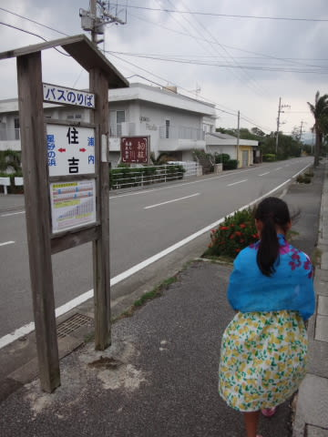

# 2015年10月　子連れで西表へダイビング旅行その7…午後は雨も止んだのでお散歩へ

📅 投稿日時: 2016-08-31 01:56:09

🏷️ カテゴリ: [ダイビング日記](ce3a7a8d424d112fce83ee85c81a0e344.md)

ということで．

あまりもの海況の悪さ＆強風＆雨という．

私何か悪いことしましたっけ？

…っていう，悲惨なコンディションに．←やってるから．悪いこといっぱいしてるから

我が家史上初，今後歴史に残るであろう

午後のダイビングをキャンセルする，

…という事態に陥ったわけですが．

お昼ご飯を食べてしばらく．

強い北風は相変わらずですが．

雨は止んだようなので．

やることもない午後，ちょっと散策に出てみますか…

ということで．

この宿の裏が，星砂の砂浜のようなので．

ぶらついてみましょう．

この宿のすぐ裏に，プールがあるのですが…

娘「水，入ってないね」

かなり残念そうな娘…

プールの後ろの，こんなところを通ると…

砂浜に下りる道があります．

ふむ．

これが星砂の浜なのね…

天気は相変わらず，

どんよりとした空で…

あまり南国の海っぽくない感じですが．

うむ．

砂は確かに，星の形をしていますね～！

ってことで，しばし砂浜を散策します…

星砂の浜を散策した後は．

今度は，夕食へのお出かけがてら，集落を

通ってお散歩してみますか…

宿に夕食がついてないので，夕食を食べるところを

探さなくてはならないのですが．

宿の周りはこんな感じなので．

お食事ができる店までは，だいたい

徒歩5分～15分ほどと離れており，

ちょっとしたお散歩気分ですね．

まぁ，夕食にはちょっと早いので．

いろいろ遠回りしていきましょうか…

こういう，ちょっとした集落を抜けて…

宿から1kmちょい．約30分ほど歩くと…

うなりざきの展望台にやってきました．

そんなにすごく景色がいい展望台，ってわけでは無いですが．

三方が海に囲まれ，透明度が高い海が

望めます…

展望台も眺めたし．

そろそろ夕食の時間．

では，集落に戻って，

どこかでご飯を食べますか…

