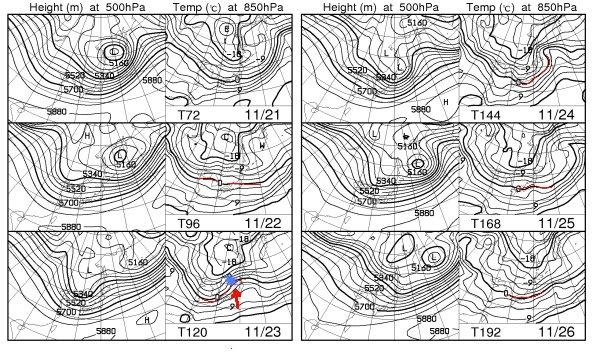
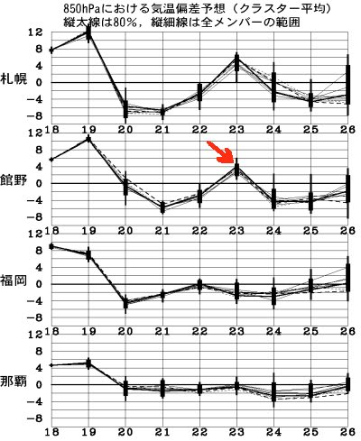
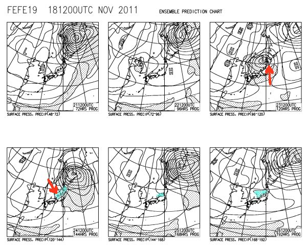

# 予想通り，全国的に高温&土砂降り…（涙)

📅 投稿日時: 2011-11-20 00:28:18

🏷️ カテゴリ: [スキー天気予想](c6554f5c3c106093b511a8daae23757e8.md)

[ここ](ee0894781cbdbf51bba9a680542ca53de.md)で13日に予告してから．

[何度か](e3fbc932b517a159e0b0e9eec4ee7afd5.md)コメントしてましたが．

いやー．

本日19日の土曜日．

全国的に気温がむちゃくちゃあがって壊滅的な雨だったようで…．

熊の湯は，本日営業できたけど．明日日曜の営業をどうするかまだ

悩んでいるようで．

Yetiは，本日8時オープンだったけど，わずか4時間営業しただけで，

昼の12時には営業終了しちゃったみたいですな．

必死で雪を作っていた湯の丸とかもかなり溶けちゃいましたな…

でも．

日曜の夜から雪だ！

20日夜～22日の夜くらいまでは雪です！

結構降りそう．

…その後，23日一日だけは低気圧が通過するので，

この低気圧に向かって南から風が吹いて…

(図中の左下，青くマークしてあるところが低気圧．ここに矢印のように南風が入る)

で，0度線が日本より北に行っちゃうので．

こんな感じで23日の一日だけ気温が上がります…

…でも，降水量があんまりなさそうなので乗り切れるかな．

で．

23日以降，24，25日は，平年より気温が下がるようで．

また冷えてくれます！

こんな感じで，23日の低気圧に吹く南風(右上図面矢印)が…

24日，低気圧の通過と共に北風に変わり(左下図面矢印)．

…下側の図に，青く示してある，降水量がある部分．

これが，日本海側にだけ降水エリアがある，

典型的な冬型の形になってますね～．

ということで．また24-26日まで雪が降りそうなので．

23日はまだ微妙ですが．26日の週末には．

アサマ2000とか，鹿沢，湯の丸，丸沼は

無事オープンできるんじゃ無いですかね～．

で．明日日曜はまたイエティに出没予定です…（そろそろ飽きた)
