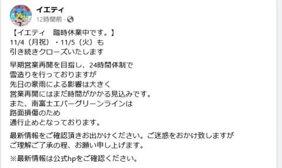
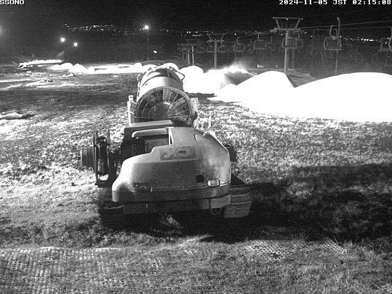

# イエティは11月5日（火）も営業中止で南富士エバーグリーンラインも通行止め．果たして営業再開はいつか…？

📅 投稿日時: 2024-11-05 03:44:10

えー．

今日は残念ながらこんな時間になっても

仕事が終わっていないので，手短に…

最近，このBlogはイエティ状況報告みたいに

なっちゃってますが．

ほぼ予想通り，11月5日もイエティは営業を

見合わせるようです…（涙）

それどころか，イエティの有料道路

（南富士エバーグリーンライン）も，豪雨の

影響で通行止めみたいで…

11月2日の豪雨，どんだけすごかったんだ？？

（[イエティFacebook](https://www.facebook.com/YetiSnowtown/posts/pfbid02okNky5JDmAzwUUcQQSkEoNM2M9fyFcGkMzn2bt2ZJ43HsHb9fu2HjmfTpbFJ4dRdl)より）

ライブカメラを見ても…

まだ雪山の間に間隔があり，もう少し

積雪が必要な感じですね．

うーん．

このペースだと，7日木曜あたりのオープン

かな…

（[WNIライブカメラ](http://webcam.wni.co.jp/KAC24326/loop.html)より）

有料道路の路面がどのくらい工事期間が

かかるのかはわからないですが，イエティが

オープンしても，有料道路を下から上がって

イエティへアクセスできない可能性が

あるので，オープン後も道路の開通情報に

注意して，通行止めに引っかからないように

してください…！！

で．期待していた7日前後の冷え込みですが…

当初予想からだんだん冷え込みが弱まる

方向の予想になってます（泣）

ガンガン冷えるはずが，7日にぎりぎり

志賀高原あたりは雪が降るかもしれないけど，

イエティで人工降雪機が動かせるほどは

冷え込まなさそう…という予想になって

来ました（涙）

そして，

また次の週末，9，10日に，狙ったように

イエティは雨になりそうな予感…（泣）

今の天気図のままだと，軽井沢は9日は

大丈夫そうだけど，10日の日曜は雨ですね（涙）

ってなことで．

どうも天候に恵まれない，かなりダメダメな

感じの11月（涙）．

果たして12月に巻き返しがあるのか…？

そして，私の仕事が12月までにちょっとは

一息つきそうなのか…？

これからの挽回に期待…！！

（早く寝たい…）
