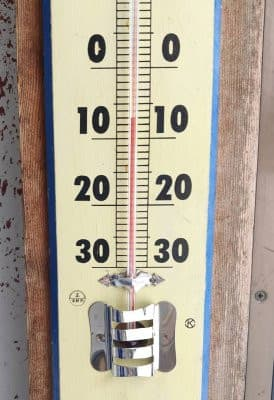
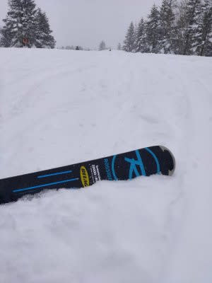
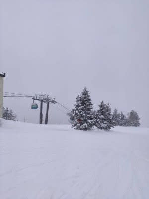

# 残念ですが，11日の志賀高原は曇り時々雪がぱらつく天気で晴れなさそう…12日は晴れ，13日は晴れのち曇り，夕方から雪

📅 投稿日時: 2022-02-11 00:20:06

🏷️ カテゴリ: [日記](cc4b5682fb7b8b144980957a978653fb0.md)

えー．

本日の志賀高原ですが．

特派員からの情報によると，

朝の気温は-7℃と，

まぁこの時期としてはちょい

暖かめで…

そして朝は予想通り，新雪が数cm

積もっていたようです

気温は昼間もマイナスキープしながらも，

重めの雪が降り続く一日だったようで．

（夕方近くはちょっと軽い雪になってきたみたい）

今日の天気は，昨日の予想がドンピシャ

予言レベルで当たったようです…！

すばらしい！私の予想！！←すごいのはあなたじゃなく，気象庁の予想天気図だから…

ただ．

明日の天気ですが．

最新の天気図を見ると，昨日の晴れ予想

とはうってかわり，風向きが見事な

北向きに変わったので…

この場合，志賀高原は山の上に雲が

かかるパターン．

だもんで．明日は晴れの予想は

曇り~雪になりそうです（涙）

ってなことで，最新の予想は，

11日(金・祝)：朝の気温は-9℃，

　朝はやわらか圧雪シマシマバーン．

　終日曇り，時折雪がぱらつくけど，

　積もるほどじゃない．

　昼間も気温は上がらず，雪質は

　良さそう．

12日(土)：朝は雲が多めかもしれないけど晴れ．

　朝の気温は-10℃近く．

　あさイチはいい感じに冷えた，締まり気味

　最高シマシマ！

　一日中天気が良いのに，そこそこ冷えた

　絶好のスキー日和の一日．

　

13日(日)：朝イチの気温は-7℃．

　あさイチは締まったいい感じのシマシマ！

　朝は晴れでスタートしそうだけど…

　じきに雲が増えていき，昼前には

　曇り空．夕方には雪がぱらつき始める

…って感じでしょうか…

この3連休，初日，最終日は曇りに

なりそうですが．

中日は晴れるし，吹雪にはならないし，

まぁ，穏やかな3連休でしょうか…

あとは金曜早朝移動の方，首都圏・東海も

道路は積雪，凍結がありそうなのでご注意を！

## 💬 コメント一覧

### 💬 コメント by (りやまやり)
**タイトル**: Unknown
**投稿日**: 2022-02-11 17:47:01

いつも楽しくて役に立つ記事をありがとうございます。3連休を利用して志賀高原に来ています。

休日なのに寺小屋、焼額2ゴン、3高速運休で大ショックでした。その影響か営業中のリフトとコースとレストランに人が集中して密集が避けられなかったです。

明日はすべてのリフトが動きますように！

### 💬 コメント by (レインボー74)
**タイトル**: Unknown
**投稿日**: 2022-02-11 18:38:39

金曜日の志賀高原情報

昨日の湿雪で車のドアが凍結、こんなのシーズン初。上林-3℃　蓮池-8℃。

シーズン初の奥ゴンスタート。ダウンヒル、三高と滑ったけど、目指すエキスパートはガスで退避。ダイヤを目指します。

白樺が本日のベスト。ニゴン停止のためイチゴンは避けるのが常道。

ダイヤの非圧雪を楽しんだあと寺子屋を目指すも、祝日は閉鎖。

ファミリーは銀座。

パーフェクタの左端の非圧雪を楽しんだあと、イチゴンが！

30分待ちの列。でも知り合いは熟知しているのでそこにはいない。

バスで奥志賀に戻り終了。

こんな日は私らに気力はありません。

三高もニゴンも、しばらくはだめかと！

皆様にお勧めは、奥志賀ゴンドラ8時スタートかなあ。とにかくイチゴンを避けること。オリンピックやGSを滑ったら、バスでの移動がお勧めです。時刻表を事前に把握することが、無駄を省くコツです。

### 💬 コメント by (みこみん)
**タイトル**: Unknown
**投稿日**: 2022-02-11 19:40:30

お疲れ様です♪

今日は、Sさんの予想通り、最高の雪質で滑れました〜( ´∀｀)

ただ第一ゴンドラ激混みだったのだけが、残念です…💦

明日はどうか、第二ゴンドラが運行されますように…

お天気も良くなりそうなので、楽しみです♪

### 💬 コメント by (Skier_S)
**タイトル**: 明日は激混みになりそう…
**投稿日**: 2022-02-11 22:34:17

＞レインボー74さま

今日のヤケビは激混みでした…

奥志賀はそれ程混まなかったみたいですが，雪が荒れてたとか…

明日はどこに逃げようか悩ましいです…

＞みこみんさま

今日は雪は良かったですよね～！

でも，混んだのが残念…

明日は2ゴン動きますよ！

### 💬 コメント by (みこみん)
**タイトル**: Unknown
**投稿日**: 2022-02-11 23:21:17

わぁ〜い！！

第二ゴンドラ🚡動くんですね〜( ´∀｀)

ありがとうございます♪

明日は今日よりも混みそうですし、いつもより頑張って早く起きて、ゲレンデへ向かいまーす⛷

