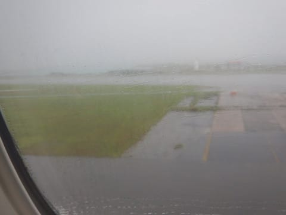

# 2018年8月，子連れ座間味で小5の娘とファンダイビング！その1…いざ出発！

📅 投稿日時: 2019-08-28 02:37:33

🏷️ カテゴリ: [ダイビング日記](ce3a7a8d424d112fce83ee85c81a0e344.md)

5月ごろ．

例年通り，座間味で人気のペンション

星砂さんに予約の電話をかけたところ．

「8月はもうほとんどいっぱいで…

　8月26日の，日曜の宿泊から3泊なら

　空いてますが…」

ということで．

自動的に日程が決まってしまった，

今回の沖縄旅行．

8月最終週という，そんな時期に

休みが取れるのか？？？

という微妙な時期に行くとなったわけで…

…しかし，星砂さんに日曜チェックイン，

水曜チェックアウトの3泊で，水曜には帰宅

しなくてはならないとなると．

日曜朝から移動して，日曜夕方の座間味入りだと，

月曜と火曜の2日間しか潜れないし，休みの

土曜日がもったいない．

会社が休みの土曜に那覇まで移動して，

日曜朝イチの高速船で座間味に入って，

日，月，火と3日潜りたいよね…

ということで，那覇前泊として．

25日(土)に那覇へ移動，

午後は那覇でゆっくり過ごし，那覇前泊，

26日(日)の朝イチに座間味へ移動，

28日(火）まで3日間潜って．

29日(水）に帰宅…

というプランとなったわけで．

そうして迎えた，出発日の朝．

今回は，台風も全く発生せず．

天気の心配なく，無事出発日を

迎えられたわけで．

…いつも通り，出発前日は．

会社を3日間休むために．

前日はほぼ徹夜で仕事を仕上げ…

そのままほとんど寝ずに，

朝6時に家を出て，羽田空港に

向かうという，

毎度繰り返されるご無体日程での

出発となったわけですが…

まぁ，飛行機は自分で操縦するわけじゃないし．

寝てても沖縄に着くから，なんとか

なるよね…

と．

空港までの高速バスでも爆睡をかまし．

さらに飛行機でも，登場直後から

ほぼ意識を失っていて…

気がついたら，沖縄上空だったのですが．

あんだこりゃ？？

沖縄，雨なんですが（涙）

なんと．

台風は発生していないものの．

沖縄のすぐそばを熱帯低気圧が

通過しており．

午前中の高速船とフェリーは

運行されたものの．

この日の午後から海が荒れて，

午後の座間味行きの高速船，

全て欠航になったようです…！！（泣）

うぎゃーーーー！！！

なんてこった～！！！

幸い今回は台風に当たらなかったなぁ…

と，思っていたのに．

まさか，高速船が欠航するとは…（涙）

…とりあえず．

座間味に移動するのは明日．

今日は午後半日，那覇でゆっくり

過ごす予定なので．

雨の中観光しますか…（涙）
