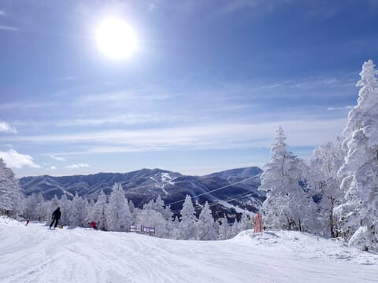
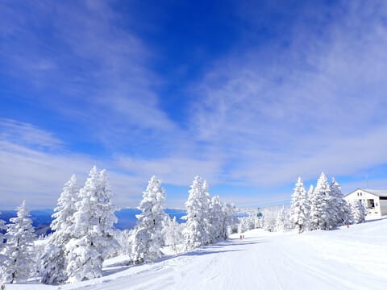
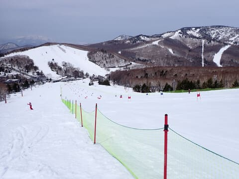
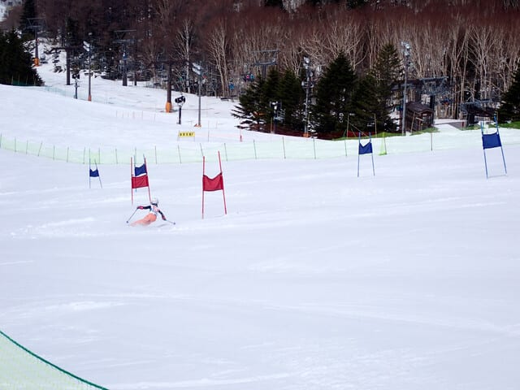

# Skier_Sは今シーズン何回転んだのか？？…2025シーズンを振り返ってみる

📅 投稿日時: 2024-06-17 03:12:47

ということで．

どうやら先週の月山で私の2025シーズンが

終わったようですが．

今回は，しっかり月山で最後の儀式を

終えて．

「いや…これならもうしばらく滑らなくていい」

と自分に思いこませることに成功したので．

いつもなら，まだ滑りたい…

と未練を残しているこの時期．

今シーズンはすっかり

「もう終わったね～」

という，心穏やかな気分でシーズンオフを

迎えられました…

こんな心穏やかにシーズンオフを迎え

られたのは，何年ぶりだろうか…

いや．

っていうか．

今シーズンは，2月末に4月並みの

気温が続き，

雪解けで普通ならトップシーズンの

2月にコースが次々クローズしていく

という事態に陥り．

3月くらいにシーズンが終わってしまうのでは？？？

という，ものすごい恐怖に襲われたシーズン

だったので．

それでGW最後まで志賀で滑れて．

そのあともかぐら・月山と滑れたんだから，

予想外にいっぱい滑れた

という気分になったというのもあるかも…

ってなことで．

私の2024シーズンも終わったので．

今シーズンを振り返る記事の第1弾として．

Skier_Sは今シーズン何回転んだのか

という，毎シーズンの定番のネタを

行ってみましょう…！

過去を振り返ってみると．

2015シーズンは1回，それもぶつかられての転倒（涙）．

2016シーズンは未転倒！

2017シーズンは2回．

2018シーズンは4回（太板誤開放が2回！）

2019シーズンは1回（太板誤解放）

2020シーズンは1回（太板誤解放）

2021シーズンは1回（他スキーヤーと交錯（涙））

2022シーズンは1回（板誤開放で低速でポテッと転倒）

2023シーズンは未転倒！！

という感じで．

2019シーズン以降は，シーズン平均

転倒回数が1回以下だし，

誤開放以外の転倒は5シーズンで1回だけ！

さらに，2022シーズン以降は板が外れる

ような転倒はしていないという，

ここしばらくはかなりセーフティーな

スキーヤーだったわけで．

さらに2023シーズンは未転倒．

滑走日数がいつもより少ない47日しか

滑ってなかったとはいえ…

シーズン未転倒はすごい！すごいぞ！

うん．

シーズンこれだけの日数滑って，

それも一日の滑走量もかなり多いし．

それで，これだけしかころんでない

ってのは，すごいよね…！！！←読者の共感を強要するんじゃない

ってことで．

今シーズンも未転倒記録は更新されるのか？？

2シーズン未転倒という奇跡の記録は

打ち立てられるのか？？

はたして，結果は…

…

…

…

ジャカジャカジャカジャカ…

ジャン！！！！

2024シーズンの転倒回数

2回

でした…（涙）

それも，2回とも自らバランスを

崩しての転倒で．

2回目は久々の板を外しての転倒（泣）

いやーー．

今シーズンは転んだなぁ…

1回目は，まだシーズンも前半の12月．

ちょいと荒れ気味のバーンで普通に

ターンをしていたところ…

谷回りで内足のインエッジが荒れた斜面で

引っ掛かり，内足が予想以上に外に

流されてしまい，バランスを崩して

内側にコテっと倒れる感じの，

情けない転び方…

いや．

普通なら内足のインエッジトップが

引っかかったくらいなら，簡単にリカバリー

できるはずなんだけど…

なぜかこの時はこらえきれず．

内側にコテっと倒れ，そのままズザザーと

流されちゃいました…

うーん．

実に2シーズンぶりの転倒がこんなに

情けないなんて．

そして，2017シーズン以来7シーズンぶり

となる，自らバランスを崩しての転倒が，

こんな形でやってくるなんて…

いろいろ衰えてきたのか…？？

と，哀愁漂う転倒でした．

で．

まぁ，シーズンノルマ（？）の1回コケたから．

もう転ばないよな…

と思っていた，シーズン終盤の4月．

今度は自分の板じゃなく試乗板を

履いていたんですが…

あんまりエッジグリップせず，

スピードを出すと板が流れるセミファットを

履いていて．

春雪のボコボコの中コントロールが

難しく，

「うーん…これは自分の板じゃないな…」

と，スピードを落とし気味に滑っていたの

ですが…

この日は，某ヤケビスーパーキッズが一ノ瀬の

大会に出ていて．

ちょうど，自分に合わない試乗板を履いていた

その時．

スーパーキッズの出走タイム！！

スタート脇のネットから見ていると…

うん．

速い．さすがスーパーキッズ，幼稚園児と

思えぬハイペースよ…

…と，満足しながら見ていたところ．

なんと．ゴール近くの旗門で転倒！！

結構派手な転倒で，しばらく立ち上がら

なかったので．

大丈夫か！！

と，慌ててかっ飛ばしてゴール付近まで

降りていき．

転倒現場の横で止まろうとしたとき…

慣れない板だったのをすっかり忘れて，

停止できずに，私も両方の板を外す

大転倒！！

レースを見ていた観衆が，

幼稚園児と思えぬスキーさばきで

旗門を通過する驚きと．

その直後に大転倒してしまって，

ギャラリーから，あぁぁぁ…！という悲鳴に

近いため息が出ているそんな中で．

コース脇を急いで転倒現場に向かう

人が！！

と思ったら，その人もコケた！！

という．

これ，何か狙ったギャグだろうか…？

と，ギャラリーも思わずにいられない，

最悪のタイミングでの転倒をかまして

しまったのでした…

いや…

多くの人に見られる中，絶妙なタイミングで，

転倒した選手の真横のネット際でコケるという，

あんな絶妙なコケ方をするとは…（激涙）

あれだけのギャラリーの目の前で

派手にコケる，この恥ずかしさ…（泣）

とりあえず．

ここで皆様に教訓を．

慣れなくて危ないな～

と思っていた試乗板で，

4月の荒れ荒れバーンを

かっ飛ばしてはいけません

自分の板だったら転ばなかったはずなのに…

いや．ちゃんとグリップする普通の板

だったら転ばなかった．←負け惜しみでは？

なぜ，あのスーパーキッズが転んだタイミングで，

最も自分に合わないセンター99mmの

ロッカーファット板を履いてたのかなぁ…

普通の板だったら絶対大丈夫だったのに…←だからそれを負け惜しみという

ってなことで．

久しぶりに，

自分でバランスを失い，板を外す転倒

をしてしまいましたが．

今シーズン，転倒が2回とも誤開放とか

人にぶつかられたとかの他責ではなく，

自損事故だったので…

うん．

ついに私にも，衰えがやってきたのか…

と．

少し悲しい気分になったけど．

でも．

シーズン58日滑って転倒2回なら少ないよね．

それも，昼食も取らずリフトスタートから

ストップまで滑り続ける毎日で，

シーズン2回しか転ばないなんて，

少ないよね．

まだ，衰えていないよね…

と．

一生懸命自分に言い聞かせる，Skier_Sだったのでした…

（こちらはかっこよく滑る，小学生のお姉ちゃん）

## 💬 コメント一覧

### 💬 コメント by (307チャンネル)
**タイトル**: Unknown
**投稿日**: 2024-06-17 21:18:07

転倒を誘発してしまったようで⁉️ご迷惑をお掛けしましたm(_ _)m

一方でSさまの転倒シーンは、反対側にいた私の脳裏にしっかり刻まれてはいますがw

幸い❓GoProは停止済みであり、録画されていないのでご安心ください。

滑走距離および平均スピードからすれば転倒2回は少ないのではないかと思いますが、

敢えて主因をあげるのであれば、衰えではなく、ご無体ではないかと…

### 💬 コメント by (Skier_S)
**タイトル**: ＞307チャンネルさま
**投稿日**: 2024-06-18 02:00:53

ついつい，道連れ転倒（？）してしまいました（笑）．

しかし，しっかり目撃されましたね…（涙）

あんな派手な転倒は，ホントに久しぶりでした（泣）．

うん．でも，そうですよね．やっぱりこれは衰えじゃなく，ご無体が理由ですよね…！

