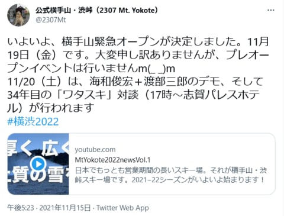

# 横手山スキー場、2022シーズンオープンが11月19日に決定！…でも、22日にすごい雨が降りそう(涙）

📅 投稿日時: 2021-11-16 04:48:50

今日もいろいろご無体で、

記事を書いている時間がないので…

手短に更新！

えー．

今週20日のオープンはないだろう…と踏んでいた

横手山ですが．

なんと、20日の一日前、19日のオープンが

決定したようです！！

（[横手山Facebook](https://twitter.com/2307Mt/status/1460161492238487552)より）

まさか19日にオープンできるとは…！！

でも．

オープン後，今のままの天気図だと…

21，22日と気温が上がって．

さらに、22日は空から液体が降ってきそう

なんですが…（涙）

22日に高温の雨となると，

23日のオープンすらやばいのですが（激泣）

とりあえず、まだ1週間先の予想なので、

精度はそんなに高くないのですが…

とりあえず、22日前後に高温になります．

ただ…そのあと、冬型になって冷えるかも？？

とりあえず、今できるのは、

全力で冷え冷え踊りを踊って、

せめて23日のオープンを祈るばかり…

しかし、22日がホントに高温の雨になると、痛い…

## 💬 コメント一覧

### 💬 コメント by (ダイヤモンド大六)
**タイトル**: 雪
**投稿日**: 2021-11-16 07:38:42

Sさんの予測では、一の瀬、焼額のオープンはいつ頃ですか？

### 💬 コメント by (Skier_S)
**タイトル**: ＞ダイヤモンド大六さま
**投稿日**: 2021-11-17 00:23:14

もしかすると、一ノ瀬のホテル大六の関係者の方でしょうか…

とりあえず、天気図によると23日夜から冷え始め、その後24，25，26とかなり冷え込み、

26日は天然雪も積もりそうなので…

一ノ瀬ファミリーは気合を入れれば27日に予定通りオープン、

焼額も12月4日に予定通りオープンできると思います！

