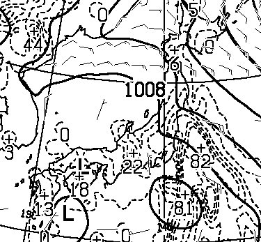

# この週末の月山の天気は…雨っぽい（涙）

📅 投稿日時: 2014-06-05 02:28:11

この週末．

…月山に行こうかなぁ…

と，思っているわけですが．

…なんだか．

土日とも．

雨っぽいんですけど～っ！！！（涙）

金曜からかなりの雨になりそうなんですが～っ！！！

土曜の夜の天気図は，こんな感じで…

水色に塗った降水量がある部分．

東北まで伸びちゃってます．

土曜は間違いなく，雨ですね（泣）．

この図を拡大すると…

うーーーむ．

こんな感じで，降水量81mmとかいう数字も

出ていて．

なんだか，かなりの降水量が

ありそうな感じ…

この図の，点線で囲まれた部分が降水量の

予想されるエリアなんですが．

7日の土曜日も，

8日の日曜日も，

なんだか，雨が予想されてます…

ただ，雲の動きが早まれば．

日曜は，午前中から雨が上がって，

うまくいくと午後には晴れ間も広がりそうな

予感…

気温自体はこんな感じで．

赤矢印で示した7，8日は，平年並みですか．

まぁ，日が射せば暑い一日になりそう．

…どーでもいいですが，青矢印で示した部分．

平年比12度を突破してますね…

北海道，暑かったわけだ…

ってことで．

あまり月山を攻めるには微妙なこの週末．

うーん．

どうしようかな～．

行くとしても日曜日帰りだな～←また月山一人日帰りやるつもりかっ！？

## 💬 コメント一覧

### 💬 コメント by (komu)
**タイトル**: 月山行きます
**投稿日**: 2014-06-05 22:58:39

予報ありがとうございますm(_ _)m

えーっと明日は何故か会社休みなのですよ…

なので、雨ですが月山出撃します(￣^￣)ゞ

レポート入れますね。_φ(・_・

しかし、今年もヒトリスト月山日帰りやるのですか…？

### 💬 コメント by (Skier_S)
**タイトル**: komuさま
**投稿日**: 2014-06-06 04:48:32

雨ですね～（涙）．

今日から月山ですか？

レポートおまちしてます～．

なんか，今週は仕事が忙しくて

行けなくなりそうな気配…

### 💬 コメント by (ひろちゃん)
**タイトル**: なんと本日月山晴れ
**投稿日**: 2014-06-06 11:17:32

途中大雨で、月山スキー諦めながら、きたら、なんと、晴れたです、スキーヤーエスさん、お疲れの様子ですが、気分転換できるかも、コブ頑張るです(o^^o)

### 💬 コメント by (komu)
**タイトル**: 晴れました
**投稿日**: 2014-06-06 18:02:04

ひろちゃんさんからコメントのとおり晴れました。やはり普段の行いですな(￣▽￣)

雪は昨年並かやや少ない感じです。リフトは板履いたまま行けます。

さ～てS殿、ストレスピークのご様子ですが、来てしまいますか？

### 💬 コメント by (Skier_S)
**タイトル**: ご無体続く…（涙）
**投稿日**: 2014-06-07 01:44:38

＞ひろちゃんさま

をを！

晴れてますか！

…こっちは今どしゃ降りです．

…これはきっと，ひろちゃんさまの

日ごろの行いでしょうか…

私も日曜日帰りで行けたら行きたいのですが．

土曜日一日で残った仕事が片づけられるか

どうか…

片づけられたら行きたいなぁ．

＞komuさま

いやー．

おそらく，ひろちゃんさまの日ごろの行いの

良さですねっ！

ひろちゃんさまの…（繰り返してみる）

もう，ストレスがピークですが．

体力がボトムなので．

明日一日で仕事をやっつけたとしても，

日帰り月山に耐えられるかどうか…

