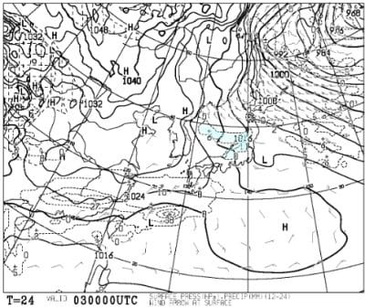
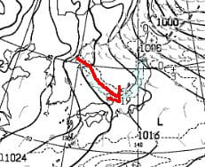
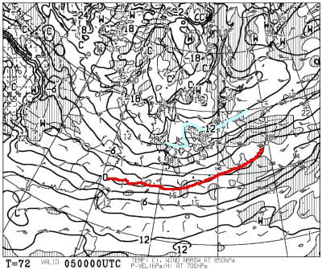

# 2月5,6日の週末の志賀高原スキー場の天気は…土日とも雪降り．めちゃ寒い根性の無いスキーヤーふるい落とし機能フル稼働の天気

📅 投稿日時: 2022-02-03 00:18:33

今日も，志賀高原特派員から送られて

きた写真を見てみると…

なんと．

朝は30cmくらいの積雪があったようです！

そして，朝の気温は-12℃と冷え冷えで…

オリンピックコースでは膝パフ，

朝に圧雪がかかるGSコースでも

ブーツパフの全面パウダー！！

しかし．

気温が低かったにもかかわらず，

雪はちょいと重めだったようです…

このGSコースの写真を見ても，

圧雪コースなのに，滑ってる人は

ブーツ～脛まで新雪に埋もれてるように

見えますね…！

ってな感じで．

今日も雪が積もったようですが．

天気図を見ると，これから週末にかけて，

まだまだ降りそうな感じです…！

ってなことで．

いつも通り天気図を見ていくわけですが…

まずは3日(木)の850hpa図を見ると．

この日は，志賀高原にかかっているのは

水色の-6℃線．

この時期としては，すごい冷えでは

なさそうな感じ…

そしてこの日の地上天気図を見ると．

日本海側にJPCZが伸びてるのが

見えますね…

この図を拡大すると．

赤矢印で示すように，JPCZは能登半島より

かなり東に延びているので…

JPCZが西風で流されているのが分かります．

これは，志賀高原には積もらない西風の

典型的パターン．

なので，3日の志賀高原は，そんなに

雪が降らなさそうかな．

続いて，翌日の4日(金)の850hpa図を見ると．

この日は，志賀高原にかかっている水色の

線は，-9℃．3日よりは冷えそうです…！

この日の地上天気図を見ると．

この日もくっきりはっきりとJPCZに

伴う雪雲が見えてますね…

拡大すると…赤矢印で示したように，

JPCZは能登半島よりわずかに西に突き

刺さっているので．

3日よりも風向きが北向きになってきて

いるのが分かります…

これなら，志賀にも雪が積もりそう！

続いて，肝心の週末，5日(土)の850hpa図を

見てみますが…

この日志賀高原に近づく水色の線は，

なんと，-12℃！！

これだと，朝イチは-15℃くらいの冷え冷え！！

さらに，500hpa気温を見てみると…

大雪の目安，赤色の-30℃線は志賀高原より

南に下がり…

ドカ雪の目安，水色の-36℃線が近づいてくる

レベル！！

これは…降りそうな予感…！！

地上天気図を見ると．

をを！

日本海側にかなり強い寒気の吹き出しの

雲が見えます…！

…それどころか，近畿まで降水域が

かかっているので，近畿地方も積雪が

ありそう…

さらに拡大すると…

JPCZの降水域はちょうど能登半島に

突き刺さるくらいですね．

これより東に流れると，志賀はそんなに

降らないけど，これだと志賀にも

積もってくれそう…！

さらに，新潟付近では，赤く囲ったように

+31という数字も見えて…

これは4日夜9時から5日朝9時までの

12時間の降水量が31mmということで．

積雪量なら31cm．

山沿いだともっと降る可能性があるので，

これは積もりそう…！！！

降る！積もるっ！！

そして，続く6日(日)の850hpa気温図を

見てみますが．

この日も志賀高原には水色の-12℃線が

かかっているので…

朝は-15℃クラス，昼間も-10℃を上回る

程度までにしか気温が上がらなさそうな

冷え冷えの一日．

地上天気図も，見事な縦縞で，

日本海側に降水域の網掛けがかかってるし．

この日も雪降りの一日になりそうですね…

ってなことで．

まとめると，

3日(木)：明け方まで雪が降りそう．

　朝までに数cmの積雪．

　あさイチの気温は-8℃程度．

　朝には雪が止み，リフト営業開始の

　頃には晴れるかな．

　ただ，細かな擾乱が通過して

　風向きが北～西と目まぐるしく

　変わりそうなので，

　晴れたり曇ったり，タイミングによって

　雪がぱらついたり…という一日．

4日(金)：3日の夜から雪が降り，

　4日朝までに少なくとも10cm，

　多ければ20cm以上積もってそう．

　朝の気温は-11～12℃程度．

　この日は終日雪が降ったり止んだり．

5日(土)：朝までに30cm以上積もるかも．

　少なくともブーツパフ，積もれば

　膝パフ．

　あさイチの気温は-15℃で終日寒く，

　一日雪が降り続け，時折強く降る

　エンドレスパウダーデー．

　ただ，根性の無いスキーヤーは

　ふるい落とされてしまう天気．

6日(日)：この日も朝はブーツ～脛パフ．

　あさイチの気温は-15℃くらいまで冷え，

　昼間も気温が上がらない，激冷えデー．

　この日もひたすら雪が降り続ける．

　この日も一日寒いよ！

ってな感じでしょうか．

うーむ．

今シーズン，ホントに良く雪が降る…

そして，志賀高原のこの時期の雪って，

普通なら軽すぎて風で飛ばされて

そんなに積もらないんだけど．

なぜか今シーズンの雪は，気温が低い

にも関わらず意外と重めの雪なので，

結構積もるんですよね…

とりあえず，現時点の志賀高原の積雪量．

ここ数シーズンでまれに見る積雪量

だと思います…！

そして，正月以来，週末は晴れのパターンが

続きましたが，今週は久しぶりのパウダー

になりそう…

ただ，

風が激烈に強くてゴンドラが止まる…

ということはなさそうですが，

寒くて雪が降り続ける，

根性の無いスキーヤーふるい落とし機能

が発動しそうなので．

のんびり晴天の下スキーをしたい人には，

向かない週末かも…

## 💬 コメント一覧

### 💬 コメント by (レインボー74)
**タイトル**: Unknown
**投稿日**: 2022-02-03 14:53:58

木曜日の志賀高原情報

湯田中は朝からうっすら雪が。上林-3℃　蓮池-8℃。意外やニゴンパークには8cm積雪。

やけびは夕方圧雪のオリンピックは20cm以上だけど、他は10cm程。

エス様の予報通り、晴れたり曇ったり雪だったりの一日でしたよ。

一通り滑ったあと、お目当てのダイヤへ。浮く、楽しい！夢中になって15本程。だんだん上手く滑れる！

途中で仲間はパーフェクタへ。左端に新雪が残っていたそうな。

昼前に満足終了して、湯田中の関英ドライブインへ。豚のもつ煮が旨すぎる。豚カツだって半端ない分厚さ。是非お勧めします。日月が定休で火曜が不定休です。

### 💬 コメント by (アリス)
**タイトル**: Unknown
**投稿日**: 2022-02-03 20:52:31

S様

気温、積雪ピタリ賞です🙆

天気は午前は、晴れ、曇、雪でしたが午後ずっと晴れ☀

午後のヤケビは、雪が締まってフラット快適バーンでした☺

やはり志賀高原はいいです🎵

ビューポイントで、天才少女のさくらちゃん親子さんと遭遇❗

残念ながらレインボーさんの逆探知は失敗❗

明日は明日の風が吹きますね😅

### 💬 コメント by (Skier_S)
**タイトル**: 今週，日曜はすごい積もりそう…！！
**投稿日**: 2022-02-04 01:49:40

＞レインボー74さま

今日は見事に予想が当たったようですね（鼻高々）

これから週末まで，また雪降りが続きますよ…

＞アリスさま

ふふふ．私の予想は当たるんです！（ここしばらく何回か外したけど…）

今日の志賀高原，朝は新雪だったけど，午後は締まって良かったんですね！

そして，さくらちゃんも来てたんですか！！

うらやましいです…

