# とりあえず，土曜に山に登ってきた…さて，何て山に登って来たでしょうか？

📅 投稿日時: 2022-08-01 00:26:46

🏷️ カテゴリ: [日記](cc4b5682fb7b8b144980957a978653fb0.md)

ってなことで．

金曜夜の記事に書いたように，土曜は

睡眠時間3時間ほどで家を出て，

山に登りに行ったわけですが…

ここしばらくは，昼前までには帰宅して

午後は仕事をしたい…ということで

近場ばっかりでしたが．

土曜は久しぶりにちょっと遠めの山まで

行ってきました～！！

…今回，二つの山に登るのが目的だったのですが．

一つ目はこんな山．

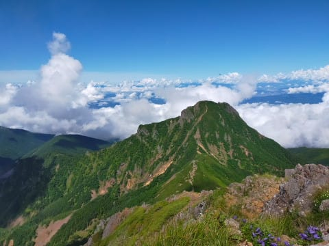

二つ目はこんな山に登ってきました…

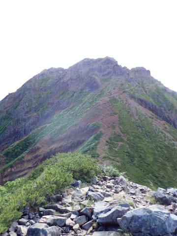

一つ目の山も，かなりエキサイティングな

登り道で．

…ここを通り抜けていくのか…っ！！

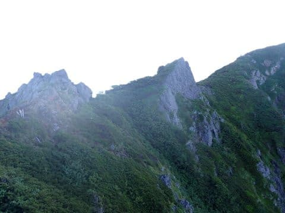

落ちたら，

「ちょっと痛いな」

では済まなさそうなルートを

通りつつ．

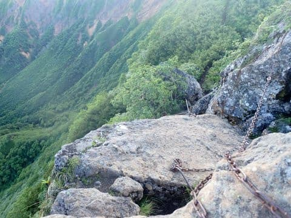

さらに何ヶ所か，落ちたら死ぬ系の

場所を通って…

（ルートに梯子が設置されてるのが分かるでしょうか…）

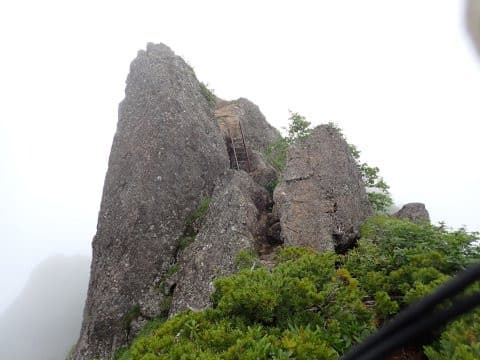

一つ目の山を越えて．

二つ目の，この山を狙いますが…

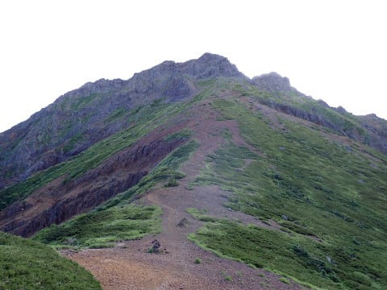

…このてっぺん．

ここまで登るのか…

ホントにあそこまで行けるのかな？

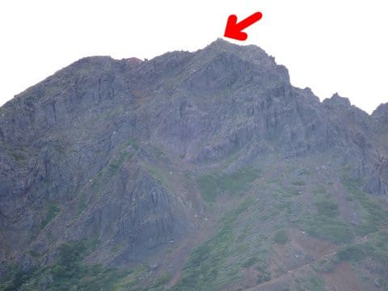

…近づくとなかなかの迫力．

とても登れそうには見えないん

だけど…

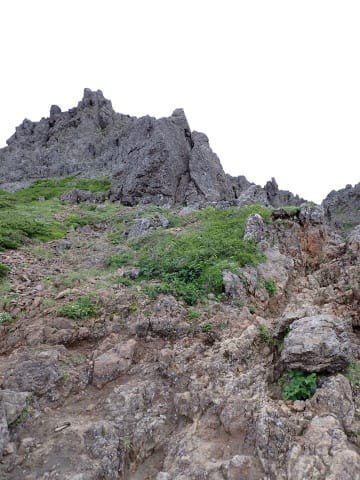

ここも最後はちょいとばかり

エキサイティングな登りを経て，

無事山頂に行くことができました～！！

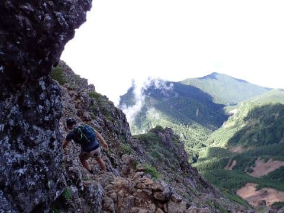

で．

二つ目の山の山頂から，

一つ目の山を振り返るわけですが…

今回，同じルートを帰るピストン登山

なので．

…また，あそこを登らないと

いけないのね…（涙）

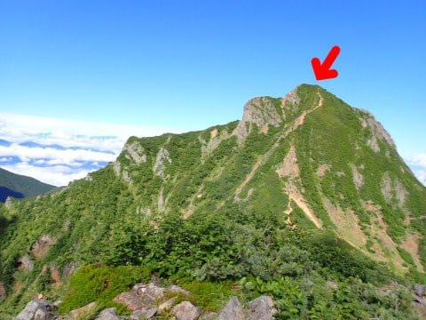

と．

泣きながら二つ目の山を下り，

また一つ目の山に登り返して，

下山したのでした…

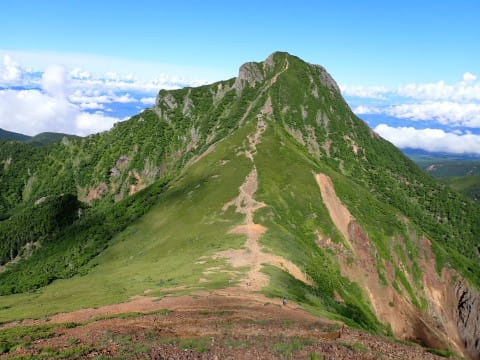

ってなことで．

5時スタート，12時半下山と，

山頂休憩は20分くらいにして，

かなり急ぎ足でピストンしてきたものの，

休憩を含め7時間半もかかった

ロングコースでした…

しかし．

車に到着する5分前から雨が降り始め，

車に到着するとほぼ同時に激しい雨に

なるという，きわどいタイミングでの

下山だったので．

急いで良かった…

（分かりにくいけど，ちょうど駐車場に着く

　このタイミングですごい大粒の雨が！）

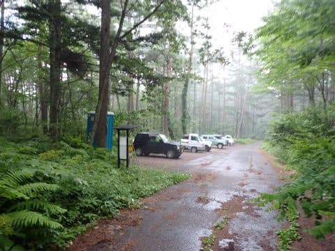

てなことで．

どんな山に登ってきたのか．

写真を見れば分かる人には分かると

思いますが…

さて．

私はどこの山に登って来たでしょうか？

…また時間があれば，別途詳細レポート

します～！

## 💬 コメント一覧

### 💬 コメント by (mae)
**タイトル**: Unknown
**投稿日**: 2022-08-01 11:54:52

お疲れ様でした。

阿弥陀岳～赤岳ですね。

私は北アルプスの五色ヶ原までピストンしてました。

### 💬 コメント by (Skier_S)
**タイトル**: ＞maeさま
**投稿日**: 2022-08-02 04:33:22

さすが，正解です！

五色ヶ原って…室堂からピストンですか？

