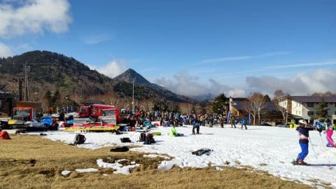

# 2021/11/20(土)のイエティ速報レポート…コース幅かなり広がったよ！雪の厚みも十分，やっぱりコースは混むよ…

📅 投稿日時: 2021-11-21 00:51:19

えー．

横手山，昨日オープンしたわけですが．

今日もいつものおこみん特派員から情報が

送られてきました～！！

どうやら，横手山は，

本日の午前中，なんと．

リフト20分待ちだったようです…！

混むとは思ったけど，ここまでとは…

おこみん特派員も，あまりもの混雑に

午前中で退散したようなので，午後の

リフト待ちがどうだったのか分からない

のですが．

横手のコース状況については，雪が

しっかりつけてあるので，数か所だけ

ごくわずかに茶色くなった程度で，

昨シーズンのように石だらけに

なることはなかったようで．

そこについては良かったようですね…

…しかし，リフト20分待ちか…

軽井沢並みですね…

とりあえず．

スキーヤーが分散するように，

早く他のスキー場がオープンして

欲しいのですが．

かぐらのライブカメラを見ても…

今日の段階で人工降雪の出来高ゼロ(涙）

あぁ…ホントなら，このゲレンデが

20日オープンのはずだったのに…

([かぐらスキー場ホームページ，ライブカメラページ](https://live.monitorbox.jp/site/kagura/90/)より)

ちなみに，我がホームゲレンデの焼額．

すでに4ロマ側のサウスコースには

人工雪が乗ってますね…！！

こっちはこのまま順調に，12月4日の

オープンまでに雪が増えてくれれば…

([焼額山スキー場ホームページ，ライブカメラページ](https://www.princehotels.co.jp/ski/shiga/livecamera/)より）

とりあえず．

850hpa気温予想でもすでに予言されて

いる，赤矢印の22日，平年比+6℃の

超高温＆激烈雨がヤバいですが…

これを乗り越えれば，23～24日と，

26日以降，かなり冷えて雪も

降りますよ～！！

27日はオープンするスキー場は多いと

思いますよ～！！！

…ってなことで．

本題へ．

本日もイエティへ滑りに行ってきたわけですが．

いつも通り帰宅が遅いので，速報モードで

本日のイエティの報告です！

今日も朝は富士山が綺麗に見える

すっきり晴天！

気温も朝は低めでバーンは柔らかく．

アイスクラッシュの氷が積もって，

板が軽く埋もれる感じのコンディションで

スタート！

コース幅は先週よりさらに広がり

ましたね～！！

厚みも十分で，土が出てるような

ところもありません！

10，11月にしかYetiで滑らない私に

とって，これまでで最も広いコース

幅かも！？

クワッドリフト待ちは3-5分で，平均的に

この程度の待ち時間．

クワッド・ペアの2本体制なので

そこまでひどくは混まず，ペアは

ほぼ待ちなしで乗れるので，リフト待ちの

ストレスは横手に比べれば少ないの

かな…？？

ただ．

コース上の人口密度はというと…

相変わらずですね(涙)

でも，コース幅自体は広がったので…

先週よりは滑りやすかったかな？？

…そして．

コース幅が広がった余裕からか．

先週までは無かった，パイプとか

ボックスとかのアイテムが3カ所に

設置されてました…

けど，狭いコース脇ギリギリに設置

されてたので，ほとんど使っている

人はいませんでしたが…(もったいない）

天気は晴れ時々曇り．

気温自体はそこまで低くないものの，

日が陰るとしっかりしたジャケットを

着た方がいい感じの気温です！

ってな感じの，今日のYetiでしたが．

いつも通り，混雑やコース状況，

リフト待ちの人数が分かる動画を

撮ってきました…

今日は2時間半睡眠で滑りに行って

眠いので，詳細レポートはまた明日！

…おやすみなさい…
